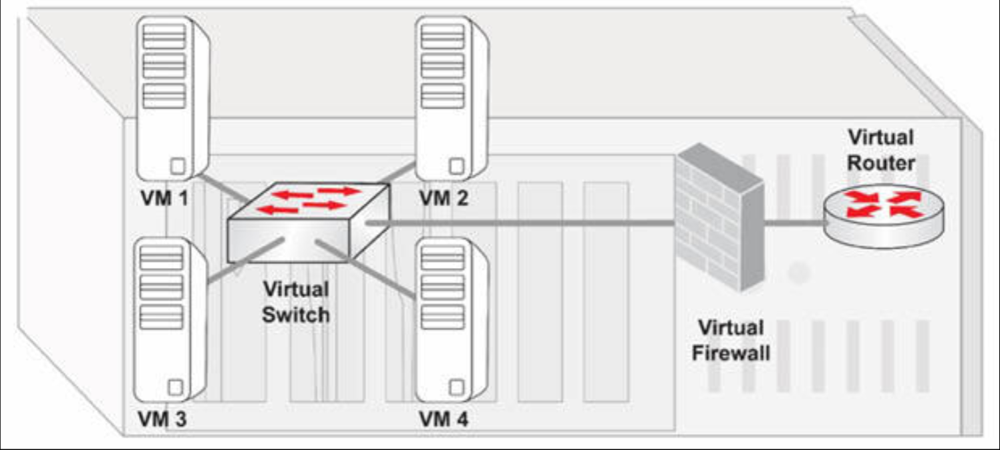

# 虚拟化

虚拟化技术在计算领域已存在很长时间，但其最近在服务器和桌面环境中经历了激增，这很大程度上得益于其可横向扩展出超大规模环境的能力。许多虚拟环境，都是由数百或数千台设备构成，而因此有大量相关的网络问题。

作为网络工程师，我们需要理解这项技术的工作原理，以便我们可对会议贡献专业见解，并在需要时提供建议。当咱们打算深入研究虚拟化技术时，那么就要关注比如 VMware 及 NetApp 等一些提供认证的市场领导者。

## 虚拟桌面与服务器

虚拟化技术允许咱们采用多台物理设备，而将他们迁移到逻辑上被划分为更小的虚拟域的单一物理设备（参见下图 38.2）。换言之，其允许咱们创建出，模拟原先就有的硬件的一种软件环境。将托管所有这些虚拟服务器的那个单一设备，将拥有丰富的可用资源，特别是以下几项：

- CPU 能力
- 存储
- 磁盘空间
- 带宽

**图 38.2** -— **网络虚拟化**

虚拟化技术涉及单一物理设备，咱们会于其上，使用能够在该物理设备内部隔离出独立虚拟机的虚拟化软件。这种虚拟化软件，将非配一定数量的磁盘空间、内存及 CPU 能力给每个定义于内部的虚拟机（VM）。当咱们打算构建某一新服务器时，咱们只需从则hyi物理设备上开辟一个新部分，来创建另一虚拟操作系统并分配必要资源，使其完全向一个物理设备一样运行（和思考）（见下图 38.3）。

实现这一能力的软件，称为虚拟机管理器，或超管理程序（hypervisor，其不仅仅是个管理程序，supervisor）。虚拟机管理程序有着以下职责：

- 管理所有虚拟系统
- 管理物理的硬件资源
- 管理虚拟机对物理服务器内部硬件组件的关系
- 桥接虚拟世界与物理世界
- 在咱们不希望虚拟机与对方通信时，维持虚拟机之间的隔离

值得注意的是，尽管所有虚拟机都位于同一物理设备上，虚拟机管理程序软件的开发者，仍必须确保他们有着限制所有虚拟机之间，可见性与访问权限的一些恰当安全特性。

**图 38.3** -— **虚拟化组件与管理程序**

虚拟机管理程序有两种类型：

- **类型 1 —— 裸机管理器**：在这种虚拟机管理器类型下，咱们要购置大型服务器，直接在原始硬件上加载虚拟机软件。没有所涉及的底层操作系统，咱们无需考虑任何操作系统方面的问题。咱们只需加载虚拟化管理程序（如 VMware ESXi 或 Microsoft Hyper-V），即具体的操作系统。这种虚拟机管理程序，常见于一些超大型企业的服务器环境；
- **类型 2 —— 运行于现有操作系统上的虚拟机管理程序**：这种虚拟机管理程序类型，运行于 Windows/Linux/Mac OS 主机之上，常用于桌面环境。

虚拟机管理程序允许咱们在同一时刻启动所有虚拟机，并同时通过配置不同系统如何在网络上通信，而在这些虚拟机间建立网络。这一特性同时在 OS 与组网方面，为系统管理员提供了强大功能。

对于企业环境，重点并非用户是在 Windows 或 Linux 平台上运行他们的虚拟系统及服务器；而关乎一种裸机安装。由于咱们通常将在单一硬件上运行数十或数百台服务器，因此该设备就需要为其分配大量资源，包括：

- 多核心 的 CPU 及多个 CPU 插槽
- 大内存容量（通常高于 128 GB，相比于桌面环境下用到的 4 至 8 GB）
- 海量存储，可为内部存储或网络连接的存储（NAS）

这些大量资源需求合情合理，因为咱们正将所有服务器，整合到一台物理机器中。咱们曾有个有着数百台同时插电服务器（物理设备）的数据中心。如今咱们已将它们全部拆除，而迁移到单一物理设备中。

这种服务器整合，带来以下优势：

- 节省大量数据中心空间
- 提升咱们使用硬件的灵活性
- 同时从 CPAEX（初始投资）及 OPEX （经常性运营及维护成本）角度，都降低了在硬件、电力、制冷等方面的成本

从管理角度来看，虚拟化还提供了数种优势：

- 快速部署：咱们不必购买新计算机、安装操作系统、将其插入网络、在机架中为其找个为止，以及完成物理服务器下的那些管理性任务。运用虚拟化，咱们可以虚拟机管理器，在几分钟内构建起包含 IP 地址，以及咱们可能已配置为某一模板的预构建软件的某一 OS。
- 管理跨服务器负载：当一个特定服务器在一年中某个时段非常繁忙时，那么咱们便可在那段时间分配额外的内存与磁盘空间。而随着其他服务变得更经常用到时，咱们亦可在别的方向分配资源。不同于使用物理服务器下，咱们通常必须掉电或升级设备存储、关机、及物理安装内存条等不同，虚拟环境下咱们不必这些耗时任务。当咱们需要更多磁盘空间或内存时，咱们可在虚拟机管理程序中，点击几下即可增加虚拟资源。虚拟化技术提供了许多优势，而这正是虚拟服务器与虚拟网络，在现代数据中心广受欢迎的主要原因。

### 虚拟交换机

与真实服务器一样，由虚拟机管理程序管理的虚拟机，同样需要与对方及与外部世界通信，完成不同任务（例如应用服务器与数据库服务器的通信）。除了前一小节中详细介绍的虚拟化桌面及服务器外，这一需要还引出了虚拟化组网设备这一概念（参见下图 38.4）。

在迁移到虚拟世界前，服务器与桌面都连接到由企业交换机、防火墙、路由器及其他的，提供了包括冗余特性在内必要功能与特性的设备。如今服务器和桌面都已迁移到虚拟世界，那么网络设备也必须要迁移到提供类似功能的虚拟环境。这属于在做出从物理世界，向虚拟世界转型时的一项重要考量。

**图 38.4** -— **网络设备的虚拟化**

网络虚拟化与具体服务器的虚拟化同样重要。在从物理网络基础设施迁移至虚拟网络基础设施时，有数个挑战必须纳入考量：

- 与外部世界的集成：物理的托管主机将配备多少个网卡？
- 物理世界中所有服务器的累积带宽，将如何转移到虚拟世界，以及如何容纳于有限数量的以太网连接下（有时仅有一条）？
- 物理服务器提供的吞吐量，将是否足以妥善服务于该系统上运行的那些虚拟化服务器？
- 网络冗余将如何构建于虚拟环境中（连入这些虚拟机的多条网络连接）？

上述考量在运行时间与可用性方面变得非常重要，尤其在托管着一些关键业务应用的大型数据中心中。鉴于网络虚拟化消除了为每台服务器专用连接的需求，现在包括分配 IP 地址、VLAN 及其他特定配置等的所有操作，都会在软件下完成。因为咱们无法物理接触到网络设备，或追踪进出服务器的布线，这种方式可能编的更加难于管理。所有这些功能，均为完全通过使用虚拟机管理程序软件完成的。

通过虚拟化网络层，咱们不仅不仅将全部功能转移到了虚拟环境，还可获得了一些额外特性。传统交换机并不具备冗余、负载均衡或 QoS 等的一些内置特性。在虚拟环境中，这些特性可轻松部署与配置，因一切都是在软件下完成的，且虚拟系统制造商可能实现一些额外优化，进而咱们便可管理一些应用，已相较其他应用更高的优先级执行。例如，咱们可使用集成负载均衡的虚拟机管理程序功能，均衡多个虚拟机 Web 服务器的流量。

相较于使用物理设备，网络组件虚拟化提供了两大优势：

- 成本节约
- 集中化的控制

许多虚拟系统还具备一些基础的集成安全特性，可能是一些直接内置于虚拟化软件中的防火墙功能。需要特别注意的是，一些第三方提供商，正开始创建一些可加载到这些虚拟环境，以在虚拟世界中提供与咱们在物理环境曾有的，完全一致安全防护态势的虚拟防火墙与入侵防御系统（IPS）。

**注意**：虚拟网络设备既可以是虚拟机监控程序系统的一部分，也可以是可像任何其他虚拟机服务器一样加载的专用虚拟机。

### 网络即服务

在虚拟化桌面、服务器和网络设备后，下一步便是迁移整个网络基础设施到云上，其中他将作为一种网络即服务运行。当网络内的事情变得过于复杂，而咱们不具备构建及维护他的专业知识时，咱们可将这一过程，连带所有必要功能一起外包给另一家公司，而将其作为一项服务使用（通常通过购买订阅），此时网络已属于云的一部分。

随着虚拟化软件已日益普及，一些第三方提供商，已开始提供云端的虚拟化，而客户就在其设施处没有了任何东西。这意味着所有的应用、平台及网络，均被迁移至云端，进而公司的所有 IT 功能都被虚拟化了，从而一切都运行在完全隔离的设施中。随后网络及与网络管理相关的一切，都对客户变得不可见，他们只会用到连接本地设施到云端单一链路，而无需担心任何网络配置方面。在这种情形下，一切都是隔离完成的，因为网络正作为一项服务，运行于第三方设施处。

当在云端提供 NaaS 时，发生于网络内部的任何变更，都对客户不可见。客户只有一条到云端的连接，一旦信息发送到云端后，就无需关心组网方面的原理，因为 ISP 负责所有的虚拟化服务。在 ISP 打算取得全部服务器，并将其迁移到某一有着更大容量、更高可用性的数据中心的情形下，这种方式提供了极大灵活性。迁移过程只需通过选取虚拟系统，并几乎可以立即地将其部署到某一可能地理上不同于最初位置的新位置，对用户透明且在客户完全不受影响下。归根结底，客户甚至不会对此类细节感兴趣，因为主要关心的是，有网络提供的服务即其应用是否如预期运行。

咱们之所以会打算将咱们的网络迁移到云上，作为服务运行有数种原因。一种情形可能是咱们有着某个被数千人使用的关键应用，其需要大量资源及带宽运行。与其在咱们的设施处，部署包括庞大的网络管线及昂贵连接在内的组网与通信资源，咱们可只需把这些放入云中，并让其由第三方提供商管理。这些业务提供商已具备到 Internet 的高容量连接，因此咱们不必在带宽及这些连接的维护服务上花钱。

完全网络虚拟化，还提供了另一有趣优势，其通常称为 “全天候” 服务（a "follow the sun" service）。这属于一个基于服务器可快速迁移，及根据服务器地理位置，服务提供商可优化资源利用率与响应时间（特定应用的大多数流量会于白天完成，而这会在全球范围内发生于不同时间间隔），这一事实的概念。

网络虚拟化的另一优势，在于便利的扩展及缩减咱们正使用多少的资源。当咱们的应用，会在某一特定日期或时段（例如税务申报）为数百万人用到时，咱们可在仅需几次鼠标点击下，轻松分配更多带宽、磁盘空间或内存，而瞬间提升该应用的容量。当繁忙时段过去，而咱们不需要全部这些已分配的资源，没有为他们付费的需要时，那么咱们可再次在仅几次鼠标点击下，降低某些参数（如网络吞吐量或 CPU 周期）到某一对该应用正在执行操作更合理的水平。

当某一客户使用着 NaaS，而在某天决定要搬到某个别的地点时，那么应用将如何执行绝对没有区别，因为他们是由服务提供商在云上的某处托管及管理的，可从任何地方访问。在云上运行 NaaS，能提了许多功能，可完美适配一些特定的业务应用及服务。

### 本地（On-site）虚拟化与异地（Off-site）虚拟化

对于咱们会于何处管理与维护虚拟化环境，虚拟化技术提供了多种选择。咱们可将所有东西，放在咱们的场所，或咱们可选择将他们异地的某一位置。

在本地配置下，咱们会拥有并管理咱们场所内的基础设施。咱们负责构建及维护他，并当有与托管相关方面相关的任何问题时，咱们就要负责解决这些问题。本地托管虚拟化环境下有数项优势：

- 咱们有着对所发生事情的掌控：当有任何何需要变更或迁移的东西时，咱们有着对托管设备与连接全部修改的完全控制；
- 咱们有着对包括内存、磁盘空间、CPU 能力及带宽等可能的资源升级的控制；
- 咱们有着对整个基础设施的完全安全性。咱们可将设备安装于上锁的房间，而限制对物理服务器访问权限，在托管于某一远端位置的虚拟环境下，这属于咱们通常不会有的事项。

这种本地方式也有一些弊端：

- 相比在第三方站点托管设备，其成本更高，因为咱们必须采购服务器、机架、连接及操作系统等，别且咱们必须确保咱们拥有一种可控环境。所有这些方面都同时涉及咱们需要考虑的 CPAEX（初始费用）及 OPEX（经常性费用）；
- 咱们需要一套包含企业交换机、路由器、带冗余及内置安全功能的防火墙等的组网基础设施；
- 上述两个因素，都使得这一基础设施难于升级。咱们必须考虑机架上有多少可用空间，咱们必须采购新的设备，同时有着提供有限性能的数太物理设备，而难以进行快速变更。

在异地的环境下，一切都托管于云上。咱们不必担心这些特定系统位于数据中心的何处，因为他们甚至不存在于咱们的设施中。所有应用、服务器及操作系统，都部署在别处，而咱们无需知晓其具体位置。这种方式带来以下主要优势：

- 咱们没有任何基础设施成本：没有服务器、无需降温，或任何需要前期投资的东西；
- 全部基础设施的管理及维护，都由第三方服务提供商负责，因此咱们无需配置大量员工管理这些设备与确保他们正常运行；
- 基础设施可位于世界上的任何地方（单一或多地托管）；
- 许多服务提供商都提供海量虚拟环境，因此当咱们需要更多资源（如磁盘空间、内存、带宽等）时，ISP 可轻松提供这些。

异地托管基础设施，也有着一些弊端：

- 全部客户数据均存储于没有对其物理访问的某一别的设施处。在这些数据属于极度敏感的情形下，将咱们的虚拟化环境部署在云上某处，可能并非最佳选择；
- 异地托管有一些相关的合同限制。通常这涉及到与服务提供商签订一个长期合约，这种合同就会在此期间提供有限的灵活性。当环境快速变化时，那么咱们就会就需要修改部分合同条款，以规避各类限制。

请参加 [Free CCNA Training Bonus – Cisco CCNA in 60 Days v4](https://www.in60days.com/free/ccnain60days/) 处今天的考试。
