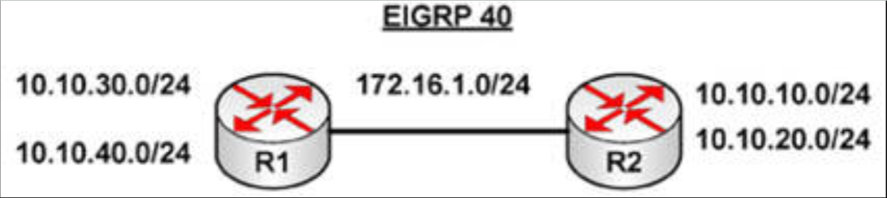

# 第 39 天 复习

## 第 39 天任务

- 复习前 2 天的理论及实验
- 参加 [Free CCNA Training Bonus – Cisco CCNA in 60 Days v4](https://www.in60days.com/free/ccnain60days/) 处今天的考试；
- 阅读 CCNA 补习指南
- 完成下面的挑战实验（若咱们愿意）
- 在 subnetting.org 上花 15 分钟

广域组网仅在考试中的网络拓扑方面有所提及，但可以肯定的是，咱们将被问题有关 WAN 协议及业务的问题。

## 挑战 —— PPP 下的 EIGRP 实验

### 拓扑结构

### 实验说明

以串行线或交叉网线，将两台路由器连接在一起。

1. 根据示意图，添加 IP 地址到两台路由器，并添加环回接口到两台路由器；
2. 在 `Router A` 与 `Router B` 之间 `ping`，测试串行线路（要记住时钟速率）；
3. 现在设置串行线路为使用带有 CHAP 的 PPP（还要设置用户名与口令）；
4. 在全部两台路由器上配置 EIGRP 40，并添加全部网络；
5. 修复阻止 `R2` `ping` `10.10.30.0` 及 `10.10.40.0` 两个网络上主机，及阻止 `R1` `ping` `R2` 上 `10` 地址的问题；
6. 修改路由，从而仅 `R2` 上的 `10.10.10.0` 与 `R1` 上的 `10.10.30.0` 两个网络得以通告。将使用其他 `10` 网络的那些环回接口，置于 EIGRP 的被动模式。

