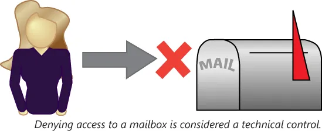

# 风险相关概念

技术系统的风险，会以许多形态及规模出现。针对这些系统的管理员，掌握风险类型非常重要；他们自己要配备一些评估不同风险程度的工具；同时要准备好实施一些消除这些风险的策略、流程及技术解决方案。这一小节将介绍以下主题：

- 控制类型
- 误报
- 政策在降低风险中的重要性
- 风险的计算
- 定量与定性分析
- 风险的规避、转移、接受、缓解及威慑
- 与云计算及虚拟化相关的风险

## 控制类型

对技术系统使用的控制，并不限于技术手段。这些系统的使用，可通过技术手段、通过落实的有关正确使用的管理政策，或通过诸如物理保护重要设备等的一些非技术手段而加以控制。以下是个控制类型列表：

**技术控制** —— 这些控制手段包括使用诸如认证、授权与计费（AAA）模型等的内置控制，控制对资源使用的访问权限。例如，技术控制的一个示例，便是拒绝所有其他用户访问某名用户的邮箱；

**图 41.1** -— **技术控制示例**

**管理控制** —— 这些政策涵盖资产的允许用途。管理控制可能配备强制合规的技术或运营控制，也可能不配备。管理控制的一个示例，便是一项规定禁止另一用户邮箱的规则；

**运营控制** —— 这些控制关注人的行为而非技术系统。运营控制的一个示例，便是始终护送或监控位处关键任务服务器机房中管理员的做法。

## 误报

任何试图动态过滤内容的系统，都必须对内容是否符合或违反政策做出判断。防病毒程序可能误将某一无害文件分类为病毒；垃圾邮件过滤器会将一封合法邮件，标记为垃圾邮件而将其发送到隔离区。当代理程序错误地将合规内容识别为违规时，那么该代理程序便以识别出了误报。

与过多误报相关的成本可能巨大。设想其中垃圾邮件过滤器把流经某一 50 人规模组织的，合法邮件总数百分之一标记为垃圾邮件的这一情形。该系统的管理员，就需要手动修正总量相当于每名用户平均邮件流量一般数量的邮件路由。当诸如反垃圾邮件等省时系统存在足够高的误报率时，那么该系统实际上可能就会对效率产生负面影响。

## 政策在降低风险方面的重要性

组织会实施多种政策缓解或降低针对其组织的风险。管理层可能需要权衡与许多不同的常见政策类型相关的利弊。任何政策要能有效降低风险，都必须付诸实践。制定后又被忽视的政策，对任何组织都几乎毫无裨益；

**隐私政策** —— 所谓隐私政策，描述了某一组织可使用及不可使用被视为隐私的信息的方式。例如：某一公司是否会将有关购物习惯的信息出售给第三方？某个组织是否能将姓名及地址信息发布给某家印刷店，以便外包邮寄信息？考虑要实施某种隐私政策的阻止，需要考量有关机密性的任何法律要求、客户对披露与其相关信息接受度，以及过度限制性政策对组织高效运营能力的影响。

**可接受的使用** —— 所谓可接受的使用政策，规定了公司资源的允许及禁止用途。例如 Internet 的可接受使用政策，便可能规定了 Internet 流媒体音乐是否允许，或列明可能无法访问的特定站点类型。这一政策可能规定了诸如个人网页浏览活动仅在午休时间允许，等的一些受允许活动的时段。这些政策旨在告知使用者，有关公司资源用途的一些预期规范；

**安全政策** —— 安全政策涉及确保资源免遭未经授权使用，而采取的一些政策与做法。所谓未授权使用，包括了内部及外部威胁，比如黑客攻击或未授权的数据披露等。安全政策还包含为执行诸如隐私政策与可接受使用政策等其他政策，而制订的一些政策；

**强制休假** —— 处理敏感数据的员工，可能被要求执行 “强制休假”。强制休假政策的目标，是要让另一员工接管敏感员工角色的职责，既提高任何不当行为将得以发现的可能性，又同时遏制了此类活动。通过强制规定连续数天的离岗工作日，组织便可确保某名员工的工作，将为另一员工审阅；

**岗位轮换** —— 所谓岗位轮换，或定期安排新员工处理敏感数据，达成了与强制休假同样的许多目标。当某名员工或一组员工确信他们的工作将定期由其他人接管时，那么从事那些违规行为的动机就会减少。但岗位轮换的弊端在于，其可能阻碍任何特定领域专业能力的发展，因为定期更换岗位的员工，更可能成为通才而非专才。

**职责分离** —— 职责分离确保建立制衡体系，没有人具备擅自执行可能违反政策行为的能力。这方面的一个常见示例，便是让不同人开具支票与签发支票。这样做确保了每笔交易都必须由至少两人经手。另一示例便是程序员在合并他的代码到当前构建前，要提交代码给经理审批。程序员只关心编写必要的代码，而经理则关心构建的管理。

