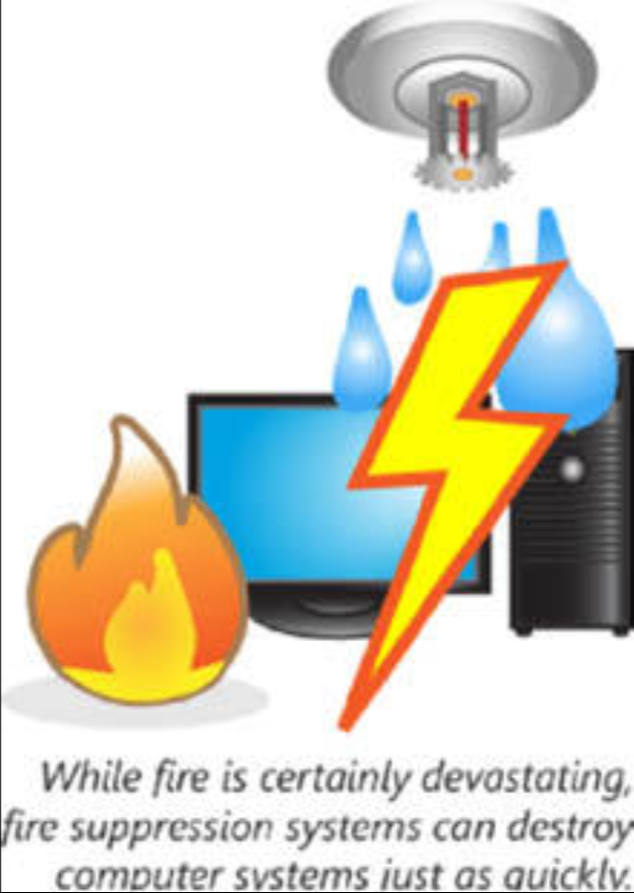
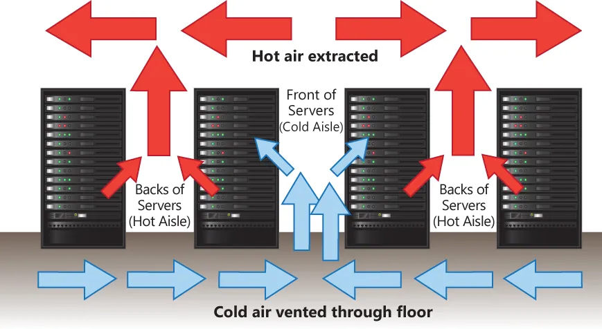

# 环境控制的影响与正确运用

系统管理员可能需要采取确保系统意图于其中运作的环境，不会降低其性能的一些步骤。系统不应放置在过热、太多粉尘，或有水患/火灾风险的环境中。最佳环境会得以定期监控，确保那些环境变量维持在理想范围。这一小节将涵盖以下主题：

- 暖通空调（HVAC）
- 灭火
- 电磁屏蔽
- 热/冷风道
- 环境监测
- 温湿度控制
- 视频监控

## HVAC

供暖、通风及空调（HVAC），属于系统管理员关注的重点。这些系统对确保温湿度的控制至关重要。计算资源的重度使用，往往会产生大量废热。当这些热量受困于在产生他的计算机周围时，那么他便会使这些计算机的性能及寿命降级。出于这一原因，高密度的计算基础设施，几乎总是需要专门的制冷。

## 灭火系统

任何高能耗环境的一项风险都属于火灾。在发生火灾的情形下，电子设备资源就会被标准喷淋系统严重损坏。

**图 41.4** -— **灭火**

对于封闭的服务器机房，一种比如卤化烷或氩气的专用灭火剂可被使用。这些系统对电子设备安全，但对人类存在威胁。当某种专用灭火系统被安装时，那么至关重要的是，其要包含一些保护人类免受潜在致命制剂意外排放伤害的安全措施。至少，存放电子设备的区域，必须配备火灾报警系统，从而任何火灾都能被检测到，并能得到尽快响应。

## 电磁屏蔽

电磁干扰（EMI）由电流的运动产生。EMI 会是一个问题，因为强 EMI 会干扰网络通信。在 EMI 可持续观察到的环境中，分析产生 EMI 的电流模式是可行的。这种干扰在一些高度敏感的网络通信下尤为棘手。针对那些高度敏感的网络，建议屏蔽网络运行以遏制 EMI。

## 冷热风道

在数据中心环境下，气流不应是事后才想到的，而应是个不可或缺的设计要素。数据中心应利用冷热风道。为了一种节能的热调节，设计良好的数据中心将最大化通风，或热空气排出及冷空气流入。气流管理的一些最有效方法之一，便是冷热风道的建立。在热风道中，连续数排的服务器机柜会朝向同一排通风。下一排机柜，将从共用的冷风道抽取空气，并排向通用的热风道。这一配置会于每对风道重复，冷热风道交替。

**图 41.5** -— **冷热风道**

设计用于排出热空气的通风口，会置于在热风道中，而设计用于帮助保持冷空气流的通风口，则要置于冷风道中。与将整个数据中心视为单一无差别区域相比，这种做法允许有着相同热输出的同一空间，得以更有效地冷却。

## 环境监控

某一规划的环境，还必须符合规划者的预期。确保环境控制有效性的唯一途径，便是环境监测。一些告警及警报，应针对环境未能保持在某一可接受条件范围的一些情形加以配置。在这种方式下，当遇到一些环境问题时，在他们造成设备故障前，便能得以解决。

## 温湿度控制

除那些专门的制冷要求外，电子基础设施还可能需要温湿度控制。极端干燥或多尘的环境，可能引发额外静电放电。出于这一原因，一些高颗粒物环境与那些极度干燥的环境，均属于不理想环境。

## 视频监控

就数据中心安全而言，视频监控属于最佳选择。相较于记录进出情况的简单安防日志，视频监控通常可以提供更完整的画面。敏感区域的视频记录，不仅揭示了进出安全区域的情况，还能提供进出时间、地点，以及在安全区域内所做事情的公正记录。
