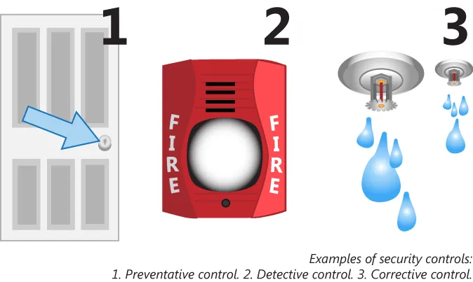

# 适当的风险缓解策略

一旦风险已加以评估后，那么就是要考虑一些缓解他们的最佳方法。实施任何缓解步骤前，其成本与预期效益都应加以权衡，确保这些缓解步骤真正适合于咱们的组织。这一小节将介绍以下主题：

- 基于风险的安全控制
- 变更管理
- 事件管理
- 用户权限审查
- 例行审计
- 防止数据丢失或窃取的政策与流程

基于风险的安全控制安全控制是防范安全风险的保障措施，通常可分为以下三类：• 预防性控制：如门锁装置，旨在事件发生前就存在以阻挠或预防事件发生。• 侦测性控制：用于识别并记录正在发生的安防事件信息，例如火灾警报器或闭路电视监控摄像头。

## 基于风险的安全控制

所谓安全控制，属于针对安全风险的一些保障措施。他们通常可分为以下三个类别：

- 诸如门锁等的一些预防性控制，属于事件发生前就存在，阻止或预防该事件的一些安全控制措施；
- 侦测性控制，用于识别并记录有关正在发生的某一安全事件的信息。这些控制措施可能包括火灾警报器，或闭路电视监控摄像头等；
- 纠正性控制，旨在最小化由某一事件所造成的损害，比如针对存放重要电子设备房间的专用灭火系统。

**图 41.3** -— **安全控制**

除了这些控制措施所服务的目的外，控制措施可根据其用途分类。我们已讨论过技术控制、管理控制及运营控制。而除了这些基本类别外，我们同样可考虑物理的控制以及法律/监管的控制。

重要的是要将控制措施与风险匹配。对于 Internet 的浏览，在某些情形下，一项简单的可接受使用政策，便可能就足够了；而在其他情形下，就有必要实施多种性质的预防性、侦测性及纠正性的控制。一种情形可能会在技术层面，用到防火墙规则、实时监控、日志记录及报告等。另一种情形则还要通过将那些有着对敏感内部数据的网络，与那些有着对 Internet 访问的网络隔离，或部署诸如诸如保留连接 Internet 机器上的时间等运营约束等方式，进一步限制对互联网的访问。

正如咱们从我们的简单示例中看到的，要实现一些同样目标，可采取多种控制措施，但这些控制措施越深入，那么这些控制措施就越可能包括一些不合理成本。重要的是要将控制水平，与他们打算缓解的风险相匹配。

## 变更管理

所谓变更管理，是对基础设施变更的系统化实施。部署良好的某种变更管理系统（CMS），会防范一些临时性配置错误，并能提供会滚一些不当变更的方法。而得到良好执行的某种变更管理策略，将记录关键变更，及重要基础设施的当前状态，提供了在用基础设施可预期参照的一个配置基线。诸如固件版本更新或操作系统替换等的一些重大变更，应始终要记录在 CMS 中。

## 事件管理

所谓事件管理，属于响应安全问题的系统及过程。其可被广义地定义为 “出现问题时要做什么”。事件管理流程，会以事件为中心，比某一简单的事件日志条目，或一次断电事件等。这一流程涉及定义问题及采取纠正措施。

而保全系统则并非一个一次性事件，而是个持续进行的过程。当某一事件真的发生时，那么其可能是现有控制措施不足的迹象，或现有控制措施未曾得到正确应用。维护系统安全，需要定期的风险与威胁再评估。事件管理应作为从已发生失效中汲取教训，以及通过解决问题并考虑可行的缓解策略强化现有系统的契机，而加以采行。

事件响应流程将在这一章中详细介绍。

## 用户权限审查

为了符合最小权限的最佳实践，那么用户权限就应定期审查。用户权限及组成员身份应得以审查，以确保当前权限仅分应履行职责所需的必要权限。

## 例行审计

除了定期的用户权限审查外，其他一些例行信息安全审计也应开展。这些安全审计包括服务器的事件日志审查、确保正确防火墙及服务器配置的基础渗透测试、确保软件按要求更新及在 CMS 中追踪的那些软件版本准确的版本审计等。

## 防止数据丢失或窃取的政策及程序

数据丢失与数据被盗，属于没有公司愿意遇到的两项风险。在数据丢失下，数据就不再对那些需要他的人可用；在数据被窃取下，那些机密、隐私或专有数据暴露于，便暴露给一些未经授权方。在这两种情况下，数据都已不在其应在之处。

防止数据丢失的政策与流程，通常以备份/恢复为中心，其中一份拷贝会从要加以保护的数据得以构造。当数据发生问题时，那么只有备份完成后的那些已修改数据，才有丢失的风险。这些按时的备份，被称为检查点或还原点。其他保护数据的策略，则首先考虑的是不丢失数据。所谓不丢失数据，是指配备冗余服务器、限制对数据修改的访问，以及定期检查数据完整性等。

数据失窃，发生于一些未授权的个人，能够访问一些专有数据时。为打击数据窃取，必须一些定义谁有着对敏感数据访问权限的政策，必须加以制订及执行。备份应得以安全存储，包括备份介质本身的物理防护、备份介质内容的加密，或二者同时实施。

系统应得以安全强化，且只有必要服务被启用。同样地，用户权限应仅授予确需访问的人。数据窃取通常会在没有任何数据删除下发生。其通常经由数据拷贝发生，因此难以检测。要尽可能限制对机密或隐私数据的访问权限，并审计对数据的访问。遗憾的是，一旦对隐私数据的未授权访问已发生，在维持对数据的控制往往为时已晚。要打击数据窃取，咱们必须首先阻止访问。

