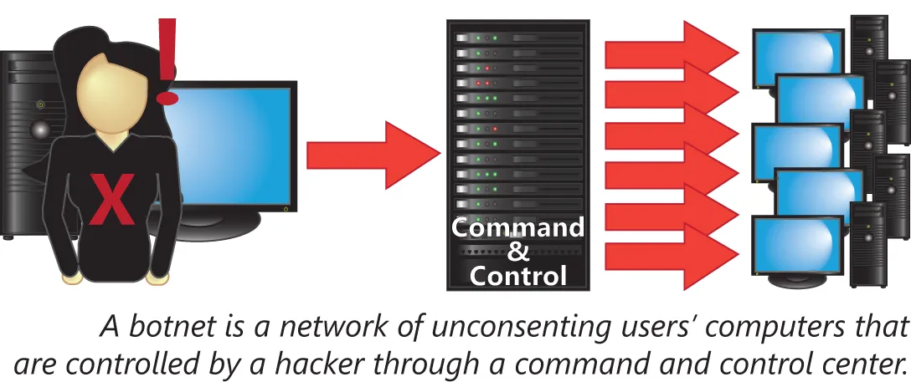

# 恶意软件的类型

所谓恶意软件，是在未经用户同意下，便运行或驻留于某一计算机上软件的统称。根据其目的、执行方式与传播方式等，其可被大致分类。这一节将涵盖以下主题：

- 广告软件
- 病毒
- 蠕虫
- 间谍软件
- 木马程序
- 根套件
- 后门程序
- 逻辑炸弹
- 僵尸网络

> *译注*：如今，勒索软件，denial-of-access attack，阻断访问式攻击，更加称为一种主流攻击方式。

## 广告软件

所谓广告软件，属于是一种寻求劫持用户注意力，通常会引起一些额外广告出现，或以一个广告软件所选择的新广告，替换原本通常出现的广告。就恶意软件来说，这一类别属于最接近灰色地带的类别。广告软件会在未经用户同意下即被安装，但其通常以所谓 “免费” 软件条件形式，作为某一软件包的一部分而安装。无论是否在用户同意下安装，广告软件本身都会导致干扰性广告及弹窗数量的激增。

## 病毒

病毒是人们最熟悉的一种恶意软件形式。由于 “病毒” 一词无处不在，许多外行人常将病毒与恶意软件两个术语互换使用。然而，病毒并非简单的有害程序。比如大多数的间谍软件和广告软件，都不会恰当地被指为范畴。病毒属于一种为了发挥作用，而要修改现有文件的特定恶意软件类型。 病毒的另一核心属性，是其自我复制的能力。任何将其本身附着于现有文件，并未在用户同意下运行的自我复制程序，均可视为病毒。

## 蠕虫

蠕虫在其自我复制及在无用户同意下运行两个方面，共用了病毒的一项重要属性。与病毒不同，蠕虫一般将其自身附着现有文件，且他们一般会在无需用户交互下扩散。一旦某一台计算机暴露并感染后，蠕虫便会迅速扩散至某一网络上有着特定漏洞的每台计算机，这种情况并不罕见。

区分蠕虫与病毒的有效方法，便是要记住，蠕虫以其通过网络扩散的能力而著称，而病毒主要以其修改计算机文件上的文件而引发关注。

## 间谍软件

另一常见恶意软件类型，会收集目标系统上的信息，并将其收集到的数据报告回恶意软件的控制者。这一恶意软件类别，被称为间谍软件。间谍软件的常见用途包括：收集受感染计算机磁盘驱动器上的数据、监控用户输入，比如用户名及口令等，或监视网络流量，比如未加密的 HTTPS 通信等。间谍软件会将私有的计算机使用，暴露于所有的未授权监控类型。

## 木马程序

所谓特洛伊木马，属于通过将自己伪装为合法软件扩散的任何恶意软件。这一传播方式使这些程序类型，与传说中的特洛伊木马极为相似。木马程序的一个示例，便是某种声称咱们的 PC 可能感染了恶意软件，并要提供检测及清理 PC 的服务。这种恶意软件实际上并不会检测并移除 PC 上的恶意软件，而反而会诱使用户安装这一木马恶意软件。

针对一些想要的盗版软件，会修改自原版以包含恶意软件的情况屡见不鲜。任何将其伪装成合法软件的恶意程序，都会被正确归类为特洛伊木马。

## 根套件

所谓根套件（rootkit），属于一种极难检测的恶意软件类型。这是因为，不同于大多数作为在现有操作系统上程序运行的恶意软件，根套件会通过将其本身，插入操作系统与用户环境之间，或通过篡改操作系统本身的运行发挥作用。

由于根套件在如此底层处运作，因此即使面对专业调查人员，他们通常也能有效隐藏他们的踪迹，因为他们可简单地更改呈现给调查员的信息。根套件属于最难与检测和清除的恶意软件类型。识别根套件的方法分别是当根套件浮现并试图与计算机交互时，杀毒软件中的误报，以及那些被挂钩的进程（所谓进程，是一些运行于计算机内存中的可执行代码）。

## 后门程序

所谓后门程序，属于任何意图提升某一攻击者访问系统便利性的恶意软件。尽管后门程序本身可能不包含恶意代码，但其往往是某种更严重攻击的前兆。后门通常通过在任何安装于目标计算机上的反恶意软件中打开一些口子，并就某一系统的未授权访问可用性，向某一外部主机发出警告方式发挥作用。

## 逻辑炸弹

所谓逻辑炸弹，是一种带有不会在感染后立即激活的破坏性载荷的恶意软件。激活条件可能是自感染后的某一特定时间量、或感染系统的某一 “跃点” 数，或来自控制服务器的某条特别指令等任一条件。逻辑炸弹很危险，因为唯有在其激活前成功检测到他们，才能避免损害。

逻辑炸弹通常针对某一特定目的而创建。由于他们往往属于单一用途的攻击，因此他们很少被反恶意软件检测到。逻辑炸弹的一个示例，便是被设置为在用户授权失败情形下运行的一个简单脚本。某名心怀不满的管理员，可能会一个在其主用户账户被禁用时运行的脚本，其将移除或修改网络上的信息。

## 僵尸网络

有另一种不以计算机上的信息或用户注意力为目标，而以计算机本身的带宽与计算资源为目标的恶意软件类型。这种恶意软件类型，目的要控制大量个人 PC，即被称作创建僵尸网络。计算机在僵尸网络中通常作为邮件中继发送垃圾邮件，用于参与 DDoS 攻击，或利用该计算机的处理能力于某一特殊用途。

**图 42.1** -— **僵尸网络**

