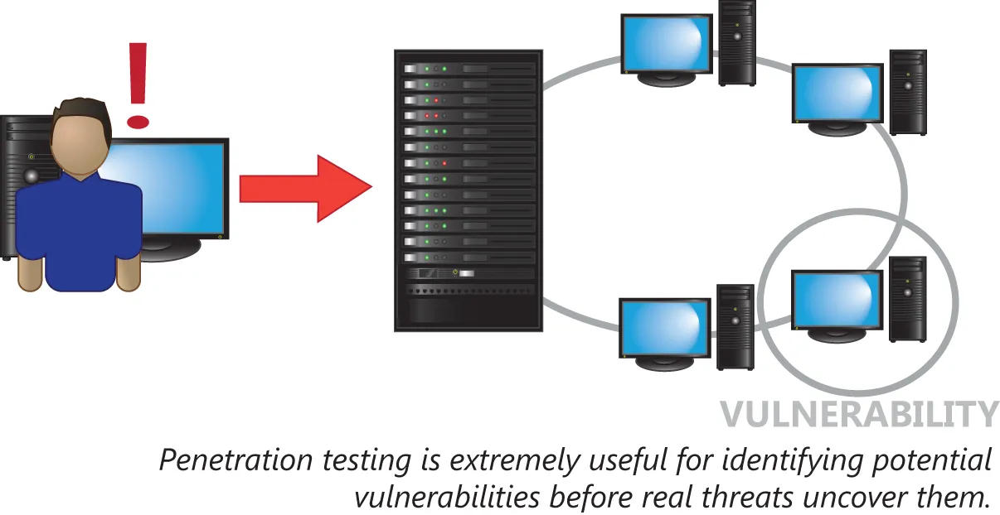

# 渗透测试的正确使用与漏洞扫描

了解所有这些威胁，只是解决威胁与漏洞问题的一半。另一半是掌握如何测试咱们网络的漏洞。这一小节将涵盖以下主题：

- 渗透测试
- 漏洞扫描
- 黑盒测试
- 白盒测试
- 灰盒测试

## 渗透测试

就可访问性而言，配置得当的网络是件好事。就安全性而言，配置的当的网络则是每家公司都希望拥有的无价资产。通过对咱们的网络进行渗透测试，以测试其咱们网络并发现其是否对安全性配置得当，是可能的。

**图 42.17** -- **渗透测试**

渗透测试的作用正如其听起来那样：他会通过尝试渗透咱们的网络而测试咱们的网络，如同某名黑客或某名恶意用户将要的那样，但不会造成咱们网络或数据的混乱或损害，相反咱们将运用咱们获得的有关咱们网络安全状态的信息在好的方面。这些信息对公司来说通常非常宝贵，使他们能对他们的安全基础设施进行改进。

这一测试类型应只在受控环境下的某一网络上，由训练有素的专业人员执行。这一测试还应在该网络所有者的许可下完成。由于渗透测试会模拟黑客行为与攻击，因此了解此类测试会于何时发生，以及能够考虑由于测试而造成的网络中断与不稳定，就十分重要。

渗透测试通常在网络中尝试以下操作：
© 绕过安全控制 © 主动测试安全控制 © 利用漏洞需再次强调，渗透测试结果应及时反馈给网络所有者，以便其采取措施修复发现的安全漏洞。关于渗透测试的最后一点说明涉及黑客行为本身——黑客可分为黑帽、灰帽和白帽三类。 黑帽黑客具有恶意，其唯一目的是窃取信息或破坏系统。灰帽黑客通常怀有特定目的，实施攻击仅为提高安全漏洞意识或进行抗议。白帽黑客通常被称为"道德黑客"，正是受雇执行渗透测试的人员。白帽黑客值得信赖，不会对网络造成损害，尽管他们具备实施破坏的工具和知识。 他们的能力不仅限于渗透测试，还涉及更广泛的网络与计算机安全领域。漏洞扫描 漏洞扫描通常被视为渗透测试中更被动的方法。该方法不涉及网络中断，对于需要高可用性和稳定性的网络尤为有利——它仅对网络进行漏洞"扫描"，而非尝试入侵。
