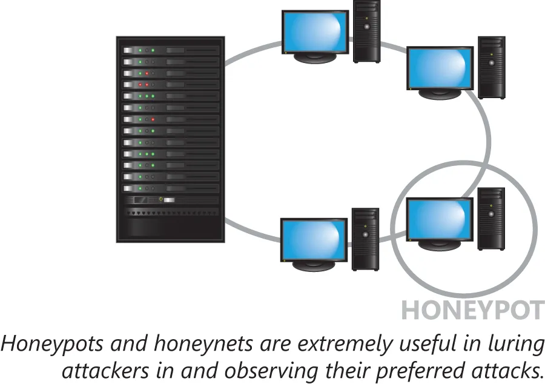

# 用于发现安全威胁与漏洞的评估工具与技术

在努力实现安全的网络过程中，能够检测到安全弱点或漏洞至关重要。这一目标通常是通过一些评估工具与技术，亦被称为管理性控制实现的。我们将检视数种的这些工具与技术，从而咱们就会对一些监控网络，确保其不会不必要地受到一些已知威胁的常见方法有所了解。这一小节将涵盖以下主题：

- 漏洞扫描
- 一些工具
- 风险计算
- 评估类型
- 评估技术
- 设计评审

## 漏洞扫描

当某一网络管理员使用工具寻找一些可能的安全漏洞时，那么他便是正在执行漏洞扫描。这些扫描的目的，是要检测并通知管理员，一些可能的安全漏洞。由于这些方法有助于使管理员意识到一些可能威胁，因此他们就是任何网络安全计划的重要组件。

这些工具和技术，只是寻求让管理员引起重视。他们属于一些识别弱点相对被动尝试。他们不会纠正发现的任何问题，他们也未必会向渗透测试软件那样，利用任何可能的弱点确定出他们是否属于一些真正的威胁。他们可能创建出一些误报，因为他们缺少要确定某一配置是否是有意的上下文。即使考虑到他们的缺点，漏洞扫描也是提升管理员对网络认知的一种非常棒的方法。

## 工具

在监控与评估网络安全方面，有数种工具类别，每种工具类别都有特定功能。

- 协议分析器

    对于即使是训练有素的安全分析师，原始数据也会无法理解。为了以更为人类可读的方式查看数据，管理员就会使用某种协议分析器。任何监控网络流量并生成有关该流量内容报告的工具，都属于协议分析器。

- 嗅探器

    某种嗅探器会捕获可用的网络流量，并允许管理员访问原始数据。例如，当某名管理员提前知道要查找的特定信息时，那么嗅探器便是最佳选项。嗅探器会提供查看所有网络流量的完整访问。

- 漏洞扫描器

    查看一些可能漏洞的一种基本方法，便是所谓漏洞扫描器的运用。这些扫描器通常会运行于某一本地网络上，并会尝试发现一些可能的弱点，而不会在发现弱点时利用这些弱点。

    漏洞扫描器通常将揭示某一网络中主机的数量及类型，以及检索这些主机上的已一些知漏洞，并按主机逐一列举。

    漏洞扫描器以多种形态与规模出现，并有着不同侧重。一些扫描器会专注于操作系统或应用的漏洞，而诸如 nmap 或 Nessus 等别的一些，则会只关注网络能力或漏洞。漏洞扫描器可检测并向管理员报告一些潜在弱点；然而，与所有评估工具一样，纠正任何错误配置，都留给了管理员。

- 蜜罐

    所谓蜜罐，属于一个以吸引攻击者注意目的，而部署在某一网络中的系统。这些系统一般会受到严密监控，且通常会刻意保留为较低安全性。背后的想法是要欺骗攻击者，使其认为他已获得了对某一生产系统的访问，随后监控该系统，以获得对攻击手法与目的的洞察。由于蜜罐允许管理员直观观察真实环境下的某次攻击，因此在检测和识别一些新的攻击形式方面，他们可能极具价值。

    为了吸引攻击者的注意，网络管理员不会部署单个虚假系统，而会一整套相互通信的受到密切监控系统。在数个物理系统或虚拟机得以部署时，所得到的系统分组，便被统称为一个蜜罐网络。无论是蜜罐系统还是蜜罐网络，都应与任何的真实生产信息完全隔离。

    

    **图 42.16** -- **蜜罐系统**

- 端口扫描器

    所谓端口扫描器，属于一种尝试确定出，哪些端口会响应网络通信请求的简单工具。某一开放端口，通常表示着某一运行在该端口上的特定网络服务。由于不同系统类型会不同地响应初始会话请求，因此端口扫描器还将通常能够识别操作系统及应用的版本。

## 风险计算

当选择了对抗及缓解威胁后，我们便会面临资源有限且边际效益递减的情况。要全面防范所有可设想到的威胁，几乎不可能或不可行。为了确定出于何处投入我们的安全时间与金钱最好，进行风险计算就会很有帮助。

一些威胁极为常见但一般影响很低，比如一条简单的垃圾消息。其他威胁可能更具影响力，但频率却低得多。在评估某一威胁的影响时，即使存在一些极不可能发生的一些更大威胁，关注那些将发生的威胁也会很有用。

当咱们只能防范有限数量的一些威胁时，那么咱们就不一定要安排对那些最大威胁，或那些最频繁威胁的保护，而应安排对那些咱们可于其中获得最佳投资回报威胁的防护。

## 评估类型

在决定要将安全资源分配于何处前，有数种可进行的评估类型。

在防御安全威胁时，重要的是要将财务与业务影响纳入考量。咱们在提升安全方面的那些努力，在最终尘埃落定时，都应属于网络的净收益。

要对威胁缓解措施进行一次快速的健全性检查，咱们可将某单次事件的预期损失（single loss expectary, SLE），乘以该事件在一年中发生的概率（the annualized rate of occurrence, ARO），从而得出这一风险的年化成本（annualized loss expectary,  ALE）。若缓解的成本加上新的 ALE，低于原 ALE 时，那么咱们可能做出了一项不错的投资。

所谓威胁评估，会尝试确定出哪些威胁能够影响咱们的网络。针对咱们用户的网络钓鱼尝试是否有所增加？垃圾邮件发送者是否正发送比平时更多流量到咱们的网络？是否有一些端口扫描，正针对咱们的系统运行着？在咱们能够对某一缓解策略作出决定前，重要的是咱们网络所面临的那些威胁。

正如早先曾讨论过的，一些漏洞扫描程序，便可能是确定出，咱们的系统可能未有效防范哪些威胁方面的一种了不起工具。了解咱们漏洞都位于何处，是消除这些漏洞的关键第一步。

## 评估技术

有一些可提升某一网络安全及可靠性，而要采取的重要步骤。由于安全属于一个持续过程，因此采取一些日常的安全手段，以确保对咱们计算环境的充分认知，就会很有用。

从安全角度看，一个重大危险信号，便是与以前或预期的行为的显著差异。遗憾的是，检测这些偏差的唯一方法，便是了解某一特定系统的 “正常” 看起来的样子。所谓基线报告，便是了解某一系统正常运行时，看起来如何的过程。一旦某一基线得以建立，管理员就可以更轻松地识别那些显著差异。

例如，请设想某一应用日志，正显示每小时 25 个 SSH 登录会话。在某一大型公司中，管理员可能无法立即判断这是一种正常行为，还是某一正在进行攻击的证据。在基线的辅助下，管理员就应能够轻松确定出，这一行为属于正常或异常。

应用的变更，或别的内部开发不一定应被信任。一些代码审查做法，可确保在这些代码投入使用前，有另一双眼睛查看这些代码。这样做可同时防范有意或无意的一些安区方面的过失。

所谓攻击面，是指某名攻击者可与咱们网络交互的途径数量。限制攻击面属于一项基本的安全原则。例如，管理员将希望知道哪些端口是开放的、登录于何处是被允许的，以及每种角色被授予了多少权限等。可用的网络交互方式越多，那么可能的攻击面就越大。

咱们可能有个依赖于某一框架的应用，这个框架位于某一通过网络通信的服务器上。那么在该应用、框架、服务器，或网络中的某一安全漏洞，都将咱们的私人数据置于风险下。咱们网络的每个组件，都需要单独加固，因为咱们数据的安全，取决于端到端的安全性，而不仅是单一组件的安全性。

## 设计的审查

在对任何程序或应用进行修改时，该应用的目的与其交互方式，应从一个高的层级加以考量。加密将是否需要？安全性是否需要内置于该应用并受该应用支持，还是安全性将由另一来源提供？某一应用的功能变更，是否将扩大网络攻击面？这些增加的风险能否得到缓解？

加固某个程序的最佳方法，并非在功能实现后再添加安全性，而要将安全性视为开发过程的一个组成部分。
