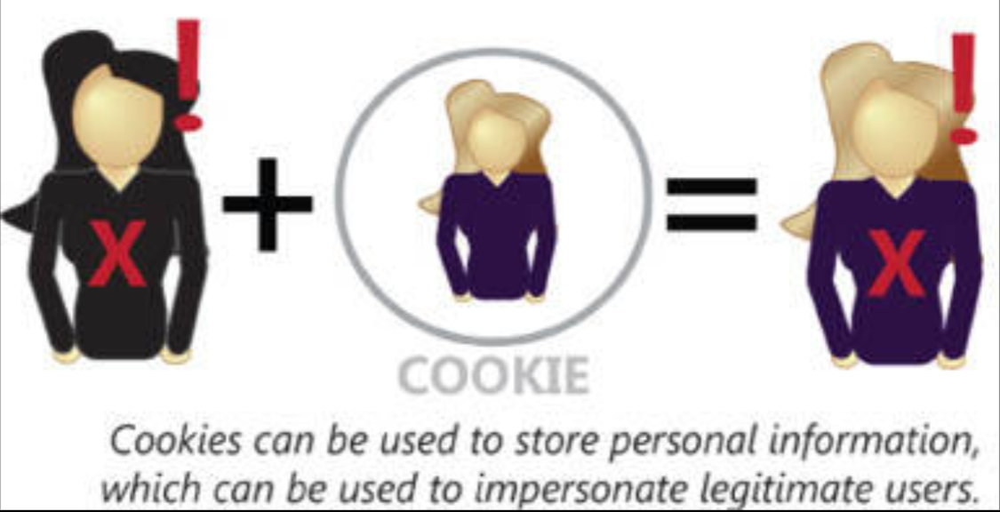
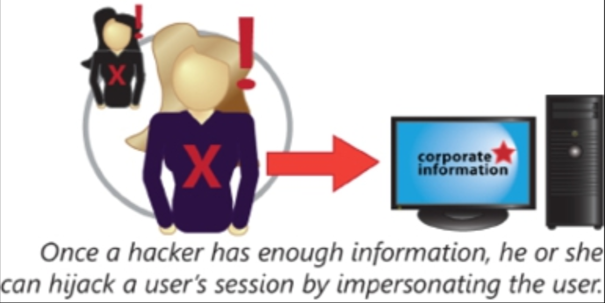

# 应用攻击的类型

攻击可以基础设施、用户或应用为目标。在这一小节中，我们将重点探讨那些面向用户的应用及 web 主机，可能有的不同漏洞类型，以及针对这些服务，在应用级别可能实施的攻击类型。这一小节将涵盖以下主题：

- 跨站脚本（XSS）
- SQL 注入
- LDAP 注入
- XML 注入
- 目录遍历/命令注入
- 缓冲区溢出
- 零日漏洞
- Cookie 与附件
- 恶意附加组件
- 会话劫持
- 头部篡改

## 跨站脚本攻击（XSS）

所谓跨站脚本攻击（或 Cross-site Scripting, XSS，以区别于层叠样式表 CSS），是针对某种 web 浏览器攻击的最常见攻击类型之一。在一次 XSS 攻击中，未授权的脚本代码会被客户端浏览器执行，而这就会将用户信息，暴露到某一未授权的第三方站点。

这段脚本代码可能并非来自该站点本身，而是来自允许来自第三方的代码，被客户端浏览器执行的某一站点漏洞。来自某一不相关站点的代码很常见，这正是这一攻击类型被称为跨站脚本攻击的原因。攻击代码还可能来自诱使用户点击的链接、服务器端脚本的未授权编辑、到托管于其他站点脚本的链接，甚至设计利用一些特定浏览器，比如某种渲染 HTML 代码的电邮浏览器的一些专门构思的 “图像” 链接。

大多数浏览器都被设计为阻止站点与别的站点通信，但黑客们一直在努力绕过这些安全特性。一次成功的 XSS 攻击，便能绕过这些防护机制，泄露用户名、密码、会话 ID 或其他机密信息。

为防范 XSS 攻击，管理员应将 web 表单中的所有代码，均作为潜在恶意代码处理，验证这些代码以确保其未包含未授权代码，比如指向恶意脚本而非图片的那些图像链接。

## SQL 注入

另一种可针对托管应用使用的攻击类型，便是 SQL 注入攻击。当某名攻击者能够输入会被某种 SQL 服务器，解析为 SQL 命令的信息时，这种攻击便会发生。例如，当某个表单允许用户输入会被发送到某一 SQL 数据库的信息，且仅有薄弱验证时，那么攻击者便能够指示 SQL 数据库删除某个数据表，或创建一次泄露私密数据的查询，而不仅是插入新数据。

防止 SQL 注入攻击的输入验证，会采取许多形式，而一些基本步骤，则是要确保用户输入被作为文本字符串，而不是代码对待，并要限制输入为一些特定字符集。某个字符集限制的名字字段，就会不允许数字与特殊字符，例如等号、括号或标点符号等。

## LDAP 注入

所谓轻量级目录访问协议（LDAP）注入攻击，与 SQL 注入攻击的原理相似。主要区别在于攻击的目标。攻击者现在不是寻求注入可执行 SQL 代码到某个 web 表单，而是尝试执行 LDAP 的代码。

就如 SQL 注入下一样，针对 LDAP 注入的最佳防护，是通过验证输入并确保所有用户输入均被存储为字符串，而非作为可执行代码解析。

## XML 注入

可扩展标记语言（XML）的注入，有着与 LDAP 及 SQL 注入的很多共通点。与其他代码注入攻击类型一样，一次 XML 注入攻击的目标，就是要在标准用户输入处插入可执行代码，不过是使用 XML。

## 目录遍历/命令注入

要考虑的代码注入最后一种形式，是目录遍历或命令注入攻击。在这种攻击下，某名攻击者可能发送一些会被文件 API 解析的特殊字符。例如，用户会请求某个域中的一个 web 页面，这个页面通常是存储于某一服务器上，一个特定目录下某个文件的文件名，如 `/var/www/html/index.htm`。该用户通常将前往 `example.com/index.htm`，以查看这个文件/web 页面。但是，某名攻击者则可能会尝试前往 `example.com/../../../../../etc/passwd`，或任何可能包含了该攻击者感兴趣文件的另一位置。

或者，某名攻击者可能输入一些文件系统命令，到一些 web 表单中，以期糟糕的后端设计将放行文件 API 尝试执行这一命令。例如，某名用户便可能将他/她的名字，输入为 `"test; rm rf /etc/passwd"`。这些攻击依赖于传递会被文件系统 API 解析的信息到 web 服务器。

与我们已探讨过的别的注入攻击一样，最佳防护措施便是验证输入内容，并将用户输入显式地作为字符串，而非可解析代码处理。

## 缓冲区溢出

所谓缓冲区溢出，是指发送到某一内存区域的数据量，超过该区域所分配以保存数据容量的一种攻击。在一次精心设计的缓冲区溢出攻击中，某名攻击者或能够执行任意代码。相比我们已讨论过的那些其他攻击，这些攻击一般更为复杂，因为他们运行于计算层次架构的更底层。一旦某名攻击者能够修改内存栈上的指令，那么他们往往便有了机器根控制权的路径。

缓冲区溢出攻击极难防御，但通过一些严谨的内存管理技术，他们可被阻止或降低。诸如微软的数据执行保护（DEP）等许多工具，都试图缓解或消除攻击者将缓冲区溢出，转变为系统根权控制的那些手段。

## 零日攻击

所谓零日攻击，属于那些当前尚不为公众所知的攻击。任何使用某一先前未披露漏洞的，不管采取何种手段的攻击，都被称为零日攻击。由于这些漏洞并未预先知晓，那么当咱们启用了被此类攻击作为目标的服务时，就没有防御他们的办法。最佳实践便是要禁用所有非必要服务，以缩小攻击面。零日攻击无法利用某一未在用软件中的漏洞。

## Cookie 与附件

Cookie 是由浏览器存储于本地硬盘上的一些信息。这些 Cookie 可能存储着一些对攻击者有价值的个人信息，比如某名用户的浏览习惯，甚至一些持久性会话 ID。当某名攻击者能够获取到某一会话 ID 时，那么这名攻击者便会能够劫持某一会话，从而有效冒充这一用户。

**图 42.11** -- **Cookies**

发送于电子邮件消息中的附件，可能包含恶意代码。需要用户交互才能传播的代码，常常会发现伪装为合法附件进入收件箱这一方式。几乎任何类型的文件，都可作为附件通过电子邮件发送。重要的是，要只运行那些来自可信来源的附件，以及那些预期的附件。仅仅因为某个附件看似来自某一受信任地址，并不一定意味着这名用户就是发送者。在打开电子邮件附件时，最安全的做法，便是将所有非预期通信都视为不可信。

## 恶意附加组件

许多用户应用都是可定制的。例如，Microsoft Office 就支持一些用于简化 Word 中格式化，或 Excel 中复杂计算的定制附加组件。Mozilla Firefox 则允许安装各类定制浏览体验的附加组件。但并非所有附加组件都无害。一些附加组件，出了执行他们所宣传的功能外，还具备充当间谍软件、广告软件或其他恶意软件的能力。要防范恶意附加组件，就要只从一些可信来源安装附加组件。

## 会话劫持

运用会话劫持，hijacking, or sidejacking，某名攻击者可利用认证过程中的漏洞，冒充某名用户。当某名攻击者能够获取到会话 ID 时，那么该名攻击者将能够在这一会话超时前，冒充该名用户。

**图 42.12** -- **会话劫持**

会话劫持可通过加密整个身份验证交换，包括绝不以明文形式发送会话 ID 等而予以防范。这样做保护了会话免于易受嗅探攻击，但会话仍会被以其他方式劫持，比如跨站脚本攻击，或通过获取对存储于某一 cookie 中会话 ID 的访问。要进一步防范会话劫持，建议要让那些不再活动使用中的会话超时，比如通过一个注销选项，或会话 ID 的快速超时。

## 头部篡改

攻击者可通过篡改由某名用户的计算机发送的信息，冒充该名授权用户。被盗的会话 ID，与伪造头部的结合，将允许某名攻击者提交与该名合法用户的别无二致的信息到某一服务器。在缺少很强的基于会话的认证下，通过使用已存储认证信息创建出的伪造头部，会足以冒充某名真实用户。

