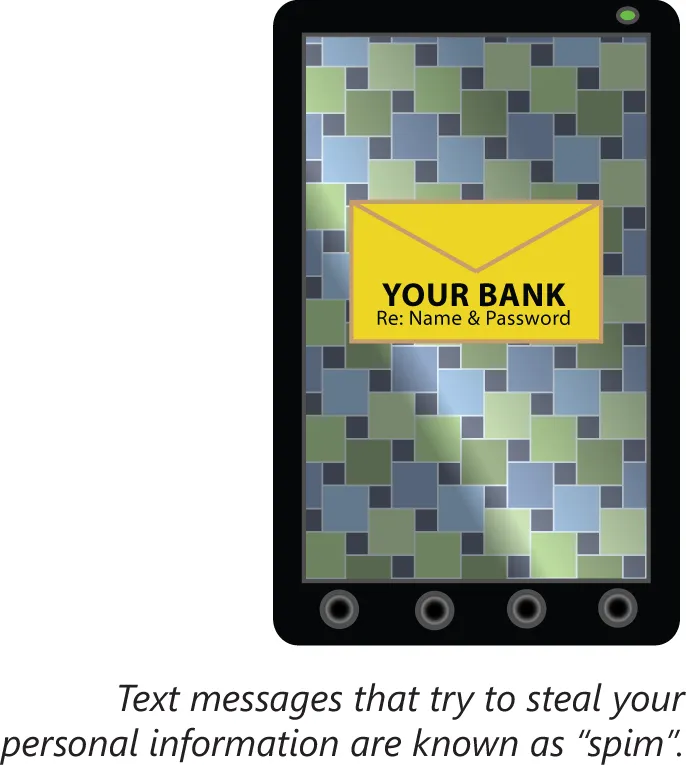

# 攻击类型

并对 PC 的每次攻击，都依赖于在 PC 本身上放置可执行代码。除恶意软件外，数种网络攻击也会得以尝试。这些攻击通常会根据恶意访问或攻击的方式加以分类。这一小节将涵盖以下主题：

- 中间人
- DDoS
- DoS
- 重放
- 蓝精灵攻击
- 欺骗
- 垃圾邮件
- 钓鱼邮件
- Spim
- 语音钓鱼
- 鱼叉式钓鱼
- 圣诞树攻击
- 域名劫持
- 特权提升
- 恶意内部威胁
- DNS 投毒与 ARP 投毒
- 传递访问
- 客户端侧攻击

## 中间人攻击

所谓中间人攻击，正如其名。从一点到另一点的通信，会被某一第三方，或即中间人查看并可能被篡改。在一次成功的中间人攻击中，由两端用户发送及接收的信息，会在他们不知情下被拦截并可能被篡改。

**图 42.2** -— **中间人攻击**

## DDoS

在分布式拒绝服务（DDoS）攻击下，来自多个地点的主机会协同工作，创建出海量网络流量。这种流量会有效导致目标系统无法区分合法流量与恶意流量，进而也无法有效响应除极小部分流量之外的任何流量。这些攻击类型依赖于某一极大自愿参与者群组，比如 “黑客行动主义” 组织匿名者（Anonymous），或僵尸网络。

**图 42.3** -— **分布式拒绝服务攻击**

## DoS

一种密切相关的攻击，便是简单的拒绝服务（DoS）攻击。其目标相同，就是要是服务器无法提供网络服务，但 DoS 攻击包括多种手段。这可以是以单一来源的大量流量攻击某一小型无防护服务器，也如以某一在线商店的某个特定漏洞或弱点为目标，破坏数据库一样复杂。无论具体方式如何，任何意图使某一服务离线的攻击，都属于 DoS 攻击。

## 重放

所谓重放攻击，是对网络通信，尤其是认证通信的捕获，以及以捕获到的通信冒充某名已认证用户的用法。这种攻击类型对一些简单认证协议，比如针对多次认证会话接受同一哈希化口令的那些协议便会成功。

## Smurf 攻击

所谓 Smurf 攻击，属于一种以从某一伪造的源地址，`ping` 网络广播地址方式，产生海量网络流量的简单方式。当目标的网络允许转发到广播地址的 `ping` 流量时，那么该网络中所有主机，都将同时接收 `ping` 并响应目标主机，从而造成网络流量过载。

由于这种攻击如此简单且广为人知，多数网络都已配置为防止这种攻击。例如，这些网络不会放行那些声称来自内部网络的入站流量，或那些指向网络广播地址的外部流量。

## 欺骗

所谓欺骗，是冒用他人身份的这种常见攻击手段的术语。这种骗可能是以其中 “发件人:” 或 “发送:” 行为伪造的垃圾邮件形式。其也可能在网络级别上完成，正如在我们的 Smurf 攻击示例中那样。为了拦截发送到某一共用交换机，却以另一主机为预期目的地的数据，其甚至会在 MAC 地址级别完成。任何冒充另一用户或设备的攻击，均属于欺骗攻击。

## 垃圾邮件

垃圾邮件，或未经请求的批量/广告电子邮件，如今属于网络中的常态。垃圾邮件会消耗带宽及终端用户的注意力。垃圾邮件可通过多种手段予以减少，包括创建批准的发件人列表、对关键字的启发式/贝叶斯过滤，以及诸如对抗地址欺骗 SPF 等身份验证协议。然而，只要垃圾邮件发送者仍有继续发送的动机，那么阻止垃圾邮件进入终端用户邮箱的斗争就会继续下去。

## 网络钓鱼

所谓网络钓鱼（Phishing，发音与 "fishing" 相同），是指试图通过冒充某一可信第三方，获取用户敏感用户信息的行径。这种攻击手法，通常会采取看似来自某一可信来源垃圾邮件的形式，链接到某个看似合法的网站。然而，这个网站属于某一真实站点的复制，任何信息都会前往到这一原始钓鱼邮件的发送者。网络钓鱼属于利用技术手段，获取私人信息的社会工程的任意形式。

## Spim

即时消息垃圾信息，有时称为 spim，通常用于网络钓鱼攻击种。网络钓鱼投送的另一种常见传播途径，便是手机短信。就像电子邮件的网络钓鱼一样，这些即时消息通常来自一些伪造的发件人，而他们寻求诱骗目标透露私人信息。

**图 42.4** -— **Spim 攻击**

为了将这些攻击与电子邮件钓鱼攻击，或基于 web 的钓鱼攻击区分，即时通讯与短信的钓鱼，也可称为 “短信钓鱼”（smishing），即短信（SMS）与钓鱼（phishing）的组合词。这种钓鱼攻击类型的目标并无不同，Spim/短信钓鱼这一绰号，仅用于指明这种钓鱼攻击中用到的介质。

## 语音钓鱼

通过电话的钓鱼攻击，被称为语音钓鱼（vishing，voice phishing）。正如电子邮件及短信两种钓鱼攻击，试图通过电话获取个人信息的诈骗者，会冒充某一可信第三方的代表。他们将通常伪造来电号码信息，使其与他们正冒充的合法来源信息一致。 随着 VoIP 的兴起，大规模的自动化语音钓鱼攻击便有了更低的进入门槛。此外，伪造的来电号码，会呈现一种伪造电子邮件地址所无法实现的虚假安全感。

## 鱼叉式网络钓鱼

与通常发送到海量收件人的标准钓鱼攻击相比，有时网络钓鱼攻击是针对一些特定目标或目标群体量身定制。当某一网络钓鱼攻击为冒充某家公司的内网站点，并仅发送垃圾电子邮件到该公司的员工，而与冒充某一公共网站与发送垃圾邮件到一大群人相反时，那么这种定向的网络钓鱼尝试，便是鱼叉式网络钓鱼的一个示例。

## 圣诞节攻击

在一次圣诞攻击，或圣诞树攻击中，某名攻击者会发送一个带有异常数量选项集或标志集的数据包。在正常网络流量中，这些数据包类型将几乎不会被创建出来。这一攻击类型的名字，便是源于这些数据包的这一异常性质。这些选项被启用后的数据包，据说像是圣诞树点亮一样。

不同设备将对这些特制特殊数据包反应不一。当某名攻击者清楚不同设备的预期响应时，那么他便能够收集有关该网络的数据。在网络设备无法快速有效地处理这些不同寻常的数据包的情形下，圣诞树数据包还会发起 DoS 攻击非常有用。

## 域名劫持

域名劫持，或网络钓鱼农场（pharming，即 phishing + farming），属于将访问合法网页的尝试，重定向到为网络钓鱼目的另一网页的行径。例如，某一 DNS 服务器可能已被入侵，从而当某一特定网络上的用户尝试访问他们的银行时，他们就会代之以发送到该银行页面的钓鱼者副本。

这些攻击与标准钓鱼攻击的不同之处在于，用户并非被诱骗访问某一虚假网站；而是他们尝试访问某一合法网站，而完成域名解析的技术，悄悄地发送给他们冒牌网站。

## 权限提升

其中攻击者能够获取到高于指派给他们权限的攻击，均称为权限提升攻击。这种攻击可通过冒用某一更高权限用户或进程的身份，或运用被忽视的权限分配新的与更高的权限实现。例如，`secretaries` 这个安全组，曾被意外支派了分配组成员身份的权限。若某位秘书随后分配给了她自己 `administrator` 的安全组，获得登入服务器及删除配置文件权限时，那么他便已构成了一次权限提升攻击。

## 恶意内部威胁

我们有时会以为安全威胁仅源自一些外部来源。这种认知是错误的。强大的安全方案，还要将组织内部那些人的可能恶意意图纳入考量。简单地信任组织内部所有人，既不现实又属于不必要的风险。最小权限分配原则，是恶意内部威胁可得以缓解的主要手段之一。其他手段可能包括一些缓解单个人员在未被察觉情况下造成损害的流程程序，比如定期工作轮换或监控等。

## DNS 投毒与ARP 投毒

所谓 DNS 投毒与 ARP 投毒，是指以重定向发往某些主机流量的意图，发送虚假更新到  DNS 与 ARP 解析器的行径。接受了虚假更新的解析器，便被说成是已被投毒。

在 DNS 投毒下，DNS 服务器就被攻击了。这可发生于（DNS）层次化结构中的任何级别，而并不必仅限于于权限域根服务器。当层次化结构中较低的任何 DNS 服务器，向该已被入侵服务器查询更新的名字解析信息时，他们也将受到毒害。请务必阅读任何优质 Network+ 指南中，有关整个 DNS 流程的内容。

ARP 投毒属于一种极其相似的过程，但不同于依赖 DNS 系统重定向用户的名字解析，其经由 MAC 地址欺骗而依赖于地址解析协议（ARP），在更底层处重定向流量。在 ARP 投毒的助力下，本地交换网络中所有发往某一目标设备的流量均可被拦截。这样做可实现中间人攻击，包括拦截、篡改或拒绝服务攻击。

## 传递访问

所谓传递访问，发生于在某台机器使用一系列信任，访问某一信任关系尚未显式建立的系统时。这会造成其中信任被意外授予的问题。一个非预期传递性访问的示例，可以是某种绕过了防火墙的客户端 VPN。这种 VPN 本意是配置为允许外部的笔记本电脑，取得对内部网络的访问。但是，当该外部笔记本电脑的用户，启用了 Internet 连接共享时，那么同一外部网络上的任何计算机，都将能够绕过防火墙访问该内部网络。

在建立信任关系时，必须进行仔细规划，以最小化传递性访问意外建立的可能性。

## 客户端侧攻击

与传递性访问密切相关的便是客户端侧攻击。客户端权限一定是在某一级别上授予的，但某一恶意攻击者利用必须授予给客户端的信任，获取比预期更高的访问权限是可能的。在指派客户端权限方面，最小权限原则非常重要，因为客户端计算机于何时可能被入侵尚未可知。某一被入侵的受信任客户端计算机，肯定会称为一名受信任的恶意用户。例如，当用户需要能够查询某一数据库时，他们未必需要同时具备修改或移除数据的能力。

如今安全方面的一项前在可怕变换，便是现代显卡，或 GPU 的并行处理能力。黑客们可能潜在地使用这种能力，通过对客户端计算机使用一些随机字符，执行暴力破解或猜测口令，并轻松破解口令。密码复杂性规则有变得无用的风险。

此外，使用 LANMAN 协议不被推荐，因为相比于诸如 NTLMv2 或 Kerberos 等其他协议，其显著不安全。在抵御暴力破解攻击方面 LANMAN 尤其薄弱，因为其仅存储七个大写字符，即超过七个字符的口令就会被拆分为两部分，进而可被分别破解，从从数学上讲，其要比破解单个长密码更为容易。

