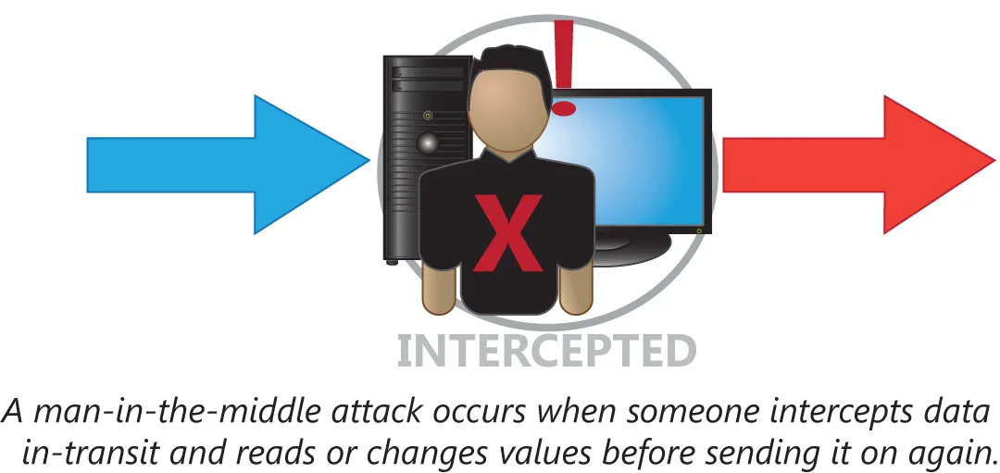
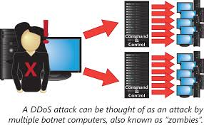

# 攻击类型

并对 PC 的每次攻击，都依赖于在 PC 本身上放置可执行代码。除恶意软件外，数种网络攻击也会得以尝试。这些攻击通常会根据恶意访问或攻击的方式加以分类。这一小节将涵盖以下主题：

- 中间人
- DDoS
- DoS
- 重放
- 蓝精灵攻击
- 欺骗
- 垃圾邮件
- 钓鱼邮件
- Spim
- 语音钓鱼
- 鱼叉式钓鱼
- 圣诞攻击
- 域名劫持
- 特权提升
- 恶意内部威胁
- DNS 投毒与 ARP 投毒
- 传递访问
- 客户端侧攻击

## 中间人攻击

所谓中间人攻击，正如其名。从一点到另一点的通信，会被某一第三方，或即中间人查看并可能被篡改。在一次成功的中间人攻击中，由两端用户发送及接收的信息，会在他们不知情下被拦截并可能被篡改。

**图 42.2** -— **中间人攻击**

## DDoS

在分布式拒绝服务（DDoS）攻击下，来自多个地点的主机会协同工作，创建出海量网络流量。这种流量会有效导致目标系统无法区分合法流量与恶意流量，进而也无法有效响应除极小部分流量之外的任何流量。这些攻击类型依赖于某一极大自愿参与者群组，比如 “黑客行动主义” 组织匿名者（Anonymous），或僵尸网络。

**图 42.3** -— **分布式拒绝服务攻击**

## DoS

一种密切相关的攻击，便是简单的拒绝服务（DoS）攻击。其目标相同，就是要是服务器无法提供网络服务，但 DoS 攻击包括多种手段。这可以是以单一来源的大量流量攻击某一小型无防护服务器，也如以某一在线商店的某个特定漏洞或弱点为目标，破坏数据库一样复杂。无论具体方式如何，任何意图使某一服务离线的攻击，都属于 DoS 攻击。

## 重放

所谓重放攻击，是对网络通信，尤其是认证通信的捕获，以及以捕获到的通信冒充某名已认证用户的用法。这种攻击类型对一些简单认证协议，比如针对多次认证会话接受同一哈希化口令的那些协议便会成功。

## Smurf 攻击

所谓 Smurf 攻击，属于一种以从某一伪造的源地址，`ping` 网络广播地址方式，产生海量网络流量的简单方式。当目标的网络允许转发到广播地址的 `ping` 流量时，那么该网络中所有主机，都将同时接收 `ping` 并响应目标主机，从而造成网络流量过载。

由于这种攻击如此简单且广为人知，多数网络都已配置为防止这种攻击。例如，这些网络不会放行那些声称来自内部网络的入站流量，或那些指向网络广播地址的外部流量。

## 欺骗

所谓欺骗，是冒用他人身份的这种常见攻击手段的术语。这种骗可能是以其中 “发件人:” 或 “发送:” 行为伪造的垃圾邮件形式。其也可能在网络级别上完成，正如在我们的 Smurf 攻击示例中那样。为了拦截发送到某一共用交换机，却以另一主机为预期目的地的数据，其甚至会在 MAC 地址级别完成。任何冒充另一用户或设备的攻击，均属于欺骗攻击。

## 垃圾邮件

垃圾邮件，即未经请求的大量商业电子邮件，已成为当今网络环境中的常态。它不仅消耗带宽资源，更分散终端用户的注意力。 通过多种手段可有效减少垃圾邮件，包括建立发件人白名单、基于关键词的启发式/贝叶斯过滤，以及采用SPF等专用身份验证协议来防范地址欺骗。然而只要垃圾邮件发送者存在持续发送的动机，这场阻止垃圾邮件进入终端用户邮箱的斗争就不会停止。
网络钓鱼（Phishing，发音与"fishing"相同）是指冒充可信第三方以获取用户敏感信息的行径。常见手法是伪装成可信来源的垃圾邮件，链接至看似正规的网站。然而该网站实为真实站点的复制品，所有信息最终都会流向原始钓鱼邮件的发送者。 网络钓鱼是利用技术手段获取私人信息的任何形式的社会工程学攻击。即时消息垃圾信息（Spim）即时消息垃圾信息（有时称为spim）常被用于网络钓鱼攻击。另一种常见的钓鱼攻击载体是手机短信。这些即时消息与电子邮件钓鱼类似，往往伪造发件人身份，诱骗目标透露私人信息。
