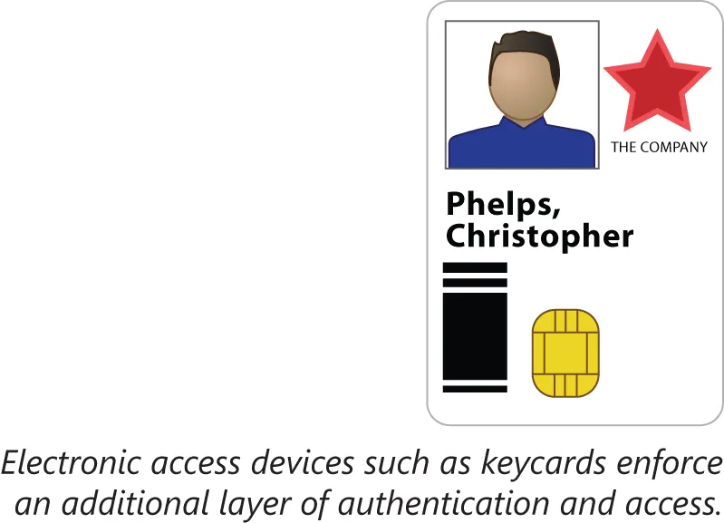
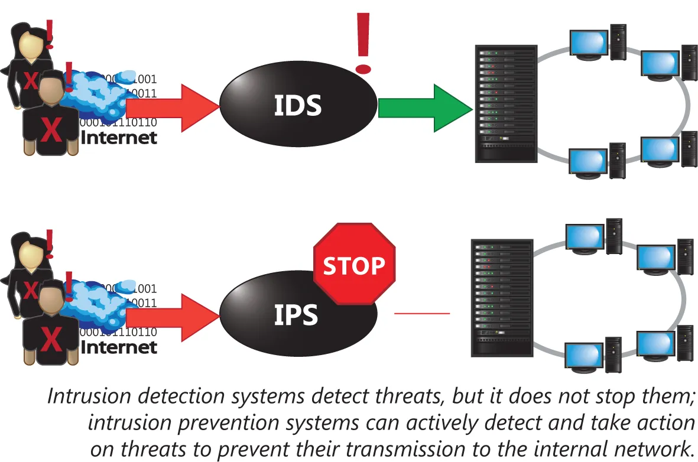

# 缓解与阻断技术的类型

既然我们已经深入探讨了各类威胁与漏洞，那么我们将仔细研究那些防护措施类型，以及可用于遏制攻击及减轻其损害的一些最佳实践。这一小节将涵盖以下主题：

- 手动绕过电子控制
- 监控系统日志
- 物理安全
- 系统强化
- 端口安全
- 安全态势
- 报告机制
- 检测控制与预防控制

## 手动绕过电子控制

用于增强物理安全的电子控制，包括比如门禁卡、钥匙扣的读卡器等设备。物理安全与电子控制的这种联系，意味着某名获取了系统任一环节控制的攻击者若，都将能够绕过这些防护。

**图 42.13** -- **电子控制旁路**

在某一整体安防设备的电子部件失效的情形下，那么物理部分也会对关闭/保护/安全状态失效，或进入不安全/开启状态。例如，通往某一安全区域的外门，可能被配置在安全门应在停电时放行其中的某人退出时，对关闭状态失效。失效安全应用于一些安全至关重要的情形下，而失效开启则应用于易用性/可用的连续性更重要的情形下。

## 监控系统日志

攻击者通常会留下他们的访问与获取对受保护系统失败尝试的痕迹。但是，除非这些信息被看到并采取行动，否则这些痕迹在保护咱们的系统方面并没有什么用。因此，必须要有人监控系统日志。

某名定期检查日志的管理员，当其知道要在何处查看入侵证据时，便将不必依赖当场抓获攻击者。有许多的日志类型，了解于何处查看便对防范威胁至关重要。

- 事件日志

    由网络设备生成，用于创建某一设备所采取的操作，或某一设备观察到的变更的记录。当某名攻击者正于某一计划维护窗口之外，启动某一服务时，那么事件日志就会是系统未授权访问或使用的首个迹象。事件日志还可追踪比如连接中断、系统离线或运行进程中的一些未预期报错等重要事件。

- 审计日志

    会追踪对系统某一特定部分所作出的变更。某一文件或实例的完整审计日志，将跟踪该文件的创建及每次该文件的编辑，及对该文件作出修改的人。审计日志记录的一种常见用途，便是追踪数据库中值的变更。比如，某一银行账户的余额，就不止存在于当时，还会存在于回溯审计轨迹时段内的所有交易列表中。审计日志对追踪系统的状态变更，以及检查作出这些变更的人非常有用。

- 安全与访问日志

    会追踪比如登录与身份验证尝试等一些安全事件。这两种日志将通常包含所尝试的认证类型，与验证尝试的结果等内容。安全日志会记录其中某一安全策略，阻止了某一用户完成某一特定操作，比如访问受限数据等的一些事件。访问日志则将追踪对敏感数据的每次访问或尝试访问，以威慑未授权访问，如同审计日志追踪对数据的每次变更，以确保数据完整性那样。

## 物理安全

- 硬件锁

    具可用于防止对像建筑群那样大的某一区域，或某一小过甚至珠宝盒区域的访问。尽管锁具形状大小各异，他们的目的都一样，即要求锁的操作者在放行访问前，予以身份验证。

- 安全门

    属于一种通常部署以保护对高度敏感区域访问的安全检查点类型。安全门通过仅放行一人进入两道门之间的狭小空间发挥作用。一旦外门密封关闭后，待认证人员将被锁在这个狭小房间，直至其得以成功身份验证，才会开启第二道门。这种物理安防措施虽必须加以监控，但其在防止未授权访问方面极为有效。

    

    **图 42.14** -- **安全门**

- 视频监控

    服务于两个主要目标。作为一种检测控制的实时闭路电视监控，可允许更少数量的安保人员，监控相比直接有效监控大得多的区域。这允许同样规模的安保力量，保护更大的区域，或以更细致方式，或更少人力保护某一较小区域。存档的视频监控，亦会是绝佳的调查信息来源，因其提供了对某一监控区域中，在某一给定时间段所发生事情的公正描述。

- 围栏

    对禁区的访问，可通过添加围栏阻断。虽然围栏本身并非安全的一种保障，但围栏可有助于防止咱们的安全区域成为唾手可得的果实。简单的低矮铁丝网围栏就会是种有效威慑，而带刺铁丝网围栏，或有着震动传感器的 12 英尺围栏，则可阻止攀爬。围栏有助于遏制对安全区域的随意入侵。

- 电子设备

    诸如门禁卡、工牌或钥匙扣等的读卡器，可被部署以要求访问某一区域的任何人，都要持有某种仅发放给特定人群的装置。这一方案兼具传统钥匙的优势，以及电子认证机制难复制方面难度提升层面的额外益处，还具备分配给每个用户一张唯一可撤销门禁卡的能力。

物理安防不需要其他技术。其就像一个人站在门口，只放行那些在一个预先批准名单上人员一样简单。

## 系统强化

在保护系统免受威胁时，咱们能采取的一些最基础且最有效的步骤之一，是通过禁用一些非必要服务，减少攻击者可利用的漏洞途径。这种做法被称为缩小攻击面，或系统强化/加固。初期系统加固的另一基础步骤，是要在修改默认用户名和密码时建立一些安全设置，并停用那些非必要或未在使用的账户。通过将系统配置为失效安全，或失效关闭，，从而某种未预期状态就会导致某项服务中断，而非系统造成某种可能的安全漏洞，系统会得到进一步加固。

建立安全系统的另一基础步骤，是将其打补丁到当前级别。不仅要给操作系统打补丁，还要给运行在系统上的应用打补丁。所有建立系统基础安全的这些初始步骤，统称为系统加固。得以加固的系统，就像被围栏包围的许多东西一样，不再像其以前那样容易成为目标。

## 端口安全

物理的端口安全，会阻止任何有着对某一网络物理访问的设备，获得对该网络其余部分的访问。黑客通常会寻找一些错误配置的代理服务器，通过在这些 “开放中继” 上反弹他们的流量，隐藏他们的来源。

MAC 地址属于每个以太网设备所分配的唯一标识符。仅放行网络上一些特定已知无问题 MAC 地址的过滤器，可在交换机或路由器上予以设置。这是一项可完全防范对本地网络的意外未授权访问的良好基本保护。但遗憾的是，MAC 地址易被伪造，从而允许某一冒充者绕过 MAC 地址防护。

网络访问控制（NAC）同样可以部署于某一网络中，要求设备连接网络时，在新连接的设备能够发送和接收大部分网络流量前，先要就到某一网络的连接向某一中心服务器认证。[802.1X](https://en.wikipedia.org/wiki/IEEE_802.1X) 是 NAC 的一种简单实现，其实现了在客户端连接网络时中心服务器对其认证，并根据客户端的认证信息，将其分配至特定的 VLAN。这样做便能能有效划分网络，阻止未授权主机发送或接收流量。

与系统加固一样，防止网络访问的最有效手段，是彻底禁用对非必要端口的访问。针对端口安全，这意味着在任何新的网络设备连接前，均需管理员的干预。

## 安全态势

系统强化属于构建安全网络服务基础设施的关键第一步。除了诸如系统加固与配置系统的日志记录/监控等，这些基本安全步骤外，管理员还应建立他们系统日常 “正常” 使用为何这一态势。只有了解那些正常负载与活动是什么，管理员才能设置一些触发机制，或及时发现属于异常的活动。

即便环境改变了、一些新应用被安装了、一些新的威胁出现了，或一些新系统被安装了，咱们的环境都仍应维持这种基线的安全级别。这一要求意味着安全维护是个持续的过程。

某名管理员可确保某一安全基线维护的方式之一，便是对网络服务器与主机的持续监控。当某一未满足基线安全配置的主机被检测到时，那么其便可得以隔离，同时配置可得以纠正。例如，某一远端用户可能将某一笔记本电脑带到异地一段时间，在返回后就需要更新操作系统补丁级别。在没有持续的监控与补救下，那么这一缺陷便不会被检测到。然而，通过运用监控与 NAC，管理员便可立即将这一设备置于某个用于补救的网络，而不会面临对既有网络未受保护访问的风险。

## 报告

数据可从数种来源得以收集并记录记录，也可以主动得以呈现。这一来源称为报告。在任何监控系统中，配置警报或告警，或解析日志记录以显示出随时间变化的，都具有重要价值。

所谓告警，可通过电子邮件、电话或短信联系管理员或管理员团队。一般情况下，告警为一些重要且紧急的问题所保留，例如停电、意外服务中断或一些严重的环境问题等。

所谓警报，发挥与告警同样的作用，但通常对一些较低紧急事件发出。警报通常针对一些非紧急但重要的信息配置。可能需要触发警报的一些事件，分别是磁盘空间不足、高于正常网络流量、异常数量的登录尝试，或打印机耗材告急等。这些较低紧急的事件，通常无需多人的立即响应，但需要留意以及可能需要响应。

长期积累的信息，可有助于发现一些偏离预期标准的异常事件。高 CPU 使用率警报，在一台服务器与另一服务器将可能阈值可能极为不同。为了了解要将告警与警报阈值设置于何处，建立预期活动水平的基准就非常重要。识别并应对环境变动的一种方式，便是运行一些报告，以查看一些监控指标方面的趋势，比如可用磁盘空间等。持续关注那些随时间推移的变化，能使管理员更具洞察力，他们便更能解决他们环境下不断改变的需求。

## 检测控制与预防控制

为了有效保护资产，咱们可采取检测或阻断未授权行为的一些步骤。例如，某个房间可通过一把锁而得以保护。而很多房间则会通过阻止闯入者的简单围栏而得以保护。一名守卫可派驻于某个门口，阻止任何人通行这道门。这些都是可被实施，以阻止安全违规的物理阻止控制的示例。

可实施的安全控制的另一方式，属于检测控制。这些控制类型更侧重于创建所发生事件的准确记录，而非将阻止事件发生放在首要位置。检测控制的一个示例，便是某个未积极监控，但会出于在必要时今后查看的目的，存储所有视频的摄像头。尽管对检测系统的认知，可能起到威慑作用，但检测系统本身并不会阻止未授权访问。

在保护计算机网络免于未授权访问时，有两种技术类型，即入侵检测系统（IDS）与入侵防御系统（IPS），分别大致相当于录像监控摄像头，与安保人员。

**图 42.15** -- **入侵检测系统**

所谓入侵检测系统（IDS）技术，非常适合于检测未授权活动并向某名管理员发出警报。IDS 的作用有限，因此其无需广泛的网络集成。当某种 IDS 能够查看到网络流量，那么他便能分析流量并就异常行为向管理员发出警报。就像监控摄像头一样，IDS 只会观察与报告。

不同于 IDS 的简单观察与报告，IPS 具备在网络威胁到达某一网络上的受保护主机前，自行予以响应的能力。除非网络流量通过这一 IPS 路由，这一能力是不可能。强大的 IPS 可识别数种攻击类型，比如以 web 主机为目标的 SQL 或其他注入攻击等，并会在这些恶意代码投送到其负载前予以拦截。

一些先进的 IPS 与 IDS 部署，可执行网络行为分析，以智能地针对一些异常流量模式加以响应。这一特性类似于管理员会创建某种预期行为基线，及配置异常行为警报的做法，但其是完全自动化的。

尽管多数 IPS 部署都会监控网络流量，也有一些基于主机的入侵防御系统（HIPS）。这些系统会安装在主机上，以类似于某种反病毒软件的方式，监控主机的工作。然而，HIPS 的作用并非保护主机免受病毒影响，而是保护该主机免受攻击影响，比如缓冲区溢出利用等，并在该主机上强制执行一些安全策略。

