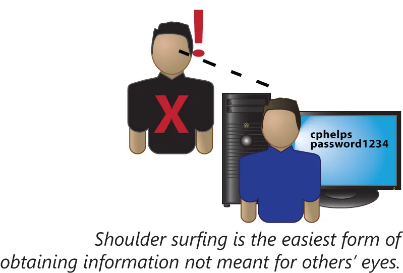
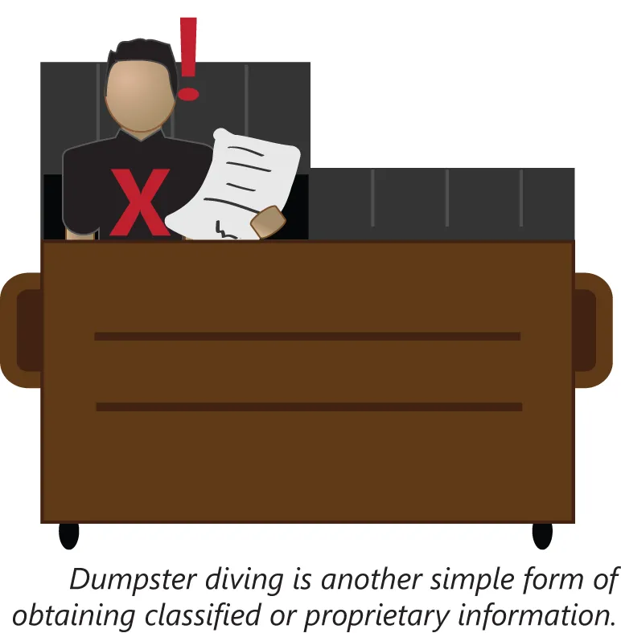
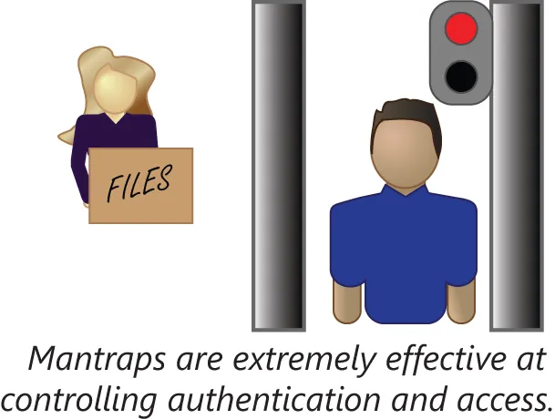

# 社会工程攻击的类型

获取私有数据及受保护区域的未经授权访问，既有技术手段，同时也有非技术手段。当某次攻击依赖于老式的狡诈而非技术手段时，那么这种攻击被称为社会工程。这一小节将涵盖以下主题：

- 肩窥
- 垃圾箱翻找
- 尾随
- 冒充身份
- 恶作剧
- 鲸鱼钓鱼
- 语音钓鱼

## 肩窥窃取

所谓肩窥窃取，或者即直接窥视某名用户于其屏幕上代开的信息，属于窃取手段的一些最简单方法之一。在公共场所或一些未获准查看某些数据的同事中间，用户可能忽视他们所访问数据的敏感性。在离开他们的计算机时，他们可能让敏感信息留存在计算机屏幕上。

**图 42.5** -— **肩窥**

防范肩窥的基本措施，包括安装限制屏幕可视角度的隐私屏幕；培训用户不要在非私密环境下访问机密文件；以及部署在一段时间内未使用后自动锁定计算机的策略。

## 翻找垃圾箱

翻找垃圾桶，获取翻拣某一组织垃圾的行径，属于另一种咱们组织的安全可能被攻击的低技术方法。敏感数据可能会以多种途径，最终取道咱们的垃圾桶。敏感文件应被碎纸处理，同时敏感介质或硬件应被销毁。

要防范翻找垃圾箱行为，就要记住，将某物丢到垃圾箱中，并不会破坏他。当咱们需要安全地处置敏感数据时，那么就要在丢弃前销毁他，或雇佣安全的粉碎及处置服务为咱们销毁他。

## 尾随

陪同某名获准人员通过某一检查点，而逃避物理防护某一区域的保护措施，通常是可行的。这种行为被称为尾随。当任何获准通过的人都将放行任何人，那么安全门便是无效的。

至少，用户应培训为仅放行他们认识的人。这包括那些双手抱着设备、或推着小推车或身着制服的人。公司文化应强调每个人都必须身份验证。然而，人们可能不愿对试图尾随他们通过的人关上门。因为有着帮人开门的强烈社交期许。

**图 42.7** —- **安全门**

要防范这种 “热心” 行为，安全检查点可予以设立，并由一名安保人员监控。一种此类检查点，便是安全门。在安全门下，一种两道门的装置，控制着对某一安全区域的进入。试图进入这一安全区域的人员必须先通过第一道门，这道门必须在此人身后关闭。这个小认证区域，一般不够站下多人。随后，这个人必须在第二道门将打开前身份验证。当这个人身份验证失败时，那么他/她将被困住，直至安全响应得以完成。

## 冒充身份

所谓冒充身份，属于组织安全的可能被攻破的另一种手段。这种攻击可能发生于当面接触、通过 Internet 或通过电话。用户应了解，检查联系他们，但他们私下并不认识的人的身份，是没有问题的。一种快速方法方法便是，使用某一可信来源的信息回拨这个人，或让某名双方都认识的用户，证明这个人的身份。正如网络钓鱼攻击下的情况一样，防范假冒身份的最强大防御手段之一，便是用户的警惕。

## 恶作剧

虽然恶作剧本身一般不属于安全威胁，但他们可能属于巨大的时间浪费。当涉及对他们计算机的所谓威胁时，用户往往会过度轻信。咱们就可能认识一些会转发他/她所收到的所有邮件链的人。要鼓励咱们的用户，在重新发送他们收件箱中任何声明前，核实这些邮件声明的真实性。这种核实就如同询问网络管理员，或查证 snopes.com 网站一样简单。抵御恶作剧的关键，在于保持怀疑态度，及转发前要核实。

## 鲸鱼攻击

所谓鲸鱼攻击，属于一种网络钓鱼攻击，通过各种手段，专门针对某一组织高层的个人。这种攻击会精心策划将该组织内其他用户，或公开网络获取的个人信息纳入考量。咱们在某一组织层中达到的地位越高，那么一次成功钓鱼攻击的回报就越大。那么这就意味着，一次针对某一组织高管的钓鱼攻击，相比一次普通钓鱼攻击，就会投入多得多的努力。要防范鲸鱼攻击，培训高管识别钓鱼攻击并演练，相比普通用户就更有意义。

## 语音钓鱼

所谓语音钓鱼（Vishing），正如前一小节所提到的，只是通过电话进行的网络钓鱼。这种钓鱼攻击类型，可以是鱼叉式钓鱼或鲸鱼钓鱼，也可以是自动化的大规模钓鱼攻击。当某一通话与伪造的来电显示信息结合时，那么虚假信任便会很容易建立。当回拨咱们的服务提供商电话时，咱们应如同咱们回复电子邮件那样同等警惕。不要回拨任何留下来的号码，而要该服务提供商已存档的号码。
