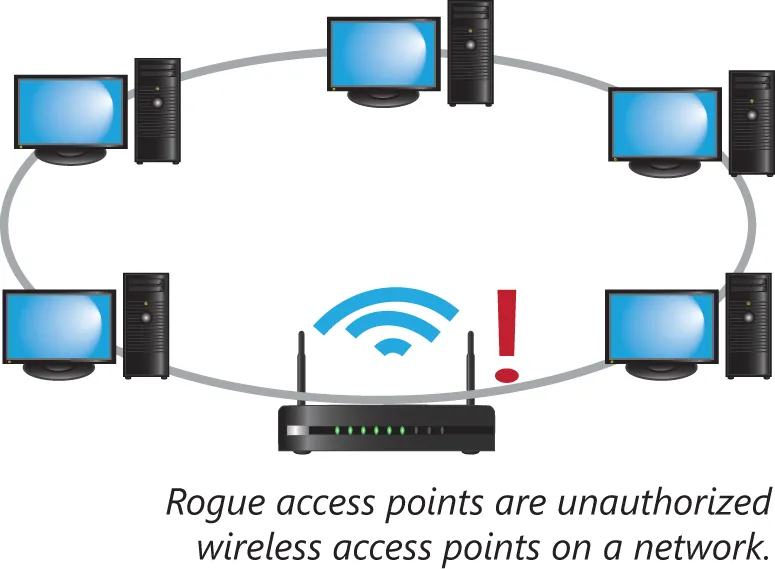
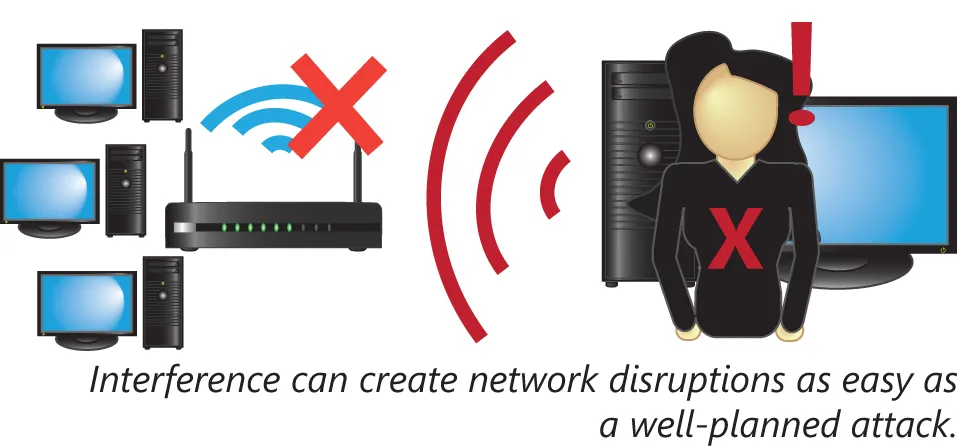
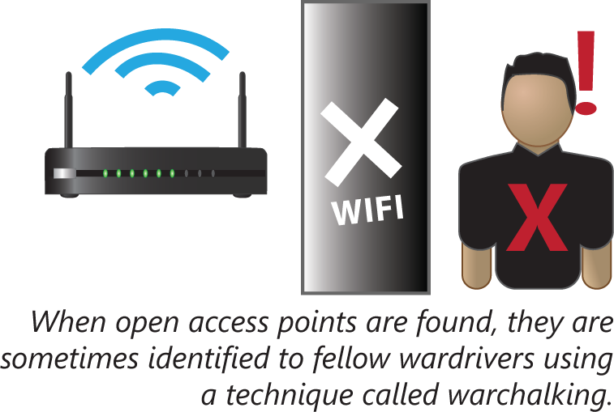

## 无线攻击的类型

由于无线网络无需物理接入，因此他们对黑客攻击尤其脆弱。数种攻击或漏洞，都会影响无线网络。这一小节将涵盖以下主题：

- 恶意接入点
- 干扰
- 孪生恶魔
- 无线网络侦察/战争驾驶
- 蓝牙劫持
- 蓝牙窃取
- 战争涂鸦
- 初始化矢量攻击（WEP）
- 数据包嗅探

## 恶意接入点

所谓恶意接入点，是某一网络中的一个未经授权的无线接入点。在缺少网络访问控制协议下，添加一个未授权的无线接入点到某一既有网络极其简单。这种对某一网络的无线接入点添加，会在无需物理接入下，便放行了对咱们网络的访问。

**图 42.8** -— **恶意接入点**

要检测与打击恶意接入点，建议定期以无线网络检测器，或嗅探器进行现场勘测，在网络的物理区域内巡查的同时，监控未经授权的无线流量。

## 干扰

无线网络运行在的射频的某一特定范围。某一攻击者可通过在该网络将运行的一些频段内产生强烈干扰，而进行 DoS 攻击。

**图 42.9** -— **干扰**

## 孪生恶魔

所谓孪生恶魔攻击，是以一个看似相同的接入点，对某一授权接入点的替换。通常，只要 “孪生恶魔” 的信号强度更强，那么甚至不需要从网络中物理移除 “孪生好人”。孪生恶魔 AP 将有着同样的 SSID 及认证信息，从而允许客户端以与平常相同的方式连入。这种孪生恶魔攻击，会给到攻击者对在这一无线链路上传输的所有通信的访问权限，而不会就网络基础设施中的任何变化警示终端用户。

## 战争驾驶

所谓战争驾驶（wardriving），是指带着某种网络探测器，在一些可接入无线通信的区域周边驾驶车辆的行为。战争驾驶攻击目的，通常出于未授权使用，找到开放或低安全性的 Wi-Fi 热点。由于无线网络仅受系统物理传播限制，Wi-Fi 网络可能无意中扩展到某一公共可访问区域。

## 蓝牙劫持

所谓蓝牙劫持，或 bluejacking，会利用蓝牙技术中的一些漏洞，发送诸如图片或联系人等一些未授权的消息或其他信息，到一些启用了蓝牙的设备。这种攻击不会授予攻击者对设备的控制权，或对存储于目标设备上数据的访问。蓝牙劫持更像是垃圾邮件，而非黑客行为。

## 蓝牙窃取

所谓蓝牙窃取，bluesnarfing，是给为了访问某一远端设备上的数据，而对某一启用了蓝牙设备的攻击取的名字。这一弱点以前很普遍，并且其可能仍存在于一些使用着较旧蓝牙技术的设备上。蓝牙协议的一些安全改进，现在要求在远端设备可访问本地内容前，两个设备先要配对。

一次成功的蓝牙窃取攻击，尤其是针对较旧的蓝牙技术，未必需要任何的用户操作。即使在没有任何用户通知下，访问某一锁定设备上的数据也是可行的。

## 战争涂鸦

所谓战争涂鸦，warchalking，是指公开标注某一无线网络可访问的行为；其常与战争驾驶配合。战争涂鸦背后的想法，是要让公众直到，存在开放接入点的任何区域。如今随着咖啡馆，以及类似提供并宣传免费 Wi-Fi 的场所无处不在，战争涂鸦的目的与做法，已基本消亡。

**图 42.10** -— **战争涂鸦**

## 初始化矢量攻击（WEP）

有线等效加密（WEP）协议，利用两个组件，创建加密待发送及接收的数据的密钥。40 位的 WEP 密钥是其中一个组件，而在这一密钥使用期间，针对每个数据包都会随机且具唯一性的 24 位初始化向量（initialization vector，IV），便是另一组件。遗憾的是，这个小的 24 位初始化矢量的密钥空间，仅允许少于 1700 万个可能的初始化矢量变体。

此外，IV 是以明文形式发送到接收设备。这种可窃听的 IV，与最终同一密钥下某一 IV 的重用组合，便造成 WEP 下的一项弱点。某一攻击者生成捕获 IV 的流量、观察 IV 的重复使用，并运用收集到的信息，破解这一 WEP 密钥使用期间的加密。由于 WEP 加密可被破解的相对容易，其已不再被视为保障无线通信安全的有效手段。

## 数据包嗅探

所谓数据包嗅探，即监控某一网络上流量这一做法，可在有线网络或无线网络上完成。在某一无线网络（尤其有着弱加密的网络）上，数据包嗅探会是个更大问题，因为与所有无线的事物一样，物理访问不再需要。此外，在某一交换式有线网络中的数据包嗅探，将只会捕获单一网段的流量，或专门重定向到数据包嗅探设备的流量。而在无线网络上，嗅探器，尤其是靠近接入点的嗅探器，则可看到所有数据。
