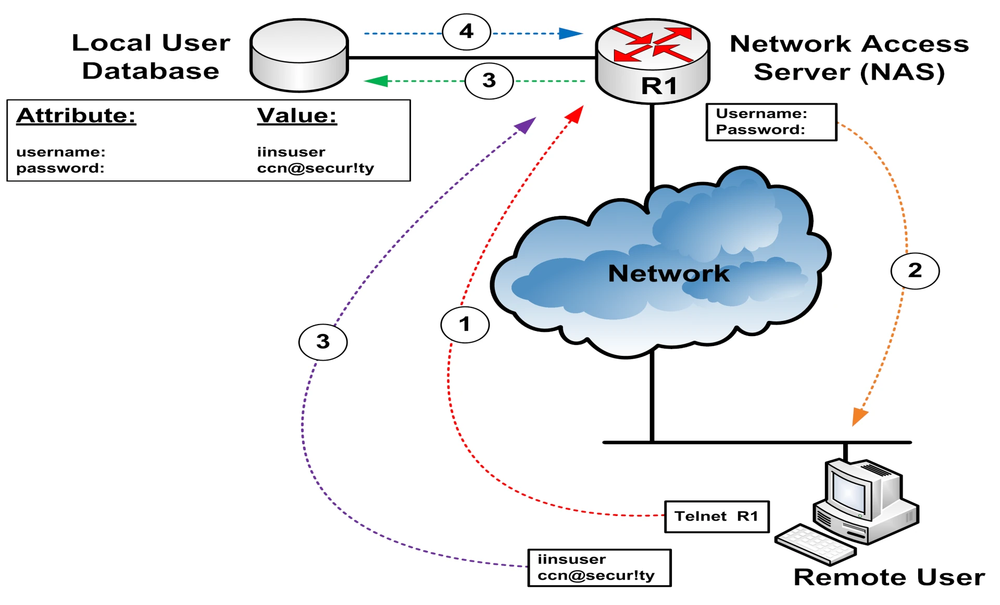
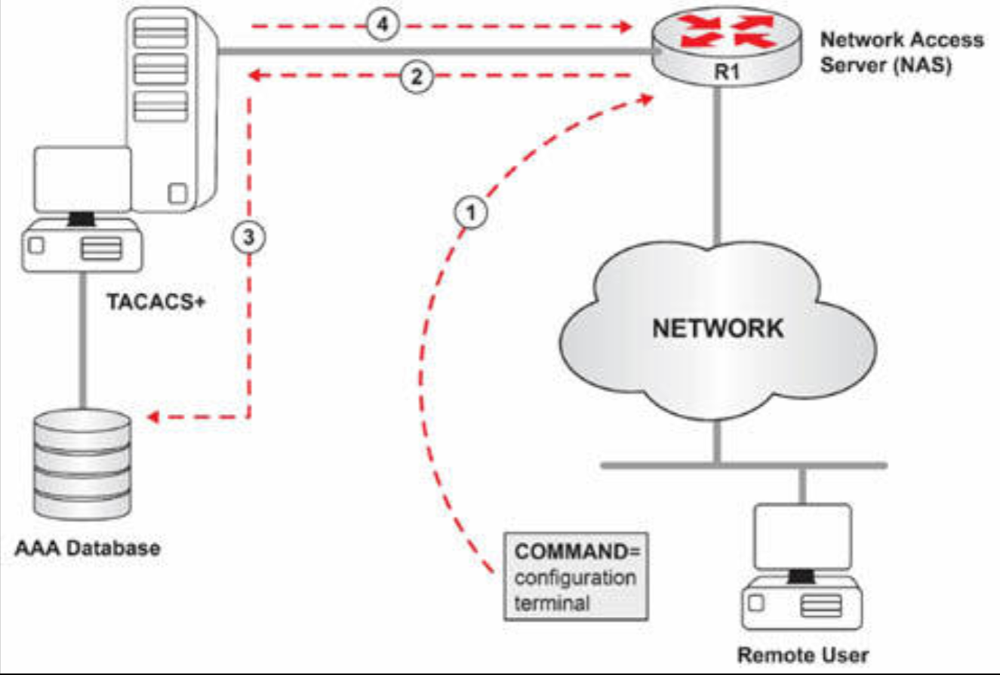
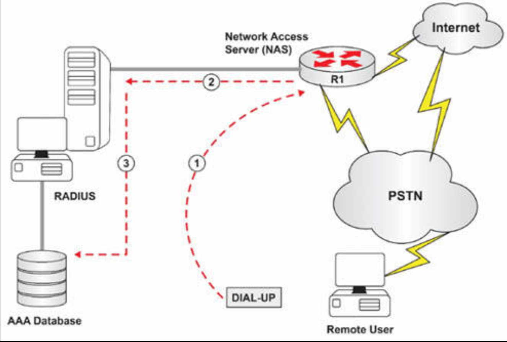
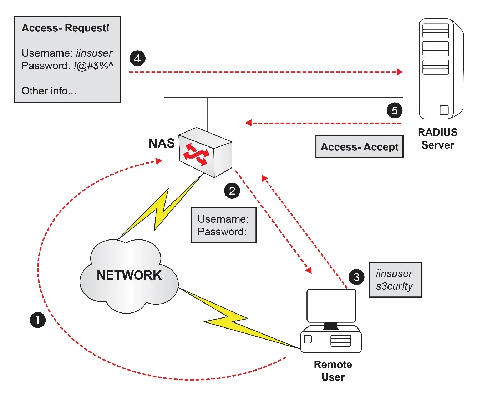

# 认证、授权与记账

随着身份安全与访问管理日益复杂，网络及网络资源亟需防范未授权访问。AAA 框架满足了这一需求。

## AAA 概述

认证用于验证身份（即用户是谁）；授权用于确定特定用户可以做什么（即那些服务对该名用户可用）；记账则用于审计跟踪（即该名用户做了什么）。

AAA 提供用于控制网络访问的灵活、模组化解决方案。他提供了在路由器、交换机或防火墙等网络设备上，设置访问控制的主要框架。在此类设备中，AAA 服务可用于管控管理性访问，比如称为字符模式访问的 Telnet 与控制台登录等。此外，AAA 还可管理网络访问，比如称为数据包模式访问的拨号或 VPN 客户端访问等。使用 AAA 的主要优势如下：

- 标准的认证方法
- 可扩展性
- 更强的灵活性与控制
- 多重备份系统

AAA 使用标准的认证方法，包括远程认证拨入用户服务（RADIUS）、终端访问控制器访问控制系统增强版（TACACS+）及 Kerberos。TACACS+ 与 AAA 的认证方法，将在这一章稍后详述，而 Kerberos 当前不在考试大纲中。

AAA 适应各种规模网络。多个安全服务器可得以部署，实现访问控制的轻松添加。这一特性允许 AAA 可从只有少量设备的小型网络，扩展到可能包含上千设备的大型网络。

除了可扩展性外，AAA 还提供极强灵活性与控制。例如，在一些小型网络中，AAA 服务可由存储于网络设备上的本地数据库管理，而不是使用某种安全服务器。用户名及口令凭据，可存储在该设备的本地数据库中，并由 AAA 服务引用。AAA 服务还可被配置为按用户、按组或按服务的控制。

AAA 允许设备指向通常称为服务器组的多个安全服务器。用户、设备及服务信息，可在多台服务器间复制，这一特性提供了大型网络中的冗余。

## AAA 模型

AAA 框架以一种模组化的方式，使用一套三种的独立安全功能，提供安全访问控制。AAA 模型用于控制对网络设备的访问（认证）、执行策略（授权），及审计使用情况（记账）。AAA 使用 RADIUS、TACACS+ 及 Kerberos 作为认证协议，管理 AAA 的安全功能。通过使用 AAA 引擎，网络设备会以这三种协议，建立与安全服务器的通信。提供安全控制，进而由 AAA 提供了的这三项独立安全功能如下：

- 身份验证
- 授权
- 记账

## 身份验证

身份验证用于在允许访问网络资源前，验证用户身份。其发生于某种客户端传递相应凭据到安全服务器以供验证时。这一验证基于检查用户的凭据，用户凭据可能包含以下任意内容：

- 用户所知的信息，这被成为根据知识的认证。这一方式通过只有该名用户知道的信息，比如用户名和密码等检查身份；
- 用户拥有的东西，这被成为根据持有的认证。这种方式通过仅由该名用户持有的某物检查身份。这种认证类型的示例，包括 ATM 卡或令牌（比如 RSA 安全令牌等）；
- 用户是什么，称为用户特征或生物特征。这种认证方式属于最强的身份验证方式，因为其避免了与另外两种认证方式有关的缺陷，比如，口令会被破解或 ATM 卡会被盗。生物特征的示例，包括指纹、面部识别及 DNA 等。

一旦安全服务器已接收这些凭据后，他将响应以一条通过（接受）或失败（拒绝）的消息。认证还提供了一些其他服务，比如挑战与响应、消息传递支持，甚至加密，具体取决于所实现的安全协议。

## 授权

授权提供了在用户已成功认证后，对网络资源执行策略的能力。换言之，授权用于确定用户、组、系统或服务器等，被允许执行的操作。将在下一小节描述的一些属性-值（Attribute-value, AV pairs）对，会定义出与该名用户关联的用户权限，从而确定出这名用户的具体权限。

客户端会查询 AAA 服务器，以确定某名用户被授予了执行哪些操作，服务器则会提供一些定义用户授权的 AV 对。客户端随后便负责根据这些 AV 对，执行用户访问控制。

## 记账

记账通过收集并发送可用于记账、审计及报告的信息到安全服务器，提供了捕获资源利用率的各种手段。这些信息可能包含用户身份（已登入的人）、会话起止时间、执行的命令，以及诸如已传输的字节或数据包等流量信息。

记账记录还由一些记账的属性值对构成。记账方式必须经由 AAA 定义。客户端随后会将这些记账记录，与相关的 AV 对一起，发送到 AAA 服务器用于存储。

现在咱们熟悉了 AAA 框架内三项独立安全功能，那么了解他们的如下关系就十分重要：

1. **在没有授权功能下，认证也是有效的**。这意味着可在无需启用对用户的授权下，启用对这些用户的认证；
2. **在没有记账功能下，认证也是有效的**。这意味着可在无需启用对用户的记账下，启用对这些用户的认证；
3. **在没有认证功能下，授权功能便无效**。这意味着在咱们对用户授权前，咱们必须对他们加以认证。咱们无法授权任何尚未认证的人；
4. **在没有认证功能下，计费功能便无效**。这意味着在咱们对用户启用记账前，咱们必须对他们加以认证。咱们无需启用授权，因为在没有授权下，认证也是有效的。

## AAA 的运行

为了 AAA 发挥作用，那么某一网络访问服务器（NAS），即诸如路由器、交换机或防火墙等的任何设备，在提供 AAA 服务前，就必须要能够访问某名特定用户的安全信息。这一信息可能在本地存储（即在该 NAS 自身上），抑或存储于远端（即在某一 RADIUS、TACACS+ 或 Kerberos 服务器上）。

虽然两种方式均有效，但重要的是要记住，本地的用户数据库，仅支持有限数量的特定于思科的一些安全属性对（AV），而基于服务器的 AAA 则提供了更多能力与存储于该服务器上，而非网络设备上的安全信息。所谓属性值对，只是由诸如用户名/密码等的属性，及该特定属性的某个值，构成的一个受保护的网络对象。

为了强化属性值对这一概念，下图 43.1 演示了在安全信息本地存储于该 NAS 上时，他们在 AAA 服务中的运用。

**图 43.1** -— **NAS 上的属性值对**

根据上面的图 43.1，在步骤 1 中，远端用户尝试经由 Telnet 连接到 `R1`（NAS）。假设这个 NAS 已配置了 AAA 服务，将其本地数据库用于身份验证，那么这个 NAS 就会呈现给该远端用户以用户名与口令的提示符，如步骤 2 中所示。

该名远程用户随后就会输入他/她的凭证，提供了用户名 `iinsuser`（这便是属性）及口令 `ccn@security`（这便是该属性的值），如步骤 3 中所示。NAS 随后便会将这一信息，与其本地数据库比对，如下表 43.1 中所示。

**表 43.1** —— **NAS 将用户凭据与其本地数据库比对**

| 属性 | 值 |
| :-- | :-- |
| `Username` | `iinsuser` |
| `Password` | `ccn@security` |

假设这一 NAS 已在全局配置模式下，配置了 `username iinsuser secret ccn@security` 这条命令，那么这两个 AV 对便均已存档，而 AV 对便会被找到。这个请求便被接受，而一条通过消息便被返回（如步骤 4 中所示），这条消息就会是来自那名远端用户的连接建立起来。当 AAA 服务是与某一远程服务器，比如 TACACS+ 或 RADIUS 身份验证时，这同样的逻辑也将适用。

让这个示例更进一步，这次描述某一外部 AAA 服务器的用法，下图 43.2 演示了属性值对在授权下的用途。

**图 43.2** -— **用于授权的属性值对**

在上图 43.2 中，假设这名远端用户已被成功认证。一旦登录到 `R1`（NAS），这名远端用户就会尝试执行 `configure terminal` 这条命令，如步骤 1 中所示。而这一 NAS 已被配置为将 AAA 服务用于授权，因此这一请求就会被发送到 TACACS+ 服务器，如步骤 2 中所示。这个 TACACS+ 服务器随后便会将以下信息，与其本地数据库对比，如下表 43.2 中所示。

**表 43.2** —— **TACACS+ 服务器会将授权信息与其本地数据库对比**

| 属性 | 值 |
| :-- | :-- |
| `command` | `configure terminal`

在步骤 3 中，该服务器发现这一属性与值均已记录，同时一个属性值对即被找到。这一请求即被接受，同时 `configure terminal` 这条命令在 `R1` 上得以成功授权，如步骤 4 中所示。该名远端用户成功进入配置模式。同样，当授权是通过使用本地数据库进行时，这同样的概念将也适用。

不同于认证与授权，记账下没有在任何数据库中对属性值对的检索。相反，信息只会以一些属性值对接收，并被存储与数据库中。记账功能如下图 43.3 中所示。

**图 43.3** -— **运作中的记账**

根据上图 43.3，在步骤 1 中，该名远端用户拨入网络接入服务器（NAS），以访问网络资源与服务。假设路由器 `R1` 属于某一经由拨号调制解调器，提供给其客户 Internet 服务的 ISP 所有。同时，假设该名远端用户已成功认证，并被授予了使用这一服务的权限。而这一网络接入服务器已配置记账功能，以便该 ISP 可根据用量等收费。根据这种情况，在步骤 2 中，网络接入服务器便会发送以下记账的属性值对到 AAA 服务器。

**表 43.3** —— **记账的属性值对信息**

| 属性 | 值 |
| :-- | --: |
| `start time` | `02:30:00` |
| `stop time` | `04:30:00` |
| `elapsed time` | `02:00:00` |
| `packets sent` | `1234567` |
| `packets received` | `9876543` |

AAA 服务器只会简单地接收这些信息，而不会执行属性值对检索。相反，这些信息会被存储在本地数据库中，如步骤 3 中所示，其稍后便可从数据库中获取到，进而该名远端用户，就会根据在这个 ISP 网络上花费的时间而被收费。

现在咱们已了解 AAA 及其工作原理，我们将继续，并学习两种主要的安全服务器协议：RADIUS 及 TACACS+。

## RADIUS

RADIUS 属于一种用于保护网络免受入侵者攻击的客户端/服务器协议。RADIUS 由 Livingston Enterprises 公司创建，而现已定义在 [RFC 2138](https://datatracker.ietf.org/doc/html/rfc2138) 及 [RFC 2139](https://datatracker.ietf.org/doc/html/rfc2139) 中。RADIUS 协议的认证与计费服务，分别单独记录于 [RFC 2865](https://datatracker.ietf.org/doc/html/rfc2865) 和 [RFC 2866](https://datatracker.ietf.org/doc/html/rfc2866) 中。这两份 RFC 已取代 RFC 2138 和 RFC 2139。

所谓 RADIUS 服务器，是指安装了 RADIUS 守护进程或应用的某一设备。与接下来小节将详细介绍的 TACACS+ 不同，RADIUS 属于一项以 C 源代码格式分发的开放标准协议。这实现了来自不同厂商的基于 RADIUS 的产品之间的互操作性与灵活性；然而，但正如这一章稍后将解释的，这一点同样是使用 RADIUS 下的主要问题之一。

### RADIUS 的认证与授权

RADIUS 使用 UDP 作为客户端与服务器之间通信的传输层协议，将 UDP 端口 1812 用于认证与授权，而 UDP 端口 1813 用于计费。但应注意的是，一些早期的 RADIUS 部署，曾将 UDP 端口 1645 用于认证与授权，将端口 1646 用于计费。由于 RADIUS 使用 UDP 作为传输协议，因此就没有 RADIUS 数据包可靠投送的保证。因此，任何与服务器可用性、数据包重传，及超时等有关的问题，均要由启用 RADIUS 的设备处理。

RADIUS 的通信由构成一次查询的某一用户登入事件触发。下图 43.4 演示了所交换的报文序列。

**图 43.4** -— **RADIUS 的报文序列**

参照上文图43.4，在步骤1中，远程用户拨入网络访问服务器（NAS）。NAS随后要求远程用户输入用户名和密码（如步骤2所示）。用户随后输入其分配的有效凭证，即用户名iinsuser和密码s3cur!ty。 此过程如步骤3所示。NAS将接收到的用户名、加密密码、NAS IP地址及端口信息打包为访问请求数据包发送至RADIUS服务器（如步骤4所示）。访问请求数据包还将包含用户希望建立的会话类型等信息。 例如：若查询以字符模式（如Telnet）提交，数据包将包含Service-Type=Shell；若以PPP模式提交，则包含Service-Type=Framed-User及Framed-Type=PPP。 当RADIUS服务器接收到NAS发送的Access-Request数据包时，首先会验证发送请求的客户端的共享密钥。此步骤旨在确保仅授权客户端能与服务器通信。若共享密钥未配置或不正确，服务器将静默丢弃Access-Request数据包而不发送响应。 但若用户名存在于数据库且密码验证通过，服务器将按步骤5所示向客户端返回Access-Accept响应。该响应携带描述本次会话参数的属性值对列表。 除标准属性集外，RADIUS还定义了供应商专属属性（属性26），允许厂商支持特定应用场景定制的扩展属性，此类属性不适用于通用场景。 TACACS+与开放标准协议RADIUS不同，TACACS+是思科专有协议，在AAA框架中用于为尝试访问网络资源的用户提供集中式认证。
