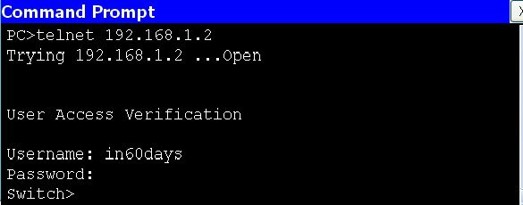

# 第 45 天实验

## 交换机与交换端口安全

### 拓扑结构


请注意，咱们的交换机需要有着允许一些基本安全设置的某个安全映像。

### 实验目的

学习如何应用一些基本的安全设置到某一思科交换机。

### 实验步骤


连接一台 PC 或笔记本电脑到咱们的交换机。此外，要为咱们的配置建立一条控制台连接。这一实验中咱们连接咱们的 PC 的端口，将是咱们要配置那些安全设置的那个端口。我（作者）已选择了我交换机上的 `FastEthernet 0/1` 端口。

1. 登入到 VTY 线路，并设置一个引用某一本地用户名及口令的 Telnet 访问；

    ```console
    Switch#conf t
    Enter configuration commands, one per line. End with CNTL/Z.
    Switch(config)#line vty 0 ?
        <1-15>	Last Line number
        <cr>
    Switch(config)#line vty 0 15
    Switch(config-line)#?
    Switch(config-line)#login local
    Switch(config-line)#exit
    Switch(config)#username in60days password cisco
    Switch(config)#
    ```

2. 在该交换机添加一个 IP 地址到 `VLAN 1`（所有端口都自动位于 `VLAN 1` 中）。此外，要将 IP 地址 `192.168.1.1` 添加到咱们 PC 的 `FastEthernet` 接口；


    ```console
    Switch(config)#interface vlan1
    Switch(config-if)#ip address 192.168.1.2 255.255.255.0
    Switch(config-if)#no shut
    %LINK-5-CHANGED: Interface Vlan1, changed state to up
    %LINEPROTO-5-UPDOWN: Line protocol on Interface Vlan2, changed state to up
    Switch(config-if)#^Z ← press Ctrl+Z keys
    Switch#
    Switch#ping 192.168.1.1 ← test connection from switch to PC
    Type escape sequence to abort.
    Sending 5, 100-byte ICMP Echos to 192.168.1.1, timeout is 2 seconds:
    .!!!!
    Success rate is 80 percent (4/5), round-trip min/avg/max = 31/31/32 ms
    Switch#
    ```

3. 通过从咱们 PC Telnet 到交换机，测试 Telnet；


    


4. 咱们的 IT 经理改变了主意而只想要 SSH 的访问，因此要在咱们的 VTY 线路上修改这一设置。只有一些确定型号及 IOS 版本将支持 SSH 命令；


    ```console
    Switch(config)#line vty 0 15
    Switch(config-line)#transport input ssh
    ```

5. 从咱们的 PC Telnet 到交换机。由于只有 SSH 被允许，因此这一连接应失败；

    


6. 在咱们的交换机上为那个 `FastEthernet` 端口设置端口安全。若咱们尚未将该端口设置为接入端口（与动态或中继端口相反），那么其将失败；


    ```console
    Switch(config)#interface FastEthernet0/1
    Switch(config-if)#switchport port-security
    Command rejected: FastEthernet0/1 is a dynamic port.
    Switch(config-if)#switchport mode access
    Switch(config-if)#switchport port-security
    Switch(config-if)#
    ```


7. 将 MAC 地址硬性设置为咱们 PC 的 MAC 地址于这个端口上被允许。咱们可在咱们 PC 的命令行中，以 `ipconfig /all` 这个命令查看这个 MAC 地址。随后要检查端口安全的状态及设置；


    ```console
    Switch(config-if)#switchport port-security mac-address 0001.C7DD.CB18
    Switch(config-if)#^Z
    Switch#show port-security int FastEthernet0/1
    Port Security				: Enabled
    Port Status					: Secure-up
    Violation Mode				: Shutdown
    Aging Time					: 0 mins
    Aging Type					: Absolute
    SecureStatic Address Aging	: Disabled
    Maximum MAC Addresses		: 1
    Total MAC Addresses			: 1
    Configured MAC Addresses	: 0
    Sticky MAC Addresses		: 0
    Last Source Address:Vlan	: 0001.C7DD.CB18:1
    Security Violation Count	: 0
    ```

8. 修改咱们 PC 上的 MAC 地址，或在咱们无法执行这一操作时，请另一设备插入这个交换机端口。这样做应造成这个端口，因一次对安全设置的破坏而关闭。下面的屏幕截图，显示了在 Packet Tracer 下，咱们将于何处修改 MAC 地址；

    

9. 咱们应会看到，咱们的 `FastEthernet` 端口会立即下线。

    ```console
    Switch#
    %LINK-5-CHANGED: Interface FastEthernet0/1, changed state to administratively down
    %LINEPROTO-5-UPDOWN: Line protocol on Interface FastEthernet0/1, changed state to down
    %LINEPROTO-5-UPDOWN: Line protocol on Interface Vlan1, changed state to down
    Switch#
    %SYS-5-CONFIG_I: Configured from console by console
    Switch#show port-security interface FastEthernet0/1
    Port Security				: Enabled
    Port Status					: Secure-shutdown
    Violation Mode				: Shutdown
    Aging Time					: 0 mins
    Aging Type					: Absolute
    SecureStatic Address Aging	: Disabled
    Maximum MAC Addresses		: 1
    Total MAC Addresses			: 0
    Configured MAC Addresses	: 0
    Sticky MAC Addresses		: 0
    Last Source Address:Vlan	: 0001.C7DD.CB19:1
    Security Violation Count	: 1
    ```

**注意**：请重复这一实验，直到咱们掌握这些命令，而能在不看着实验步骤小节下敲入他们（并要针对本主中的所有其他实验也这样做）。
