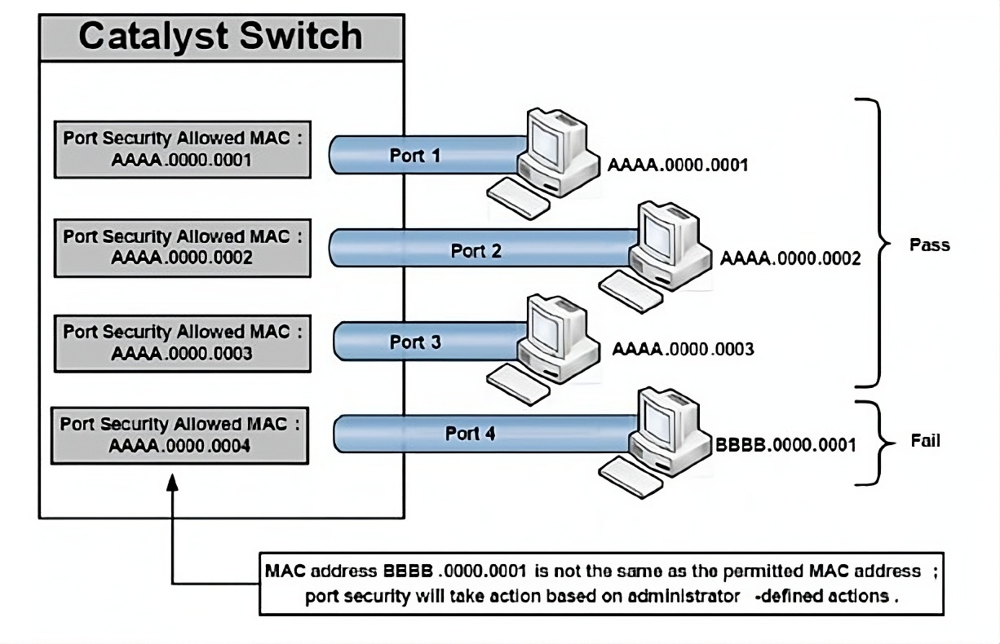
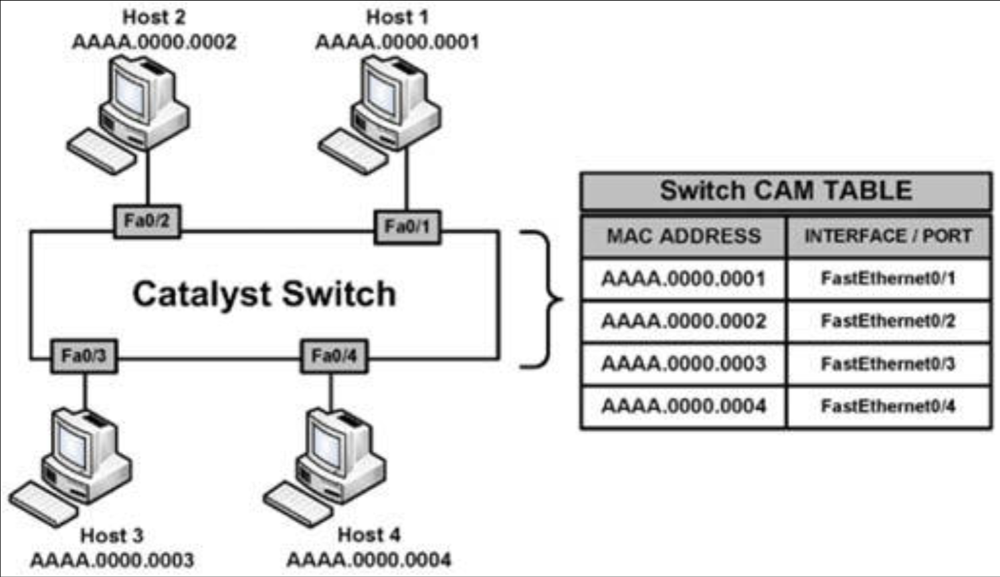
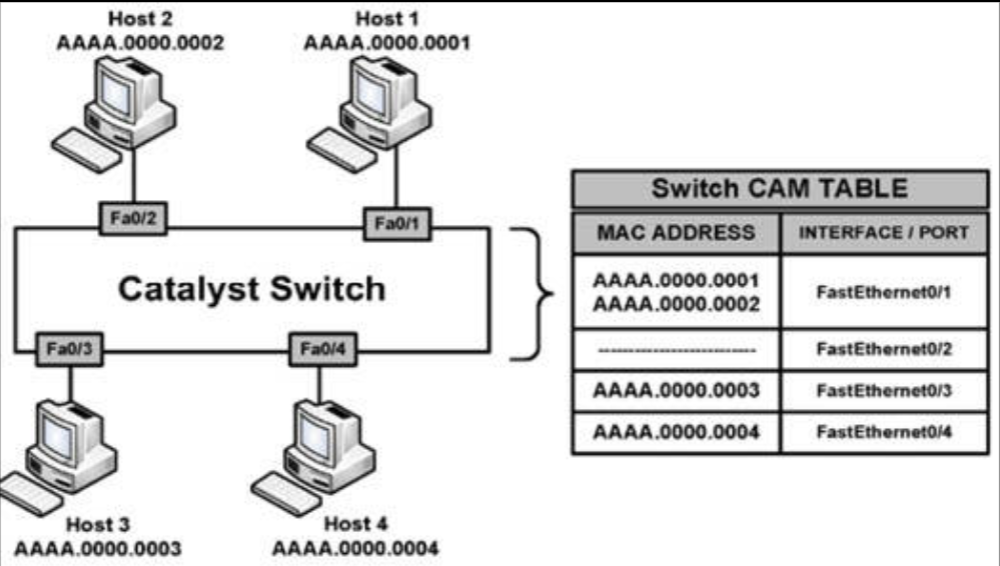

# 交换机的端口安全

所谓端口安全特性，是通过限制在某一特定端口或接口上，可被学习到的 MAC 地址数量，保护交换机端口并最终保护 CAM 数据表的一项动态 Catalyst 交换机特性。在端口安全这一特性下，交换机会维护一个用于识别哪个 MAC 地址（或哪些）可访问哪个本地交换机端口的数据表。此外，交换机还可被配置为，仅允许在任何给定交换机端口上，学习某一特定数量的 MAC 地址。端口安全如下图 45.1 中所示。



**图 45.1** -— **端口安全的运行**

图 45.1 展示了某一 Catalyst 交换机上，经由端口安全特性，被配置为放行单一 MAC 地址的四个端口。其中端口 1 至 3，被连接到其 MAC 地址与端口安全所放行地址匹配的三个主机。假设未部署其他过滤机制，那么这些主机便能够通过其各自交换机端口转发数据帧。然而，端口 4 已被配置为放行有着 `AAAA.0000.0004` MAC 地址的主机，然而有着 MAC 地址 `BBBB.0000.0001` 的一个主机已被连接到这个端口。由于该主机的 MAC 与放行的 MAC 不一样，因此端口安全便将如同管理员所定义的那样，在该端口上采取相应措施。有效的一些 [端口安全操作](#端口安全的操作)，将在后续小节中详细介绍。

端口安全这一特性，被设计以保护交换式 LAN 免于两种主要的攻击方式。这两种攻击方法，将在接下来的小节中描述：

- CAM 数据表溢出攻击
- MAC 地址欺骗攻击


## CAM 数据表溢出攻击

所谓交换机的 CAM 数据表，属于包含着一些物理端口上已知 MAC 地址的一些列表的存储场所。交换机 CMA 数据表，或 MAC 地址数据表中的那些动态学习到的内容，可通过执行 `show mac-address-table dynamic` 这条命令查看到，如下输出中所示：


```console
Switch-1#show mac-address-table dynamic
          Mac Address Table
-------------------------------------------
Vlan    Mac Address       Type        Ports
----    -----------       --------    -----
   2    000c.cea7.f3a0    DYNAMIC     Fa0/1
   2    0013.1986.0a20    DYNAMIC     Fa0/2
   6    0004.c16f.8741    DYNAMIC     Fa0/3
   6    0030.803f.ea81    DYNAMIC     Fa0/4
   8    0004.c16f.8742    DYNAMIC     Fa0/5
   8    0030.803f.ea82    DYNAMIC     Fa0/6
Total Mac Addresses for this criterion: 6
```

与所有计算设备一样，交换机也只有有限的内存资源。这意味着 CAM 数据表有着固定的、所分配的内存空间。CAM 数据表溢出攻击，通过以大量随机生成的无效源 MAC 地址和目的 MAC 地址泛洪交换机，直至 CAM 数据表充满，进而该交换机不再具备接受一些新条目的能力，而将这种内存空间限制作为目标。在此类情形下，交换机会有效地转变为一个集线器，而直接开始广播全部新近接收到的数据帧，到该交换机上的所有端口（同一 VLAN 内），实质上将这一 VLAN 转变为一个大的广播域。

CAM 数据表攻击易于进行，因为诸如 MACOF、DSNIFF 等一些常见工具，均已可用于进行这些活动。虽然增加 VLAN 数量（这样做缩小了广播域规模）有助于减小 CAM 数据表攻击的影响，但推荐的安全解决方案，是要在交换机上配置端口安全。

## MAC 欺骗攻击

所谓 MAC 地址欺骗，用于伪造某个源 MAC 地址，以冒充网络中的其他主机或设备。欺骗，spoofing，就是一个表示伪装或冒充成并不是咱们的某人。MAC 欺骗的主要目的，是要迷惑交换机，使其相信同一主机被连接到两个端口，这就会导致该交换机，尝试同时转发以受信任主机为目标的数据帧到该名攻击者。下图 45.2 展示了某一连接到四个不同网络主机交换机的 CAM 数据表。



**图 45.2** -— **建立交换机 CAM 数据表**

在图 45.2 中，该交换机处于正常运行下，并根据那些 CAM 数据表条目，了解所有连接至其端口设备的 MAC 地址。根据当前的 CAM 数据表，当 `Host 4` 打算发送一个数据帧到 `Host 2` 时，该交换机将直接从其 `FastEthernet0/2` 接口，转发出该数据帧到 `Host 2`。

现在，假设 `Host 1` 已被某名意图接收所有以 `Host 2` 为目的地流量的攻击者入侵。通过运用 MAC 地址欺骗，该名攻击者便会伪造一个使用 `Host 2` 为源地址的以太网数据帧。在该交换机接收到这个数据帧后，他就会记下这个源 MAC 地址，并覆写 `Host 2` MAC 地址的那个 CAM 数据表条目，而将其指向端口 `FastEthernet0/1` 端口，而非真正的 `Host 2` 所连接的 `FastEthernet0/2` 端口。这一概念如下图 45.3 中所示。



**图 45.3** -— **MAC 地址欺骗**

参考图 45.3，在 `Host 3` 或 `Host 4` 尝试发送数据帧到 `Host 2` 时，该交换机将从 `FastEthernet0/1` 转发他们到 `Host 1`，因为 CAM 数据表已被一次 MAC 欺骗攻击投毒。在 `Host 2` 发送另一数据帧时，该交换机便会从 `FastEthernet0/2` 重新学习到他的 MAC 地址，并再次重写那个 CAM 数据表条目以反映这一变化。结果便是一场 `Host 2` 与 `Host 1` 之间有关哪台主机拥有这一 MAC 地址的拉锯战。

此外，这种情况会使交换机陷入混乱，并导致 MAC 地址数据表条目的反复重写，从而造成对合法主机（即 `Host 2`）的一种拒绝服务（DoS）攻击。当用到的伪造 MAC 地址数量很高时，那么这种攻击便会对持续重写其 CAM 数据表的交换机，造成严重的性能后果。MAC 地址欺骗攻击，可通过实施端口安全得以缓解。

## 端口安全的安全地址

端口安全特性可用于指定允许访问某一交换机端口的特定 MAC 地址，以及限制可于某单个交换机端口上受支持的 MAC 地址数量。这一小节中描述的端口安全实现方法如下：

- 静态的安全 MAC 地址
- 动态的安全 MAC 地址
- 粘性安全 MAC 地址


所谓静态的安全 MAC 地址，属于一些由网络管理员静态配置，并存储于 MAC 地址数据表，及交换机配置中的一些 MAC 地址。在一些静态的安全 MAC 地址被支派到某一安全端口后，交换机就将不转发那些，没有与所配置静态安全地址匹配的源地址的数据帧。

所谓动态的安全 MAC 地址，属于由交换机动态学习道德，并存储于 MAC 地址数据表中的一些 MAC 地址。然而，不同于静态的安全 MAC 地址，在交换机重新加载或断电时，这些动态的安全 MAC 地址条目会被移除。这些地址随后在交换机再次启动时，必须由其重新学习。


所谓粘性的安全 MAC 地址，属于静态的安全 MAC 地址与动态的安全 MAC 地址的混合体。这些地址可被动态地学习到，或予以静态配置，并存储于 MAC 地址数据表以及交换机的运行配置中。这意味着在交换机关机或重启后，将不需要再次重新动态发现这些 MAC 地址，因为他们已存储在配置文件中（当咱们保存了运行配置时）。

## 端口安全的操作

一旦端口安全已被启用，那么管理员就可以定义一些在某种端口安全违例情形下，交换机将采取的操作。Cisco IOS 软件允许管理员，指定在某种违反发生时要采取的四种不同操作：

- 保护
- 关闭（默认）
- 限制
- 关闭 VLAN（超出 CCNA 考试范围）

保护这个选项，会强制该端口进入受保护端口模式，`Protected Port` mode。在这种模式下，交换机将直接丢弃所有有着不明源 MAC 地址的单播或多播数据帧。在交换机被配置为要保护某一端口后，那么该交换机将不会在运行于受保护端口模式期间发出通知，这就意味着管理员永远不会知晓，何时有流量已被某个运行于这一模式下的交换机端口阻止了。

关闭这个选项，会在某一端口安全事件发生时，将其置于于 `err-disabled` 状态（稍后会介绍）。启用此配置模式时，交换机对应端口的LED指示灯也将熄灭。关闭模式下，交换机会发送SNMP陷阱和系统日志消息，同时违规计数器递增。这是启用接口端口安全时的默认处理机制。 限制选项用于在安全MAC地址数量达到管理员定义的端口上限时，丢弃未知MAC地址的数据包。在此模式下，交换机将持续阻止新增MAC地址发送帧，直至移除足够数量的安全MAC地址或增加最大允许地址数。与关闭选项类似，交换机将发送SNMP陷阱和系统日志消息，并递增违规计数器。
