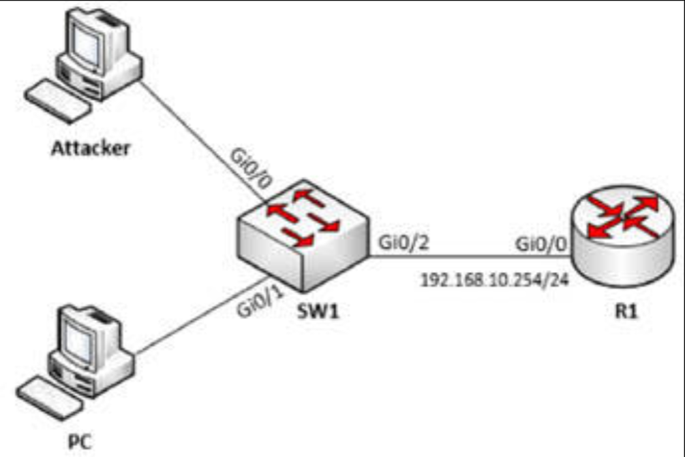

# 第 47 天 实验

## DAI 和 DHCP 侦听实验

### 拓扑结构

要使用以下拓扑结构，完成这个实验练习。（有着 IOSvL2 的 GNS3 被用于这一实验）



### 实验目的

动态 ARP 检查依赖于 DHCP 监听。一旦 DHCP 服务器发出 IP 信息，他便会取得 MAC 地址，将其映射到 IP 地址，并将其存储在交换机中。当另一设备被连接到网络，且其 MAC 地址及 IP 地址未与 DHCP 监听的绑定数据库中某一条目匹配时，那么交换机将丢弃这一 ARP 数据包。

### 实验步骤

1. 如同拓扑结构图示中那样，配置那些主机名，及 `R1` 上的 IP 地址。咱们已经知道要怎样完成这一步；
2. 在 `R1` 上配置 DHCP （地址池）范围；

    ```console
    R1#config t
    Enter configuration commands, one per line.  End with CNTL/Z.
    R1(config)#ip dhcp pool mypool
    R1(dhcp-config)#network 192.168.10.0 255.255.255.0
    R1(dhcp-config)#ip dhcp relay information trust-all
    ```

3. 要使用交换机 `SW1` 上默认的 `VLAN 1`，并配置所有三个端口为接入端口；


    ```console
    SW1#config t
    Enter configuration commands, one per line.  End with CNTL/Z.
    SW1(config)#int gi0/0
    SW1(config-if)#switchport mode access
    SW1(config-if)#int gi0/1
    SW1(config-if)#switchport mode access
    SW1(config-if)#int gi0/2
    SW1(config-if)#switchport mode access
    ```

4. 在交换机 `SW1` 上启用 DHCP 监听，并将端口 `Gi0/2` 配置为 DHCP 监听的信任端口；

    通过使用以下命令验证：

    - `show ip dhcp binding` ( 在 `R1` 上)
    - `show ip dhcp snooping binding` (在 `SW1` 上)

    ```console
    SW1#config t
    SW1(config)#ip dhcp snooping
    SW1(config)#ip dhcp snooping vlan 1
    SW1(config)#int gi0/2
    SW1(config-if)#ip dhcp snooping trust
    ```


    其中的 `PC` 应能够从 DHCP（配置在 `R1` 上）获取一个 IP 地址。


    ```console
    PC> ping 192.168.10.254
    84 bytes from 192.168.10.254 icmp_seq=1 ttl=255 time=6.759 ms
    84 bytes from 192.168.10.254 icmp_seq=2 ttl=255 time=14.000 ms
    84 bytes from 192.168.10.254 icmp_seq=3 ttl=255 time=12.774 ms
    84 bytes from 192.168.10.254 icmp_seq=4 ttl=255 time=15.825 ms
    84 bytes from 192.168.10.254 icmp_seq=5 ttl=255 time=11.043 ms
    ```

    ```console
    R1#sh ip dhcp binding
    Bindings from all pools not associated with VRF:
    IP address  Client-ID/      Lease expiration      Type State Interface
                Hardware address/
                Username
    192.168.10.1 0100.5079.6668.00 Jun15 2020 03:36PM  Auto  Active Gi0/0
    ```

    ```console
    Switch#show ip dhcp snooping binding
    MacAddress          IpAddress        Lease(sec)  Type           VLAN  Interface
    ------------------  ---------------  ----------  -------------
      00:50:79:66:68:00   192.168.10.1     80246       dhcp-snooping   1     GigabitEthernet0/1
    Total number of bindings: 1
    ```


5. 在交换机 `SW1` 上，启用对 `VLAN 1` 的 ARP 检查，并配置端口 `Gi0/1` 和 `Gi0/2` 为 ARP 检查的信任端口；


    ```console
    SW1#config t
    SW1(config)#ip arp inspection vlan 1
    SW1(config)#int gi0/1
    SW1(config-if)#ip arp inspection trust
    SW1(config-if)#int gi0/2
    SW1(config-if)#ip arp inspection trust
    ```


6. 支配静态 IP 地址 `192.168.10.2/24` 到某一攻击者的 PC，并 `ping` 向 `R1` 的 IP 地址。


    ```console
    Attacker> show ip
    NAME        : Attacker[1]
    IP/MASK     : 192.168.10.2/24
    Attacker> ping 192.168.10.254
    host (192.168.10.254) not reachable
    ```

    ```console
    SW1(config)#
    *Jun 14 07:14:05.474: %SW_DAI-4-DHCP_SNOOPING_DENY: 1 Invalid ARPs (Req) on Gi0/0, vlan 1.([0050.7966.6801/192.168.10.1/ffff.ffff.ffff/192.168.10.254/07:14:04 UTC Sun Jun 14 2020])
    *Jun 14 07:14:06.484: %SW_DAI-4-DHCP_SNOOPING_DENY: 1 Invalid ARPs (Req) on Gi0/0, vlan 1.([0050.7966.6801/192.168.10.1/ffff.ffff.ffff/192.168.10.254/07:14:05 UTC Sun Jun 14 2020])
    *Jun 14 07:14:07.536: %SW_DAI-4-DHCP_SNOOPING_DENY: 1 Invalid ARPs (Req) on Gi0/0, vlan 1.([0050.7966.6801/192.168.10.1/ffff.ffff.ffff/192.168.10.254/07:14:06 UTC Sun Jun 14 2020])
    ```

    正如咱们所能看到的，攻击者的 PC 无法 `ping` 通 `R1` 的 IP 地址，同时一些 `Invalid ARPs` 日志条目出现于交换机 `SW1` 下。


请参加 [Free CCNA Training Bonus – Cisco CCNA in 60 Days v4](https://www.in60days.com/free/ccnain60days/) 处今天的考试。


在上述网址处的免费工作簿中，有个 DAI 实验。
