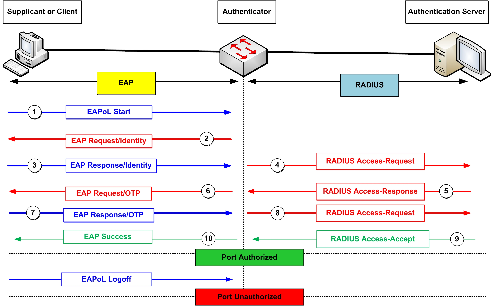
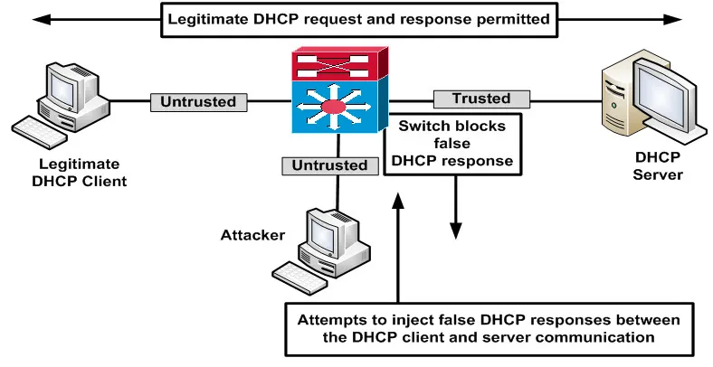

# 常见接入层威胁缓解技术

家庭用户都非常了解黑客可能用到的某些攻击类型，比如病毒及恶作剧电子邮件等。作为网络管理员，我们需要掌握并缓解许多别的攻击类型。思科已更新 CCNA 考试大纲，以反映一些最常见的网络攻击类型，这些内容补充了此前已存在数年的设备加固步骤。

在这一小节中，我们将介绍一些专为接入层部署而创造的工具。由数种攻击类型，及可用的缓解步骤；但是，我们将重点探讨 802.1X、DHCP 监听与动态地址分配（DAI），这三个都是考试大纲的主题。

## 使用 IEEE 802.1X 保护接入

在运用 [802.1X](https://zh.wikipedia.org/zh-hans/IEEE_802.1X) 下，用户无法仅凭将电脑插入网络端口，就获得网络访问。全体用户都必须经过身份验证，他们所连接的 LAN 交换机才会允许他们传递流量。802.1X 与某种 AAA 服务器的组合，将保护网络免于那些不受欢迎的各方。

802.1X 提供了基于端口的网络访问控制（PNAC），而会在用户或设备有着对 LAN 或无线 LAN 的访问前，对其进行身份验证。802.1X 提供了端口级别的策略执行，并于随后将用户置于某个预设的 VLAN 中，授予一定网络权限。

802.1X 采用了请求方、认证方及认证服务器的概念。一旦部署后，LAN 交换机便会充当认证方，如下图 47.1 中所示。客户端（请求方）为了获得对网络的访问，他/她就必须由所连接的交换机（认证方）加以认证，接着该交换机会出于授权目的，联系认证服务器。要让这一过程工作，那么终端用户设备就必须在使用 802.1X 客户端软件，这种软件在比如 Windows 及 Ubuntu 等主要操作系统下均已包含。

客户端软件必须同时支持 802.1X，以及客户端发送认证请求的可扩展认证协议（EAP）两种协议。认证方交换机通过中继客户端与认证服务器之间的报文，而扮演了一个代理。这一过程在下图 47.1 中得以概述。



**图 47.1** -— **请求方、认证方及认证服务器**


总之，作为 802.1X 认证方的交换机，会查询 AAA 服务器所提供的用户名与口令是否正确，而 AAA 服务器会提供相应的响应。当匹配时，那么交换机随后将启用该端口供使用；当不匹配时，那么该端口将不会转发流量到连接他的设备，或来自该连接设备的流量。

当已认证时，端口便将过渡到 “已授权” 状态，同时请求方将能够转发数据包到网络。虽然配置超出考试范围，但值得注意的是，这种交换机端口必须设置为静态接入端口，否则那些配置命令将不会应用。

```console
Switch(config)#int f0/1
Switch(config-if)#dot1x port-control auto
% Error: 802.1X cannot be configured on a dynamic port
```


> **译注**：译者曾配置过 dot1x 的端口认证，参见：[附录 V：交换机 dot1x 认证端口动态指定 VLAN 配置](https://netcomm.xfoss.com/22_dot1x_port_dynamic_vlan.html)


## DHCP 监听

DHCP 监听的设计初衷，是保护网络免受恶意 DHCP 服务器的侵害，这属于制造二层网络攻击的另一方式。DHCP 欺骗及饥饿攻击，是被攻击者用以耗尽 DHCP 地址池，导致资源匮乏（即没有可用于网络主机的 IP 地址）的两种手段。

攻击者的下一步，便是引入一个恶意 DHCP 服务器到网络中，响应那些对 IP 信息的主机请求。随后恶意的默认网关及 DNS 服务器信息便会提供给这些主机，从而允许其他攻击形式发生。这种攻击类型，可以将于下一小节中介绍的端口安全加以缓解。

### DHCP 监听基础


DHCP 监听通过创建一个不受信信主机与 DHCP 服务器之间的逻辑防火墙，提供对恶意 DHCP 服务器的网络防护。在 DHCP 监听启用后，交换机会建立并维护一个 DHCP 监听数据表（也称为 DHCP 绑定数据表），而这个数据表就会用于阻止及过滤网络中的不可信报文。

DHCP 监听用到了可信与不可信接口的这一概念。这意味着，当接收自不可信端口入站数据包的源 MAC 地址，未于绑定数据表中的 MAC 地址匹配时，那么这些数据包即被丢弃。下图 47.2 演示了 DHCP 监听特性的运行。



**图 47.2** —- **运行中的 DHCP 监听**

咱们可在上图 47.2 中看到，攻击者已试图注入恶意 DHCP 报文到 DHCP 服务器与客户端之间的合法通信中。DHCP 监听就意味着这些数据包会被丢弃，因为他们源自某一不受信任接口，且源 MAC 地址未出现于 MAC 绑定数据表中。位于某一不受信任接口上的合法客户端，与 DHCP 服务器之间的报文交换会被允许，因为这一源地址确与绑定数据表条目中的 MAC 地址匹配。

下图 47.3 演示了 DHCP 监听数据表的用法，其被用于过滤网络中的不受信任的那些 DHCP 报文。


**图 47.3** -— **DHCP 监听（绑定）数据表**

在上图 47.3 中，源自受信任端口的数据包不受 DHCP 监听检查。DHCP 监听的受信任接口，通常是针对直连到 DHCP服务器的端口而配置的。不过，所有来自不受信任接口的数据包，都会与 DHCP 监听数据表中的条目比对。

这种机制意味着，当某名攻击者试图使用一些随机生成的 MAC 地址，发起一次 DHCP 监听与饥饿攻击时，所有数据包都将与 DHCP 监听数据表比对。而因为将没有这些特定 MAC 地址的匹配项，那么所有数据包就都将被交换机丢弃，从而有效地阻止了这种攻击类型发生。

DHCP 监听会假设终端用户设备都不受信任。因此，任何未明确标记为受信任的端口均将被监控。DHCP 监听必须要么全局启用，或按 VLAN 启用。在 DHCP 监听启用后，所有端口都会被视为不可信。为了让某一交换机端口可信，咱们就要在连接 DHCP 服务器的端口上启用他。

以下输出演示了如何针对 `VLAN100` 配置 DHCP 监听。一旦 DHCP 监听被启用，管理员便可使用 `show ip dhcp snooping` 这条命令验证他们的配置。DHCP 监听默认是禁用的。


```console
Switch(config)#ip dhcp snooping
Switch(config)#ip dhcp snooping vlan100
Switch(config)#int gi2/24
Switch(config-if)#description “Connected to Legitimate DHCP Server”
Switch(config-if)#ip dhcp snooping trust
Switch#show ip dhcp snooping
Switch DHCP snooping is enabled.
DHCP Snooping is configured on the following VLANs:
100
Insertion of option 82 information is enabled.
Interface           Trusted        Rate limit (pps)
---------           -------        ----------------
GigabitEthernet2/24 yes            none
```

## 动态 ARP 检查

所谓动态 ARP 检查，属于会验证网络中 ARP 传入数据包的一项 Catalyst 交换机安全特性。DAI 通过执行 IP 到 MAC 地址绑定的检查，确定出数据包的有效性。

一旦这种有效性已被确认，那么数据包随后就会被转发到其目的地；但是，DAI 将丢弃那些未能通过这一检查验证过程，有着无效的 IP 到 MAC 地址绑定的数据包。DAI 确保了只有那些有效 ARP 请求与响应得以中继，从而保护网络免受某些中间人攻击。

在 DAI 启用后，交换机便会执行以下三项操作：

- 拦截那些不受信任端口上的 ARP 请求与响应。但是，重要的是要记住，他只会检查入站数据包；其不会检查出站数据包；
- DAI 会在更新本地 ARP 缓存，或转发数据包到其目的地目标前，检查每个拦截的数据包是否有着某个有效的 IP 到 MAC 地址绑定；并
- 丢弃那些无效 ARP 数据包。这些 ARP 数据包包含着无效或不正确的 IP 到 MAC 地址绑定。
