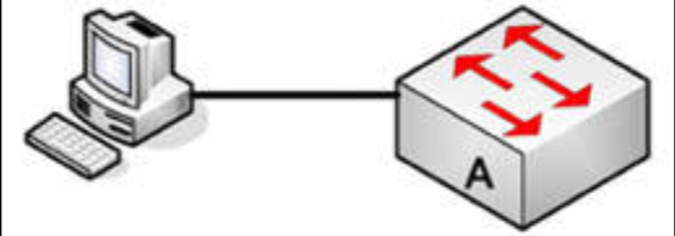
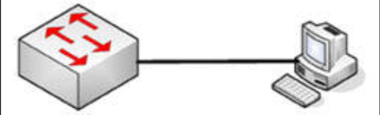

# 第 48 天 复习

## 第 48 天任务

- 复习前 3 天的课程
- 重做那些实验
- 参加 [Free CCNA Training Bonus – Cisco CCNA in 60 Days v4](https://www.in60days.com/free/ccnain60days/) 处今天的考试；
- 凭记忆写出 CCNA 补习指南
- 在 subnetting.org 上花 15 分钟

## 挑战 1 —— 交换机安全实验

### 拓扑结构

### 实验说明

使用一条控制台连接，连接到交换机。

1. 添加一个 `enable` 口令到为思科交换机；
2. 添加一个控制台口令到思科交换机；
3. 将所有口令设置为以 7 级的加密；
4. 执行一次 `show privilege` 命令，并记下用户的默认权限级别（稍后会介绍）；
5. 执行 `show line` 命令，并记下咱们有多少条 VTY 线路。随后执行一次用户通过 Telnet 登入时，要需输入 `username` 及 `password`；
6. 添加一个 SVI 到 `VLAN1`，然后使用这个 IP 地址 `telnet` 到交换机，测试用户名及口令。

**注意**：咱们将需要需在其中的 PC 上，设置一个咱们会自其 `telnet`，与交换机处在同一子网的 IP 地址，例如 `192.168.1.1` 和 `192.168.1.2`。

## 挑战 2 —— 交换机端口安全实验

### 拓扑结构

### 实验说明

使用一条控制台连接，连接到交换机。要将某一 PC 连接到交换机，或连接该交换机到某一路由器上的快速以太网端口。

1. 添加端口到该交换机；
2. 硬性设置 PC/路由器接口的 MAC 地址，为允许的地址；
3. 确保交换机的接口为 `up` 状态（以及其中 PC 上有个 IP 地址）；
4. 设置端口安全违规动作为限制；
5. 更改 PC 的 MAC 地址，或插入另一设备；
6. 在交换机上执行一次 `show port-security interface x` 命令;
7. 通过添加正确的 MAC 地址到 PC，并以一次 `shut` 和 `no shut` 命令重置该接口以恢复原先的状态。
