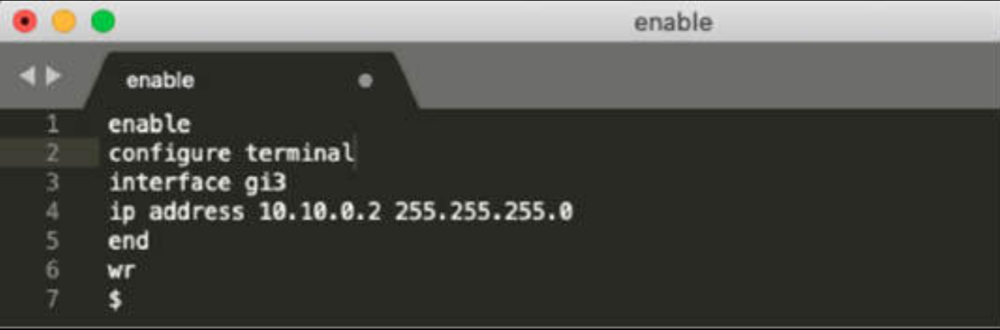
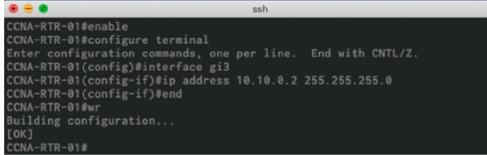
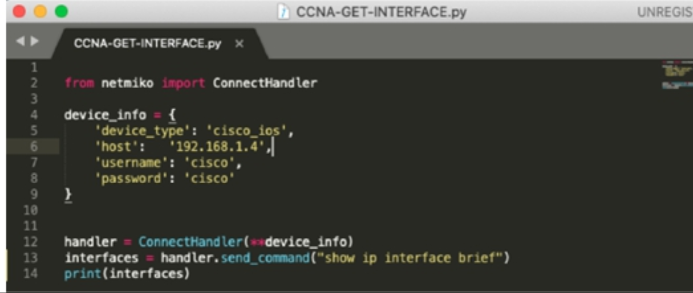
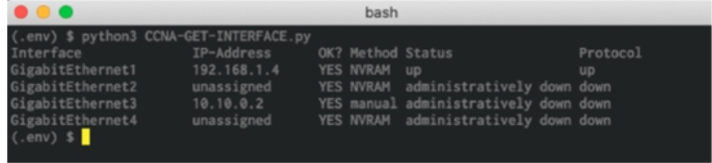
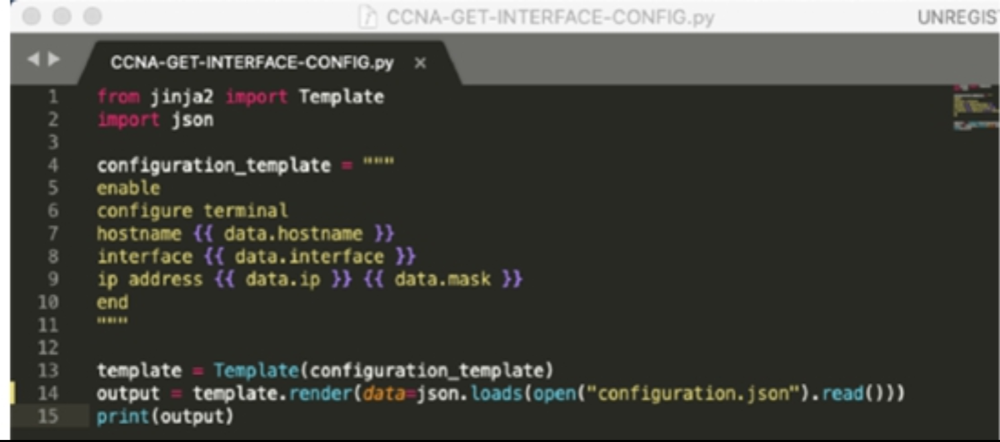
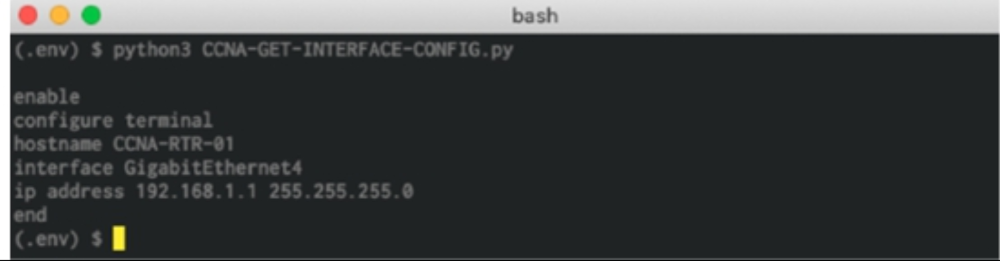

# 网络自动化

## 自动化如何影响网络管理？

管理传统网络设备几乎总是会涉及到使用臭名昭著的命令行界面，考虑到网络通常由不同厂商的设备组成，而每家厂商都有其自己的命令环境及语法，这时使用命令行环境便使得网络工程师的任务极具挑战性。当需要网络中的某项变更时，某名网络工程师通常遵循以下工作流程：

1. 远程登入到设备；

    ```console
    $ ssh cisco@192.168.1.4
    Password:
    Router#
    ```


2. 在某一文本编辑器中创建配置，并将配置粘贴到该设备；

    

    **图 50.1** —- **在文本编辑器中创建手动的 CLI 配置**

    

    **图 50.2** —- **经由 SSH 应用文本配置**

3. 通过使用一些 `show` 命令，验证实施；


    ```console
    Router#show run interface gigabitEthernet 3
    Building configuration...
    Current configuration : 128 bytes
    !
    interface GigabitEthernet3
    ip address 10.10.0.2 255.255.255.0
    shutdown
    negotiation auto
    no mop enabled
    no mop sysid
    end
    Router#
    ```


采用这样的工作流程难以扩展，尤其在如今企业中所发现的复杂性与网络设备数量下。比如，设想当于某一数据中心中托管某家新客户时，必须要修改 20 台甚至更多路由器上的某个现有访问列表。现在，设想每周要接纳 50 家此类客户。咱们将开始看到问题所在。这不仅是海量的重复性工作，当咱们在复制粘贴过程中，不小心漏掉某行时，这还会是种拼写灾难。

将软件开发与网络工程结合这一做法，描述了所谓的网络自动化时代。每天必须耗费数小时在命令行界面苦苦挣扎的日子很快就将终结，这正是为何咱们需要掌握这项新技能的原因。

网络自动化如何助力网络管理的一个示例，便是我们如何使用脚本管理设备。下面的示例展示了一个连接到思科路由器，获取 `show ip interface brief` 命令输出的 Python 脚本。顺便提一句，咱们无需出于 CCNA 考试目的，而掌握 Python 语言。



**图 50.3** -— **Python 脚本示例**

下图 50.4 展示了这个在 macOS 终端中执行的输出。



**图 50.4** -— **显示已配置接口的 Python 脚本输出**

咱们同样可以通过使用脚本，生成设备的配置。下图 50.5 展示了一个会自动将 JSON 数据（文件被命名为 `configuration.json`），转换为设备配置的 Python 脚本。



**图 50.5** -— **将 JSON 数据转换为设备配置的 Python 脚本**

下图 50.6 展示了这个脚本在 macOS 终端中执行的输出。




**图 50.6** -— **以 CLI 格式显示 JSON 数据的脚本输出**

咱们还可通过使用一些测试脚本，验证设备的配置。下图 50.7 展示了一次 Python 脚本执行的输出，该脚本会通过使用 [`robot-framework`](https://github.com/robotframework/robotframework)，自动验证设备的配置（脚本未显示）。


**图 50.7** —- **使用 `robot-framework` 验证设备配置的 Python 脚本输出**

现在咱们便可以想象到，网络自动化对那些运行着上千台，可能需要定期更新或变更设备的网络管理员，会多么有利。咱们只需创建脚本一次。

近年来，一些厂商已开放了其设备上的一些可编程应用接口，从而使脚本或其他第三方软件，更易于通过编程方式与网络设备交互。


