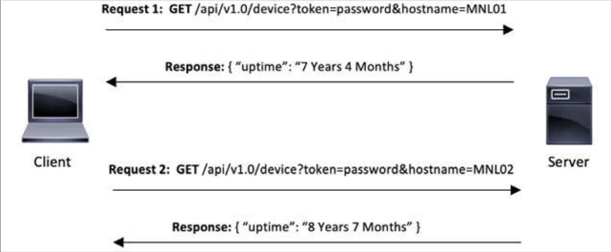
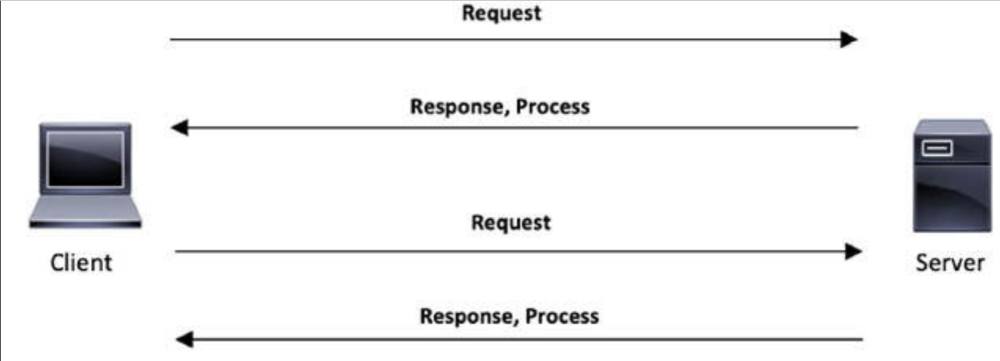
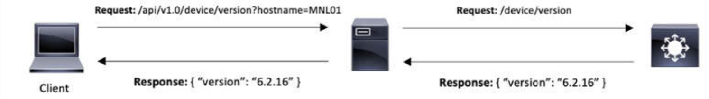
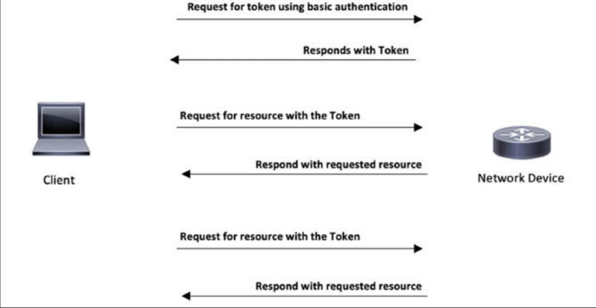

# 基于 REST 的 API（CRUD、HTTP 动词与数据编码）

我们此前曾指出，SDN 以将控制平面逻辑，迁移到受网络管理员管理的计算资源为目标，而这是经由 API 与 SDN 控制器完成。

## 应用编程接口

所谓引用编程接口（API），属于一种以软件实现的接口，允许别的第三方脚本或应用，以编程方式执行该软件的某一功能。

传统网络设备通常允许用户通过某种图形用户界面，或某种命令行界面执行网络功能。下面的示例展示了某名用户通过使用命令行界面，请求网络设备上的接口信息。

```console
Router#show ip int brief

Interface     IP-Address      OK? Method Status             Protocol
GigabitEthernet1 192.168.1.4   YES DHCP   up                    up
GigabitEthernet2 unassigned    YES NVRAM  administratively down down
GigabitEthernet3  unassigned   YES NVRAM  administratively down down
GigabitEthernet4  unassigned   YES unset  administratively down down
Router#
```

最近，诸如思科等厂商，已经允许用户经由某一 API 执行网络功能。下面的示例展示了一个通过使用 IOS XE 的 API，请求某一网络设备上接口信息的 Python 脚本。


```python
import requests

class IOSXE:
    def __init__(self,hostname,ip,username,password):
        self.ip = ip
        self.hostname = hostname
        url = f”https://{self.ip}:55443/api/v1/auth/token-services”
        auth = (username,password)
        response = requests.post(url,auth=auth,verify=False)
        if response.status_code == 200:
            self.token = response.json().get(“token-id”,None)
        else:            
            self.token = None    

    def get(self,url):        
        headers={ ‘Content-Type’: ‘application/json’, ‘X-auth-token’: self.token}        
        if self.token == None:            
            print(f”Device {self.hostname} not Connected..”)            
            return False        
        url = f”https://{self.ip}:55443{url}”        
        self.response = requests.get(url,verify=False,headers=headers)        
        return self.response.json()

CCNA_RTR_01 = IOSXE(hostname=”Router”,ip=”192.168.1.4”,username=”cisco”,password=”cisco”)
interface_list = CCNA_RTR_01.get(“/api/v1/interfaces”)
print(interface_list)
```

执行这一脚本将返回与该设备中发现的那些接口（请注意，出于简洁目的，一些接口已从输出中移除）。


```json
{  
    ‘items’: [
        {
            ‘kind’: ‘object#interface’,    
            ‘description’: ‘’,
            ‘if-name’: ‘GigabitEthernet1’,    
            ‘proxy-arp’: True,    
            ‘subnet-mask’: ‘255.255.255.0’,    
            ‘icmp-unreachable’: True,    
            ‘ipv6-enable’: False,    
            ‘nat-direction’: ‘’,    
            ‘icmp-redirects’: True,    
            ‘ip-address’: ‘192.168.1.4’,    
            ‘verify-unicast-source’: False,    
            ‘type’: ‘ethernet’,    
            ‘mac-address’: ‘0800.27e3.ca93’  
        }, {
            ‘kind’: ‘object#interface’,    
            ‘description’: ‘’,    
            ‘if-name’: ‘GigabitEthernet2’,    
            ‘proxy-arp’: True,    
            ‘subnet-mask’: ‘’,    
            ‘icmp-unreachable’: True,    
            ‘ipv6-enable’: False,    
            ‘nat-direction’: ‘’,    
            ‘icmp-redirects’: True,    
            ‘ip-address’: ‘’,    
            ‘verify-unicast-source’: False,    
            ‘type’: ‘ethernet’,    
            ‘mac-address’: ‘0800.272f.5935’  
        }
        ‘kind’: ‘collections#interface’
    }
```

## 表现层状态转换（REST）


REST 或 RESTful 的 API 设计，旨在利用一些现有协议。尽管 REST 可在许多协议上使用，但在用于 Web API 时他通常采用 HTTP 协议。这一点使开发人员免于安装一些库或其他软件，即可利用某种 REST API 的设计。

思科的 [IOS XE](https://www.cisco.com/site/us/en/products/networking/cloud-networking/ios-xe/index.html)，实现了一种基于 REST 的 API。在使用这种基于 REST 的 API 时，用户会发送一次请求到 API，以获取某一资源。


**图 50.26** —- **REST API 的请求与响应**


一次请求由以下部分构成：

- **方法**

    所谓方法，指明了这次请求将执行 API 中的功能类型。在上面的示例中，`GET` 便是所使用的方法。

- **URI**

    统一资源标识符（URI），指明了所请求资源位于何处。其亦可称为统一资源定位符（URL），因 URL 属于一种特定的 URI 类型。在咱们的示例中，`/api/v1.0/device/version` 便是 URI。

- **查询参数**

    所谓查询参数，属于这次请求的过滤器。在咱们上面的示例中，`hostname=MNLO1` 便是查询参数。我们请求这个 API，仅发送一个带有主机名为 `MNLO1` 的主机版本的响应。问号（`?`）之后的字符串，代表将被这次请求查询的目标信息。

- **头部**

    头部（HTTP）包含了比如身份验证及内容类型（`Content-Type`）等这次请求所需的一些别的数据。


要被视为基于 REST 的 API，就必须遵循一种由一些规则/约束构成的开发架构风格。在决定这种基于 REST 的 API，是否为针对咱们项目的正确 API 类型时，要注意 REST API 设计的六项关键约束。


### 约束 1 —— 客户端-服务器

某一 RESTful API 必须遵循客户端-服务器的模型，其中某一客户端会请求某一资源，而服务器则会提供到这一资源的访问。

举个例子，某一客户端可能会请求获取某一设备的版本。API 会收到这一请求，并一个返回包含了该版本的恢复予以响应。


**图 50.27** -— **客户端-服务器的 REST API 模型**

客户端请求：

```python
import requests
response = requests.get(“http://127.0.0.1:8080/api/v1.0/device/version?hostname=MNL01)
```

API 响应：


```json
{
    “version”: “6.2.16”
}
```


### 约束 2 —— 无状态


RESTful 的 API 必须遵循 “客户端-无状态-服务器” 的模型，且通信必须是无状态的。API 会将每次请求，都作为其是由客户端发出的首次请求对待。

一个示例便是基于令牌的身份验证。每次请求都会包含一个用于身份验证验证的令牌。



**图 50.28** —— **REST API 无状态的演示**

这些多次请求表明，服务器不会存储客户端的信息（两次响应中的运行时间不同），而客户端必须发送每次请求的全部信息。最显著的缺点，便是要发送一些重复数据到服务器的需要。

Python 请求：

```python
import requests
response1 = requests.get(“http://127.0.0.1:8080/api/device?version=iosxr?token=password)
response2 = requests.get(“http://127.0.0.1:8080/api/device?version=iosxe?token=password)
response3 = requests.get(“http://127.0.0.1:8080/api/device?version=nxos?token=password)
response4 = requests.get(“http://127.0.0.1:8080/api/device?version=catos?token=password)
```

每次请求都需要令牌验证，即使前一次请求已通过验证。

API 的响应：

```json
{
    “version”: “5.3.3”
}
{
    “version”: “3.16s”
}
{
    “version”: “6.2.16”
}
{
    “version”: “2.3.1”
}
```

### 约束 3 —— 缓存

RESTful 的 API 允许响应得以缓存。当服务器收到一次请求时，他会执行返回一个发送到该客户端的响应的某一功能。当缓存被启用，且服务器收到另一请求时，那么该服务器会返回同一响应。



**图 50.29** -— **REST API 的缓存**

举个例子，某一客户端可能会请求某一设备的版本。API 会收到这一请求，并以一个包含着版本的回复予以响应。在这一客户端发送另一请求时，那么即使该设备的版本被更新了，API 仍会发送同一数据。只有在缓存 TTL 超时后，或存在某一声称有了新数据的信号时，服务才会以更新后的数据响应。

Python 请求：


```python
import requests
response1 = requests.get(“http://127.0.0.1:8080/api/device/version)
response2 = requests.get(“http://127.0.0.1:8080/api/device/version)
response3 = requests.get(“http://127.0.0.1:8080/api/device/version)
# Cache TTL Expired
response4 = requests.get(“http://127.0.0.1:8080/api/device/version)
```

API 的响应：

```json
{
    “version”: “5.3.3”
}
{  
    “version”: “5.3.3”
}
{  
    “version”: “5.3.3”
}
# Cache TTL Expired.
{  
    “version”: “5.3.4”
}
```

### 约束 4 —— 统一接口

RESTful 的 API 必须有着跨平台的同一数据表示方式。

举个例子，某一 Linux 的客户端可能会通过使用 Python 语言，或通过使用 JavaScript 的某一 web 应用，请求某一设备的版本。

Python 请求：


```python
import requests
requests.get(“http:// 127.0.0.1:8080/api/v1.0/device/version?hostname=MNL01”)
```

API 的响应：

```json
{
    “version”: “6.2.16”
}
```

JavaScript 请求：

```js
import axios from ‘axios’;
axios.get(“http:// 127.0.0.1:8080/api/v1.0/device/version?hostname=MNL01”);
```

API 的响应：

```json
{
    “version”: “6.2.16”
}
```


### 约束 5 —— 分层的系统

一次 RESTful API 的请求，必须能够在无需了解实现的全部其他组件下，有着对某一资源的访问。

举个例子，客户端发送了一次对交换机中所发现版本的请求到服务器。图 50.30 显示客户端并不知道服务器也会发送一次请求到要交换机，以获取信息。



**图 50.30** -— **REST API 的分层系统**


### 约束 6 -— 按需编码（可选）

所谓按需编码，允许服务器提供客户端要执行的代码。


## 在 Cisco CSR1Kv 上启用 REST API 并配置 Python 开发环境

根据平台的不同，启用 REST API 有不同方式。下面的示例展示了如何某一运行着 Cisco IOS XE 软件版本 16.06.08 的 Cisco CSR1Kv 上，启用 REST API。这一操作仅供参考，将不会在 CCNA 考试中测试。

1. 通过使用 `show virtual-service list` 这条命令，检查虚拟服务管理容器是否已安装。下面的输出显示这个虚拟服务管理容器已安装；

    ```console
    Router#show virtual-service list
    Virtual Service List:

    Name                  Status           Package Name
    ----------------------------------------------------------------------
    csr_mgmt              Installed        iosxe-remote-mgmt.16.06.08.ova
    Router#
    ```

    若虚拟服务管理容器未安装，那么就要请从思科软件下载门户下载一份拷贝并将其安装到设备。

    i. 使用某种 TFTP 服务器，通过使用 `copy tftp: bootflash` 这条命令，将下载的文件拷贝到设备；

    ```console
    Router# copy tftp: bootflash:
    Address or name of remote host []? 192.168.1.254
    Source filename []? / iosxe-remote-mgmt.ova
    Destination filename [iosxe-remote-mgmt.ova]?
    Accessing tftp://192.168.1.254//iosxe-remote-mgmt.ova..!!!!!!!!!!!!!!!!!!!!!!!!!!!!!!!!!!!!!!!!!!!!!!!!!!!!!!!!!!!!!!!!!!!!!!!!!...
    [OK - 125696000 bytes]
    ```

    ii. 通过使用 `virtual-service install name csr_mgmt package bootflash: <FILENAME>` 这条命令，安装这个虚拟服务管理容器；

    ```console
    virtual-service install name csr_mgmt package bootflash: iosxe-remote-mgmt.ova
    ```

    iii. 通过使用 `show virtual-service list` 这条命令，再次检查虚拟服务管理容器是否已安装。下面的输出显示，这个虚拟服务管理容器现已安装。

    ```console
    Router#show virtual-service list
    Virtual Service List:
    Name                Status          Package Name
    ------------------------------------------------------------------
    csr_mgmt            Installed       iosxe-remote-mgmt.16.06.08.ova
    Router#
    ```


2. 创建一个用户会与其连接，访问 REST API 的接口；

    ```console
    Router#conf t
    Enter configuration commands, one per line.  End with CNTL/Z.
    Router(config)#int gi1
    Router(config-if)#ip address 192.168.1.4 255.255.255.0
    Router(config-if)#no shutdown
    Router(config-if)#end
    ```


    通过发送 ICMP 的 `ping` 请求，验证其可达性。

    ```console
    $ ping 192.168.1.4
    PING 192.168.1.4 (192.168.1.4): 56 data bytes
    64 bytes from 192.168.1.4: icmp_seq=0 ttl=255 time=0.874 ms
    64 bytes from 192.168.1.4: icmp_seq=1 ttl=255 time=0.676 ms
    64 bytes from 192.168.1.4: icmp_seq=2 ttl=255 time=0.660 ms
    64 bytes from 192.168.1.4: icmp_seq=3 ttl=255 time=0.662 ms
    ```

3. 创建一名有着权限级别 15 的用户；


    ```console
    Router#conf t
    Enter configuration commands, one per line.  End with CNTL/Z.
    Router(config)#username cisco privilege 15 password cisco
    Router(config)#
    ```


4. 通过使用 `virtual-service cst_mgmt / ip shared host-interface <guest-interface> / activate` 这条命令，激活该虚拟服务；

    ```console
    Router#conf t
    Enter configuration commands, one per line.  End with CNTL/Z.
    Router(config)#virtual-service csr_mgmt
    Router(config-virt-serv)# ip shared host-interface GigabitEthernet1
    Router(config-virt-serv)#activate
    ```


5. 验证这一虚拟服务是否已激活；

    ```console
    Router#show virtual-service list
    Virtual Service List:

    Name                  Status           Package Name
    ----------------------------------------------------------------------
    csr_mgmt              Activated        iosxe-remote-mgmt.16.06.08.ova
    Router#
    ```


以下这些示例，是通过使用 Python3 及 Python 的 `Request` 库运行的。以下步骤展示了如何安装 Python3 与 Python 的 `Request` 库：

1. 从 [Python 3.0 Release](https://www.python.org/download/releases/3.0/) 下载并安装 Python3；
2. 通过执行 `python3 version` 命令验证这一安装；


    ```console
    $ python3 --version
    Python 3.8.0
    ```


3. 从 [https://bootstrap.pypa.io/get-pip.py](https://bootstrap.pypa.io/get-pip.py) 下载 `get-pip.py` 这个脚本；
4. 通过在终端中执行 `python3 get-pip.py`，安装 PIP；


    ```console
    $ python3 get-pip.py
    Collecting pip
      Using cached pip-20.1.1-py2.py3-none-any.whl (1.5 MB)
    Collecting wheel
      Using cached wheel-0.34.2-py2.py3-none-any.whl (26 kB)
    Installing collected packages: pip, wheel
      Attempting uninstall: pip
        Found existing installation: pip 19.2.3
        Uninstalling pip-19.2.3:
          Successfully uninstalled pip-19.2.3
    Successfully installed pip-20.1.1 wheel-0.34.2
    $
    ```

5. 通过使用 `pip3 install requests` 命令，安装 Python3 的 `requests` 库；

    ```console
    $ pip3 install requests
    Collecting requests
      Using cached requests-2.23.0-py2.py3-none-any.whl (58 kB)
    Collecting idna<3,>=2.5
      Using cached idna-2.9-py2.py3-none-any.whl (58 kB)
    Collecting certifi>=2017.4.17
      Using cached certifi-2020.4.5.2-py2.py3-none-any.whl (157 kB)
    Collecting chardet<4,>=3.0.2
      Using cached chardet-3.0.4-py2.py3-none-any.whl (133 kB)
    Collecting urllib3!=1.25.0,!=1.25.1,<1.26,>=1.21.1
      Using cached urllib3-1.25.9-py2.py3-none-any.whl (126 kB)
    Installing collected packages: idna, certifi, chardet, urllib3, requests
    Successfully installed certifi-2020.4.5.2 chardet-3.0.4 idna-2.9 requests-2.23.0 urllib3-1.25.9
    $
    ```

6. 通过使用 `pip3 freeze` 命令，验证这一安装。

    ```console
    $ pip3 freeze
    requests==2.23.0
    ```


## 创建、读取、更新及删除（CRUD）与 HTTP 动词

在访问某个思科 IOS-XE API 中的某一资源时，其会经历一次对一个响应的请求流程。每次请求都会包含需由部署与网络设备上的 API 处理，以便发送响应的详细信息。


所谓请求方法，有时称为 HTTP 动词，便是一条必需的信息。每次请求都必需有着 `GET`、`POST`、`PUT`、`PATCH` 或 `DELETE` 中的某一请求方法。这些方法来自由目标设备的软件，所执行的四项基本功能。


| 描述 | CRUD 操作 | HTTP 方法（动词） |
| :-- | :-- | :-- |
| 创建数据 | 创建 | `Post` |
| 获取数据 | 读取 | `Get` |
| 更新数据 | 更新 | `Put` |
| 部分更新数据 | 更新 | `Patch` |
| 删除数据 | 删除 | `Delete` |

请求方法必须受目标设备支持。通常，这些方法都会描述在 API 文档中。下面是个用以 Python 实现的某一 API 的示例。在这一实现中，就只有 `GET` 和 `DELETE` 两个方法受支持。

```python
@app.route(“/api/lab/v1.0/service”,methods=[“GET”])
@app.route(“/api/lab/v1.0/service/<string:service>”,methods=[“DELETE”])
def deleting_l3vpn_service(service=None):
    if request.method == “DELETE”:
        del data[service]
        return jsonify({“status” : “Deletion Success”}),200
    if request.method == “GET”:
        return jsonify({“data” : data}),200
```

发送某种不受支持的方法，将导致如下所示的 `method not allowed` 报错。


```html
<!DOCTYPE HTML PUBLIC “-//W3C//DTD HTML 3.2 Final//EN”>
<title>405 Method Not Allowed</title>
<h1>Method Not Allowed</h1>
<p>The method is not allowed for the requested URL.</p>
```


在使用思科的 IOS-XE API 时，客户端必须先进行身份验证，以生成用于请求资源的令牌。




**图 50.31** -— **基于令牌的 REST API 请求与响应**


根据 API 文档，要生成一个令牌，请求（头部）中的以下详细信息是必需的。

```text
Resource: token-id
URI: /api/v1/auth/token-services
HTTP Method: POST
```

利用下面的信息，我们随后便可通过使用 Python 的 `Requests`库，创建一次生成令牌的请求。在下面的代码中，`requests.post` 便是我们正于这次请求使用 `POST` 这个 HTTP 动词的表征。

```python
import requests
response = requests.post(“https://192.168.1.4:55443/api/v1/auth/token-services”,auth=(“cisco”,”cisco”),verify=False)
token = response.json().get(“token-id”,None)
print(token)
```

运行这个 Python 脚本，就会返回一个可用于请求某一资源的令牌。


```console
(.env) $ python3 main.py
2pcZk6CfhDIUm7kkBTBN7zY/Sb+iS/DFtX1GbqRfg9A=
```

以错误的 HTTP 动词发送请求，会返回 `method not allowed` 的报错。在下面这一情形下，其中不受支持的 `PATCH` 方法就被使用了。

```python
import requests
response = requests.patch(“https://192.168.1.4:55443/api/v1/auth/token-services”,auth=(“cisco”,”cisco”),verify=False)
print(response.text)
```

```console
(.env) $ python3 main.py
<!DOCTYPE HTML PUBLIC “-//W3C//DTD HTML 3.2 Final//EN”>
<title>405 Method Not Allowed</title>
<h1>Method Not Allowed</h1>
<p>The method PATCH is not allowed for the requested URL.</p>
(.env) $
```


