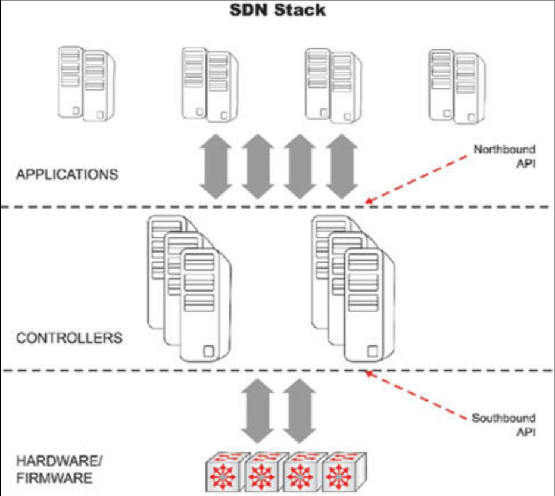
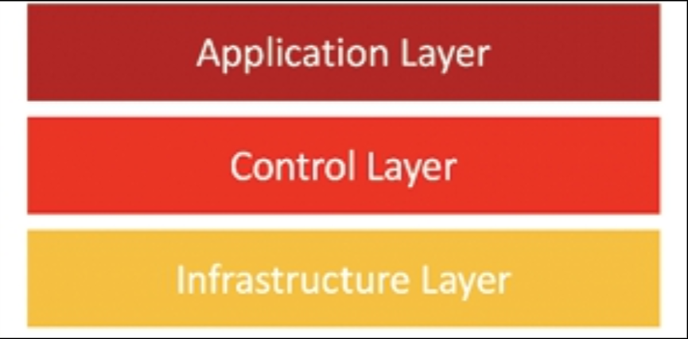
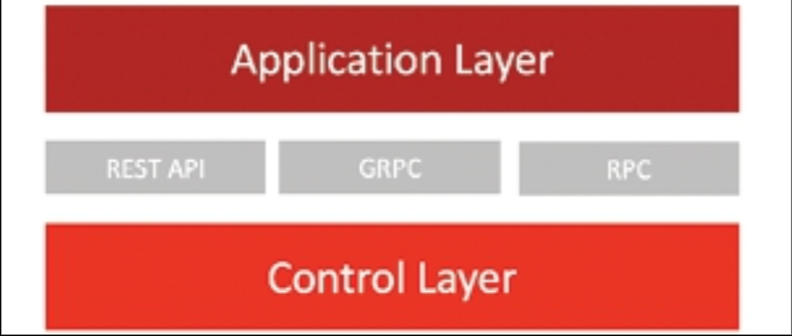
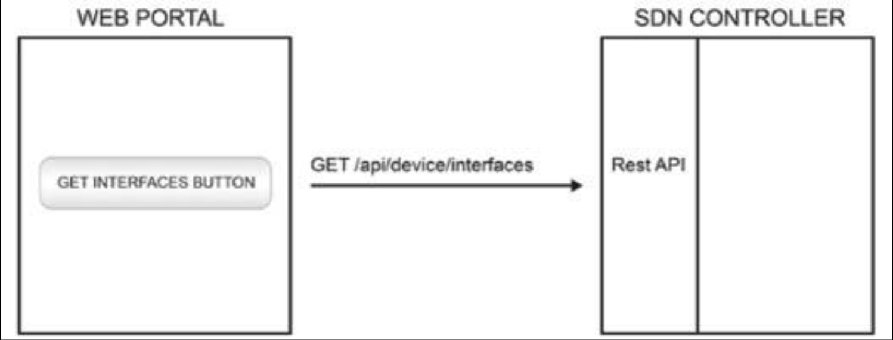
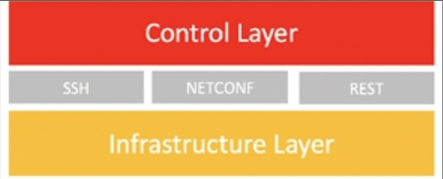

# 基于控制器及软件定义的架构（Overlay、Underlay 与 Fabric）

控制平面与数据平面的解耦，引入了一种称为软件定义网络（SDN）的新型架构。SDN 属于一种其中控制平面与数据平面分离的架构。

将控制平面与数据平面分离，使得控制平面变得可编程，并使得基础设施可被应用及网络服务访问。虽然有数种竞争架构，但他们都致力于将控制平面逻辑，迁移至受网络管理员管理的计算资源。朝着这一最终目标，这些架构均具备 API 和 SDN 控制器的特性。

控制器现在已是网络的 “大脑”。他们允许管理员决定包括路由器与交换机的那些底层设备，如何转发数据包。SDN 的控制器，提供了网络的一种中心化图景，从而给到了管理员其所需的信息。

南向的那些 API，会中继信息到路由器与交换机。OpenFlow 是最先投入市场的架构，并是南向 API 的鼻祖。思科则提供了应用中心基础设施（ACI，见下图 50.18）。设备位于控制器之下，同时 API 实现了数据交换。南向的接口（API）允许控制器与网络设备通信。存在不同的控制器类型，每种控制器类型有着不同能力。下面是咱们应留意的三个示例：

- OpenFlow（来自 ONF；[Open Network Foundation](https://www.opennetworking.org)）
- OpFlex（来自思科；与 ACI 一起使用）
- CLI（Telnet/SSH）与 SNMP（来自思科；与 APIC-EM 一起使用）

北向的 那些 API，被 SDN 用于与应用及业务逻辑的通信。北向的接口（API）会放开控制器，允许程序访问数据及功能。

整个过程如下图 50.18 种所示。

**图 50.18** -— **SDN 用到的一些 API**

如上图 50.18 中所示，软件定义的组网，由三层 —— 应用层、控制层与基础设施层，所构成。

**图 50.19** -— **SDN 的分层**

- **应用层**

    他包含了通过 SDN 控制器，与网络设备通信的某种应用。他通过某种北向应用接口（API），与控制层通信。他使某一外部应用能够通过执行控制层中的功能，管理网络。诸如 REST、GRPC 及 RPC 等的接口，会被用作北向 API。

    

    **图 50.20** —- **SDN 的应用层**

    这一层的一个常见用列，便是用户于其中执行网络命令的某一 web 门户。某名用户会在这一 web 门户中输入数据后，而 web 门户则会通过北向 API，发送该数据到控制层。

    

    **图 50.21** -— **北向 APT**

- **控制层**

    控制层包含着提供对数据平面中心化控制的 SDN 控制器。SDN 控制器使用诸如 OpenFlow、[NETCONF](https://en.wikipedia.org/wiki/NETCONF)、SNMP、[REST](https://en.wikipedia.org/wiki/REST) 及 [RESTCONF](https://datatracker.ietf.org/doc/html/rfc8040) 等接口，控制其所管理设备的数据平面。

    
    **图 50.22** -— **SDN 的控制层**

- **基础设施层**

    基础设施层包含了诸如交换机及路由器等用于处理网络流量的物理设备。

