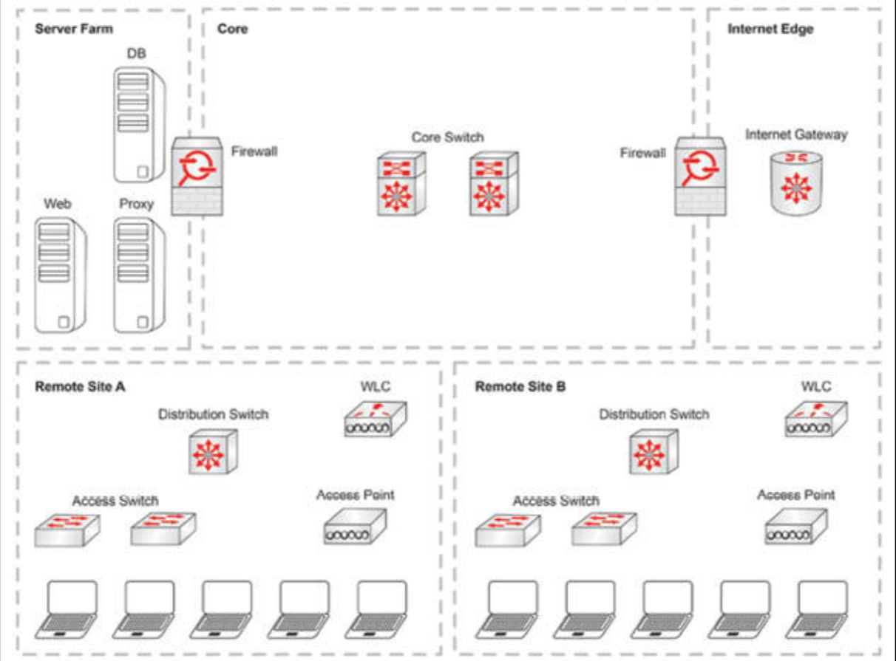
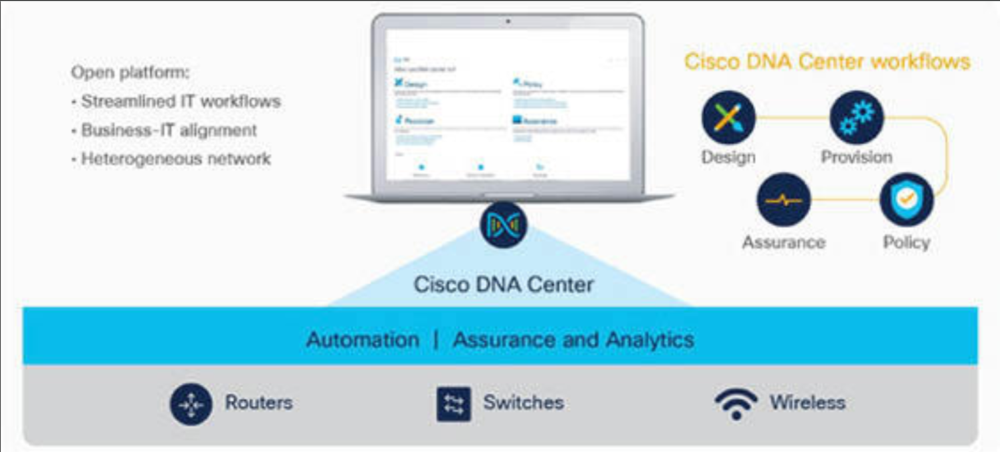

# 传统园区的设备管理与思科 DNA 中心的设备管理

典型的企业网络，由处理有线与无线连接，以及处理网络安全的一些设备构成。有着如此的多样性，增加了整个基础设施管理的复杂性。

**图 50.23** -— **典型的企业网络**

[Cisco DNA Center](https://www.cisco.com/site/cn/zh/products/networking/dna-center-platform/index.html) 属于一种部署于 Cisco DNA Center 设备上的 SDN 控制器。这一 DNA 中心可根据作为意图驱动的组网基础的应用需求，使网络自动化。

所谓意图驱动的组网，使业务策略到 IT 策略的转换过程自动化。其允许企业专注于他们想要的结果，而非如何在网络基础设施中实现。

DNA Center 会执行三项主要功能：

- **策略**

    策略的控制依赖于 [Cisco ISE](https://www.cisco.com/c/zh_tw/support/security/identity-services-engine-3-0/model.html)，其会对终端身份验证、指派终端到其相应安全组，并管理终端间的通信。

- **自动化**

    自动化发挥包括：新设备部署（即插即用，Plug and Play, PNP）、软件升级管理（软件镜像管理，Software Image Management, SWIM），以及与诸如思科 StealthWatch、思科 Umbrella 或一些第三方系统等外部系统 的API 集成。

- **保证**

    保证提供了对终端设备、应用及服务等的洞察，并会运用机器学习技术关联这些数据，从而提供可见度及性能预测给网络管理员。

**图 50.24** -— **思科的 DNA 网络**（图片 © 思科系统公司）

我（作者）强烈建议咱们在思科网站上花几小时，查看有关思科 DNA 与网络自动化的视频及白皮书。引用他们的网站：

> “思科的 DNA 中心，属于一种完整的基于软件的网络自动化及保证的解决方案，并是思科的意图驱动的网络系统：思科 DNA 的控制与管理的仪表盘。在使用思科 DNA 网络控制器及 API 下，思科 DNA 中心还是开放及可扩展的。他提供了对外部应用和系统，在交换数据及智能方面的广泛支持，这种支持构建于思科 DNA 中心的那些原生功能之上。运用这些开放平台能力，应用可进一步确保组织的网络，与其业务目标保持一致。”

与所有厂商一样，思科在讨论其软硬件解决方案时，也使用了特定的营销和销售术语，Cisco DNA Center 也不例外。出于考试目的，咱们需要注意这点。考虑到这点，值得注意的是，思科宣称 DNA Center 通过四种分别的平台能力类型，提供了 360 度的可扩展性：

- 基于意图的 API 利用控制器，使业务与 IT 应用能够将意图投送到网络，并获取用于 IT 与业务创新的网络分析及简介；
- 构建于集成 API 上过程适配器，实现了与其他 IT 与网络的集成，以优化 IT 运营与过程；
- 构建于集成 API 上的域适配器，实现与诸如数据中心、WAN 及安全性等基础设施域的集成，以在整个 IT 环境中，交付一种一致的意图驱动的基础设施；
- 软件开发工具包（SDK），实现了管理可扩展至第三方厂商的网络设备，以提供对多样化环境的支持。

这些能力如下图 50.25 中所示。

**图 50.25** -— **思科 DNA Center 平台的可扩展性**（图片 © 思科系统公司）

