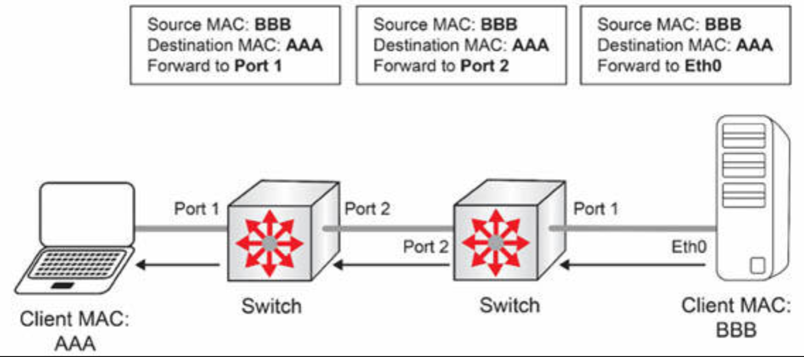
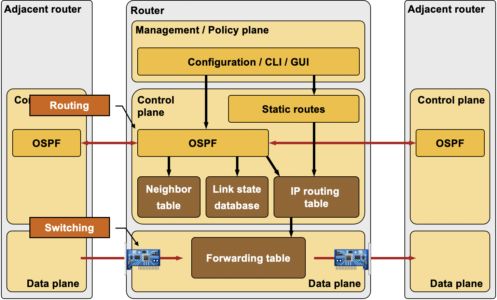
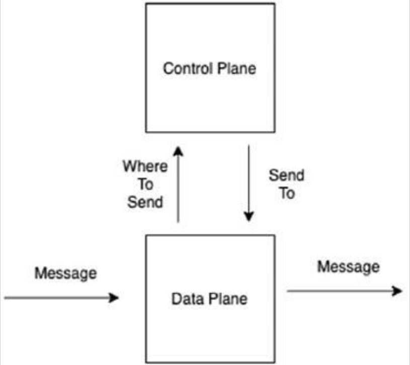
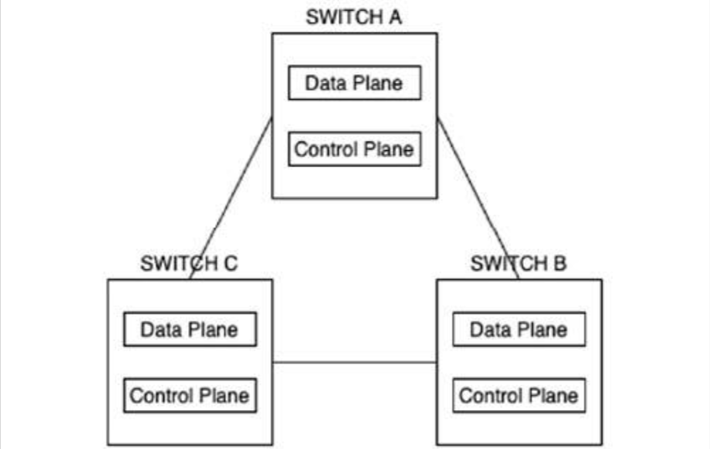
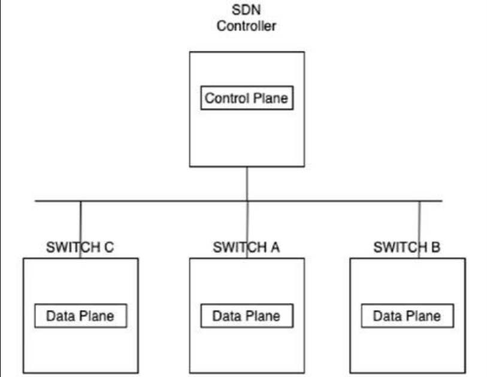
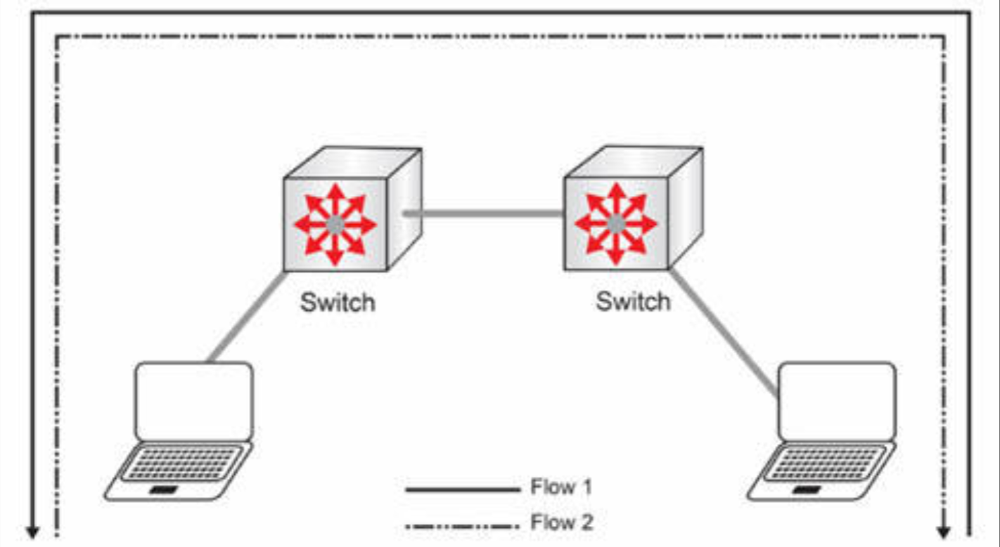
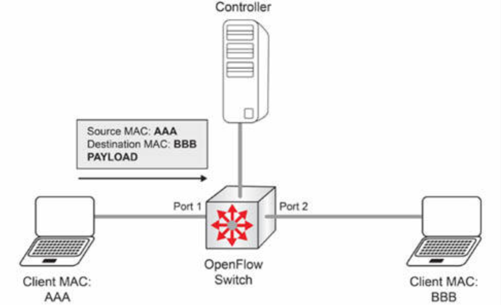
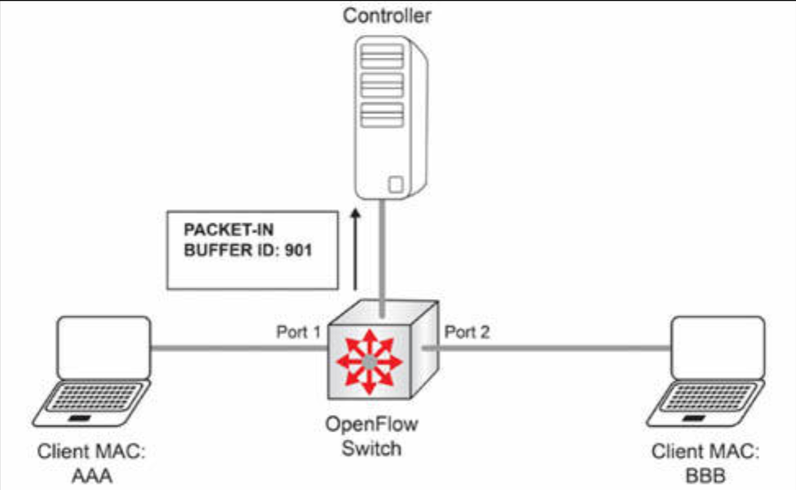
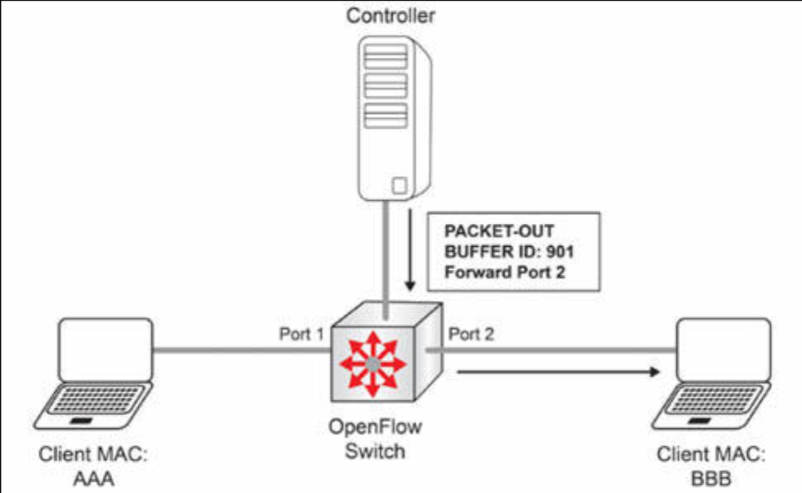

# 传统网络与控制器式网络的对比

在传统的网络基础设施中，与在何处转发流量相关的控制，独立发生于各个设备上。路由协议会确定出最佳路径并转发流量。我们将需要创建出一些操纵这些选择的高级配置。正如我们将看到的，网络自动化颠覆了这一范式。他将对网络的关注，转变为对服务于业务方面。在这一概念被提及时，咱们可能会听说过 “基于意图的组网（IBN）”这一术语。

传统组网的一个示例便是在某一交换机接收到客户端的报文时。我们已经了解，他会查询其 MAC 地址数据表，找出要于何处转发这一流量，然后将其转发出端口。在发送这一流量后，于何处转发这一流量的决策，便受下一个下游设备控制了，依此类推。

**图 50.8** -— **传统网络中的数据帧转发**

转发决策发生于数据平面，因此值得回顾三种组网平面。网络设备配备了数据平面、控制平面以及管理平面。

所谓数据平面，the Data Plane，提供了网络设备转发报文的能力。接收、处理和转发数据的过程，均属于数据平面部分。为了让数据平面知道于何处发送，设备会使用从控制平面获取的信息。这方面的一个示例，便是从交换机的一个端口，交换数据到另一端口的过程。交换机会使用由某种控制平面协议生成的， MAC 地址数据表中的信息转发流量。

所谓控制平面，the Control Plane，提供了有关于何处转发数据的信息给数据平面。这方面的一个示例，便是会计算到目的地最佳路径，并提供网络流量出站接口的某种路由协议。

设备可于管理平面上，由网络管理软件（经由 SNMP）予以远程管理。管理平面上的一些协议包括 Telnet、SSH 及 FTP 等。

**图 50.9** -— **OSPF 运行中的平面**

当某一报文被收到后，数据平面便会询问控制平面，要于何处转发这一数据。控制平面会发送一个响应会数据平面，告诉他于何处转发这一报文。

**图 50.10** —- **控制平面与数据平面分离**

在传统网络中，控制平面和数据平面均位处于每个网络设备中。每个设备都独立运行，并影响着由每个单独设备所实现的数据传输方式。

**图 50.11** -— **传统网络中的控制及数据平面**

将控制平面与数据平面分离，是那些可编程网络得以控制网络的一种解决方案。与其逐个地管理设备，一个中心化控制器，就会影响网络中所有设备的流量。

这一中心化的控制平面，被称为控制器。现在网络设备为了确定于何处转发流量，就依赖于由这个控制器所传递的信息。

**图 50.12** -— **基于 SDN 控制器的网络中控制平面与数据平面**

控制器影响数据平面的一种方式，便是通过使用一种名为 [OpenFlow](https://en.wikipedia.org/wiki/OpenFlow) 的协议。OpenFlow 属于一种允许某一控制器，影响网络设备于何处发送网络流量的标准协议。

OpenFlow 通过构建名为流数据表的网络流数据库运行。所谓流，是发送自某一特定源，到某一特定目的地的一个数据包序列。

**图 50.13** -— **数据包流**

在某一 OpenFlow 网络中，服务器与主机之间的通信运行，将看起来如下图 50.14 中所示。

**图 50.14** -— **接收到的 OpenFlow 数据包**

在交换机首次接收到来自客户端的报文时，他会发送一条消息到控制器。这种消息称为 `PACKET-IN`。

**图 50.15** —- **到控制器的 OpenFlow 通信**

在控制器接收到这一消息后，他会响应以告知该交换机，要做什么的一项操作，或一个操作列表。这种消息称为 `PACKET-OUT`。在一些情形下，控制器会发送 `FLOW MOD` 消息。在咱们的示例中，控制器告诉了交换机要在 `Port 2` 上转发这一流量。

**图 50.16** -— **来自控制器的 OpenFlow 响应**

同样过程会于客户端发送回复时发生。

