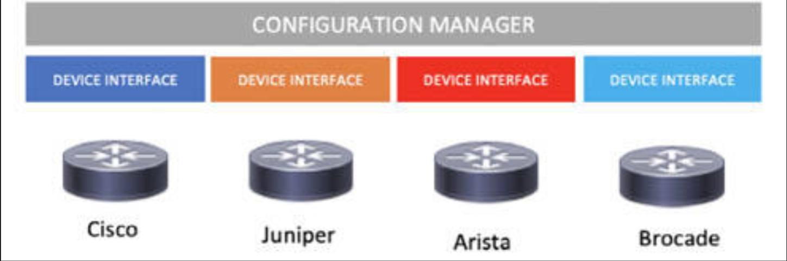
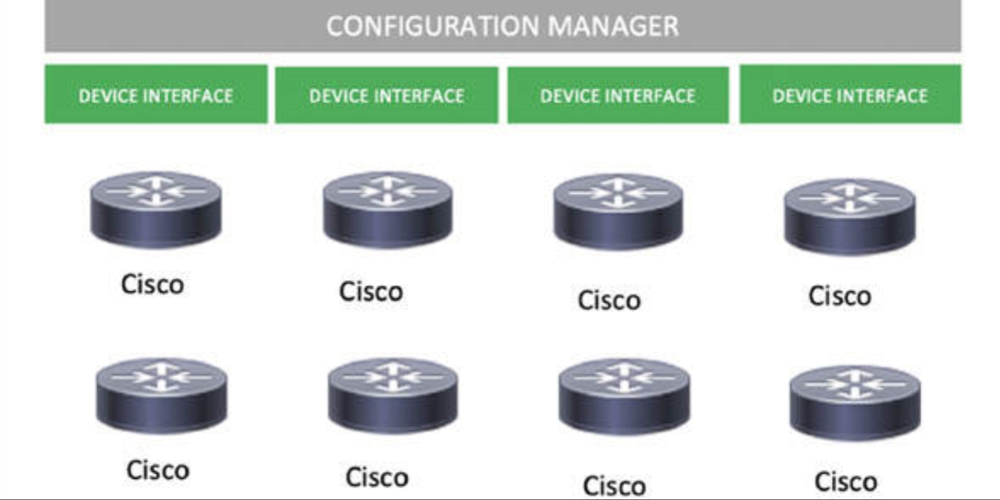
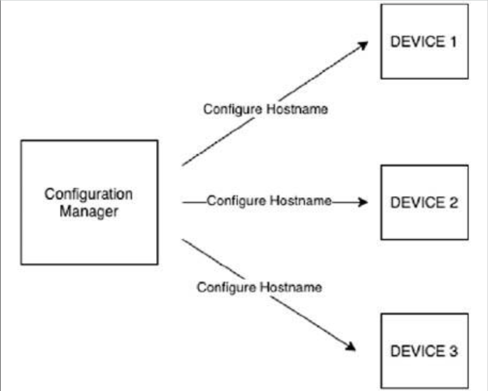

# 配置管理 —— Puppet、Chef 与 Ansible

配置管理工具包括 [SaltStack](https://saltproject.io/)、Ansible、Puppet 和 Chef（等等），他们被创建以在某一现有服务器实例（以及兼容的交换机和路由器）上，安装及管理软件。他们可执行比如软件包安装、脚本或配置文件，以及初始化服务等任务。这些工具可在无需用户指定出确切命令下，完成让单台或多台服务器实例履行其职责的艰巨且通常费力的任务。

配置管理本质上是用户与设备间的一个抽象层，支持用户将一些诸如管理、配置及部署等任务自动化。

配置管理器提供了多种设备类型的单一接口。每种设备类型都可能有着执行同一条命令的不同方式，而在某种配置管理器下，单一接口即可用于通过一条命令，配置所有设备。



**图 51.1** -— **针对多家厂商使用配置管理器**

举个例子，我们即将要配置三台设备的主机名。#1 设备是个思科设备，#2 设备是个 Juniper 设备，#3 设备是个 VYOS 设备。

在没有配置管理器下，那么我们就要在其各自配置模板下，单独配置每台设备：


#1 设备的配置

```console
hostname Cisco-Device-01
```

#2 设备的配置

```console
set hostname Juniper-Device-02
```


#3 设备的配置

```console
Set system hostname VYOS-Device-03
```


配置管理器提供了在多种设备上执行某条命令的单一接口。



**图 51.2** —- **针对多个设备使用配置管理器**


举个例子，我们即将在所有八台设备上，配置 `port 1` 为中继端口。在没有配置管理器下，咱们就需要单独配置每台设备。

#1 设备的配置：

```console
interface gi0/0/0/1 switchport mode trunk
             switchport trunk encapsulation dot1q
```

#2 设备的配置：

```console
interface gi0/0/0/1 switchport mode trunk
             switchport trunk encapsulation dot1q
```

#X 设备的配置：

```console
interface gi0/0/0/1 switchport mode trunk
             switchport trunk encapsulation dot1q
```

在这一场景下，配置管理器可帮助编排多种设备类型的配置，及在多台设备上某一命令的执行。一些配置管理器以推送模式运行，而另一些则以拉取模式运行。

在推送模型下，配置管理器充当连接设备与执行命令的一个中心化服务器。这一模型下的配置管理器，无需其所管理设备上的某种代理程序。Ansible 便是以推送模型运行的配置管理器的一个示例。




**图 51.3** -— **配置管理器的推送模型**


在拉取模型下，每台设备都安装了个从服务器拉取操作的代理程序。一旦操作被拉取到，设备内的代理程序便负责执行这一配置。这一模型下的配置管理器，就需要某种管理设备的代理程序。Chef 和 Puppet 均运行于拉取模型下。


**图 51.4** —- **配置管理器的拉取模型**

以下示例演示 Ansible 如何在其仓库中的所有 Linux 服务器上，执行 `uptime` 这条命令。

Ansible 仓库：

```conf
[all]
host1 ansible_host=192.168.1.1 ansible_user=root ansible_ssh_password=root
host2 ansible_host=192.168.1.2 ansible_user=root ansible_ssh_password=root
host3 ansible_host=192.168.1.3 ansible_user=root ansible_ssh_password=root
host4 ansible_host=192.168.1.4 ansible_user=root ansible_ssh_password=root
host5 ansible_host=192.168.1.5 ansible_user=root ansible_ssh_password=root
```

下面的输出显示了每台执行 `uptime` 命令的服务器的输出。

```console
root@anisible_server:/mnt/anisble_training# ansible all -m shell -a “uptime”  -i inventory.ini
host5 | SUCCESS | rc=0 >>
01:38:51 up  4:44,  5 users,  load average: 0.41, 0.11, 0.03
host4 | SUCCESS | rc=0 >>
01:38:51 up  4:44,  5 users,  load average: 0.41, 0.11, 0.03
host2 | SUCCESS | rc=0 >>
01:38:51 up  4:44,  5 users,  load average: 0.41, 0.11, 0.03
host3 | SUCCESS | rc=0 >>
01:38:51 up  4:44,  5 users,  load average: 0.41, 0.11, 0.03
host1 | SUCCESS | rc=0 >>
01:38:51 up  4:44,  5 users,  load average: 0.41, 0.11, 0.03
root@anisible_server:/mnt/anisble_training#
```

Ansible 被设计为精简与快速。他被认为易于学习掌握（归功于 YAML 的使用）。Ansible 无需某种节点代理程序。他在 SSH 上执行所有功能。相比于 Puppet 及 Chef 的 Ruby 基础，Ansible 构建于 Python 之上。相比于那些基于其他编程语言的工具，Ansible 被认为不够强大。

Chef 是一种针对配置管理的开源工具，专注于其用户群的开发人员侧。Chef 以主客户端模型运行，operates as a master-client model，需要一个控制主服务器的单独工作站。TCP 端口 10002 是 Chef 的命令端口。这个端口允许 Chef 的 Push Jobs 客户端与服务器通信。

Puppet 属于一种开源的配置管理解决方案。Puppet 基于 Ruby，但其针对其内部的工作，使用了一种更接近于 JSON 的定制领域脚本语言（DSL）。他使用了 嵌入式的 Ruby（Embedded Ruby，ERB）模板，以创建出一些定制的 Puppet 语言文件。咱们可通过 `.pp` 的扩展名识别 Puppet 的文件。一个 Puppet 代码片段，被称为一份清单，a Puppet piece of code is referred to a manifest。


