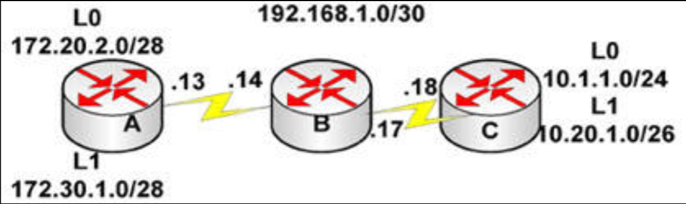

# 第 53 天 复习

## 第 53 天任务

- 复习咱们想要的任何课程
- 重做咱们想要的任何实验
- 若咱们愿意，完成今天挑战实验（下面的网址处充足的更多实验）
- 参加 [Free CCNA Training Bonus – Cisco CCNA in 60 Days v4](https://www.in60days.com/free/ccnain60days/) 处今天的考试；
- 在 subnetting.org 上花 15 分钟

我们有整整八天时间复习数个重要主题。我们将优先处理那些最可能以实验和问题形式，出现在考试中的主题，因此安全与 OSPF 将排在前列，而 FHRP 则次之（比如），因为咱们只会看到有关这一主题的一两道题目。

## 挑战 —— 路由器 OSPF 实验

### 拓扑结构

### 实验说明

以串行线或交叉网线将三台路由器连接在一起。

1. 根据示意图，添加 IP 地址到 `Router A`、`Router B` 及 `Router C`；
2. 在 `Router A` 与 `Router B` 之间 `ping`，并从 `Router B` `ping` 向 `Router C`，测试串行线路（要记住时钟速率）；
3. 设置串行线路为为使用带 CHAP 认证的 PPP（还要设置用户名与口令）；
4. 在全部路由器上配置 OSPF 协议。要将两端的环回接口，置于某一非零区域；
5. 检查路由数据表，确保咱们包含了两个 `192.168.1.x` 的网络；
6. 确保咱们可以从两端 `ping` 通所有网络。

重做这一实验，这次要创建一些咱们自己的 IPv6 子网。

