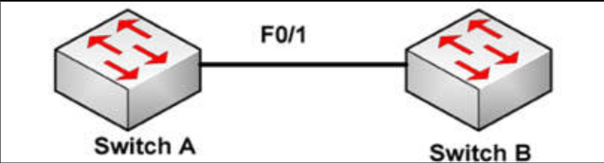
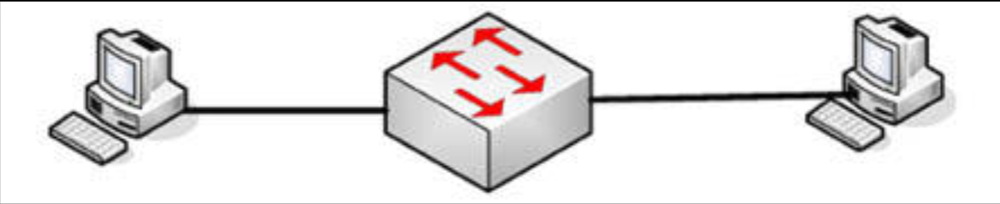

# 第 54 天 复习

## 第 54 天任务

- 复习咱们想要的任何课程
- 重做咱们想要的任何实验
- 若咱们愿意，完成今天挑战实验（下面的网址处充足的更多实验）
- 参加 [Free CCNA Training Bonus – Cisco CCNA in 60 Days v4](https://www.in60days.com/free/ccnain60days/) 处今天的考试；
- 凭记忆写出 CCNA 补习指南
- 在 subnetting.org 上花 15 分钟

## 挑战 1 —— STP 的根实验

### 拓扑结构

### 实验说明

以交叉线将两台交换机连接在一起（或使用Packet Tracer）。

1. 创建一条两台交换机间的中继链路；
2. 在两台交换机上创建 `VLAN 10` 和 `VLAN 20`；
3. 确保 `Switch A` 为 `VLAN 10` 的 STP 根桥。不要使用 `priority` 命令；
4. 确保 `Switch B` 为 `VLAN 20` 的 STP 根桥。不要使用 `root primary` 命令。

## 挑战 2 —— VLAN 间的 SVI实验

### 拓扑结构

### 实验说明

使用一条控制台连接，连接到交换机。连接两台 PC 到交换机的以太网接口。设置 `VLAN2` 为 `172.16.0.0/16`，`VLAN3` 为 `192.168.1.0/24`。咱们讲叙要一台三层交换机，若咱们没有一台三层交换机，那么就要使用 PT。

1. 在交换机上配置两个 VLAN，并把每台 PC 分配至两个 VLAN 之一。要按需设置默认网关；
2. 添加正确的 IP 地址与网关到两台 PC；
3. 在交换机上设置两个 SVI 接口，每个 VLAN 一个，并与到对应 PC 的子网匹配；
4. 启用交换机上的 IP 路由；
5. 从一台 PC `ping` 向另一 PC。
