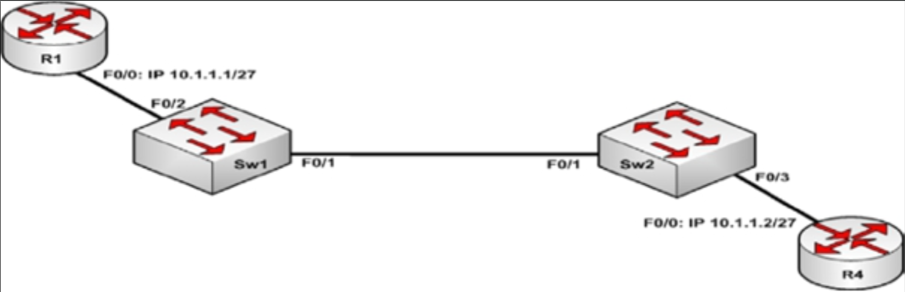

# 第 55 天 复习

## 第 55 天任务

- 复习咱们想要的任何课程
- 重做咱们想要的任何实验
- 若咱们愿意，完成今天挑战实验（下面的网址处充足的更多实验）
- 参加 [Free CCNA Training Bonus – Cisco CCNA in 60 Days v4](https://www.in60days.com/free/ccnain60days/) 处今天的考试；
- 凭记忆写出 CCNA 补习指南
- 在 subnetting.org 上花 15 分钟

## 挑战 —— STP 与 OSPF

### 拓扑结构

### 实验说明

以一条交叉网线将两台交换机连接在一起（或使用 Packet Tracer）

1. 设置 `Sw1` 和 `Sw2` 为支持扩展范围的 VLAN。两台交换机均应在 VTP 域 `CISCO` 中，带有 VTP 密码 `HOWTONETWORK`。此外，两台交换机仅应发送 VTP 版本 2 的更新；
2. 在 `Sw1` 和 `Sw2` 上配置以下 VLAN：4010、4020、4030、4040；
3. 将 `Sw1` 上的 `Fa0/2` 端口和 `Sw2` 上的 `Fa0/3` 端口支派到 `VLAN 4040`。这两个端口应被配置为立即过渡到生成树的转发状态。`Sw1` 和 `Sw2` 的两个 `Fa0/1` 端口，应被配置为一条中继链路。但是，这条该干线链路必须只放行两台交换机上所配置的那些 VLAN；
4. 在路由器 `R1` 和 `R4` 上按拓扑图所指定的那样配置 IP 地址。验证两台路由器能否相互 `ping` 通。
5. 配置交换机 `Sw1` 以 4096 的优先级值，成为 `VLAN 4010` 与 `VLAN 4030` 的根桥。使用内建的 Cisco 宏，配置 `Sw2` 为 `VLAN 4020` 和 `VLAN 4040` 的根桥。通过使用正确的生成树命令，验证这些根桥状态；
6. 在 `10.1.1.0/27` 子网上，`R1` 与 `R4` 之间配置 OSPF 的 `Area 0`。要确保 OSPF 邻接关系形成，以及一个 DR 和 BDR 在这个子网上选举出来。以相应的 OSPF 命令验证咱们的配置。
