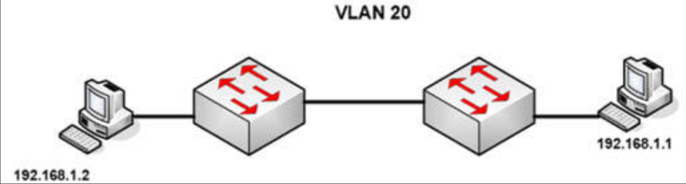
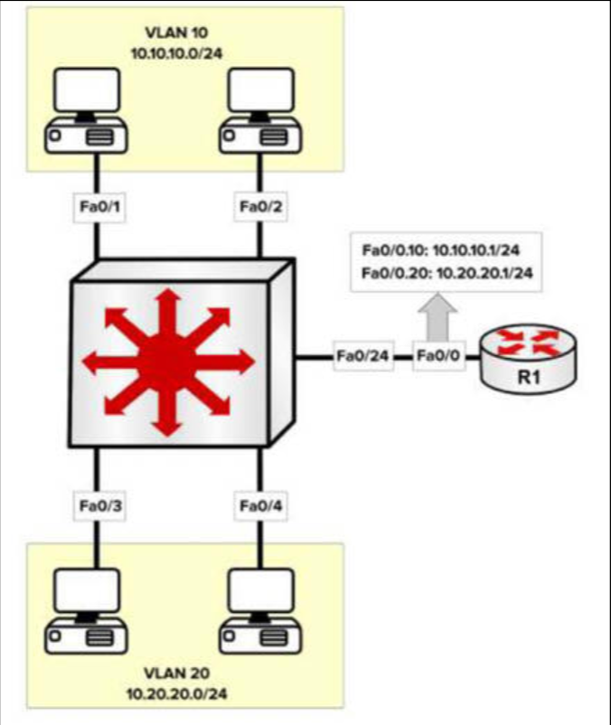

# 第 56 天 复习

## 第 56 天任务

- 复习咱们想要的任何课程
- 重做咱们想要的任何实验
- 若咱们愿意，完成今天挑战实验（下面的网址处充足的更多实验）
- 参加 [Free CCNA Training Bonus – Cisco CCNA in 60 Days v4](https://www.in60days.com/free/ccnain60days/) 处今天的考试；
- 凭记忆写出 CCNA 补习指南
- 在 subnetting.org 上花 15 分钟

## 挑战 1 —— STP 与 VLAN

### 拓扑结构

### 实验说明

通过使用一条控制台连接，连接到交换机。分别连接一台 PC 到两台交换机，或将该交换机连接到某一路由器的快速以太网端口。

1. 添加 IP 地址到两台PC 或路由器的以太网接口；
2. 在交换机上创建 `VLAN 20`；
3. 将 PC 所连接的端口，设置为接入端口（默认设置，但仍要完成）；
4. 将两个交换机端口置于 `VLAN 20` 中；
5. 检查那台根交换机是根交换机；
6. 强制另一台交换机成为根交换机；
7. 将连接 PC 的两个端口，硬性设置为 100Mbps 及全双工模式；
8. 等待 30 秒后进行一次 `ping` 测试。

## 挑战 2 —— VLAN 间路由（子接口方式）

### 拓扑结构

### 实验说明

将交换机连接至一台路由器，并连接到至少两台主机，每台主机对应一个 VLAN。

1. 添加 IP 到相应 VLAN 内的主机；
2. 在两台主机上添加默认网关，以到达路由器的两个 IP 地址；
3. 通过使用 dot1q 协议，配置交换机与路由器间的中继链路；
4. 配置  `Router 1`，使其可路由 VLAN 间的流量；
5. 通过 `ping` 两个 VLAN 上的设备加以测试；
6. 检查交换机上的 MAC 地址数据表。
