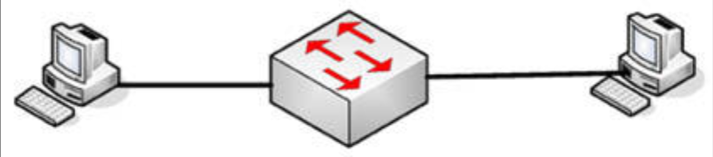
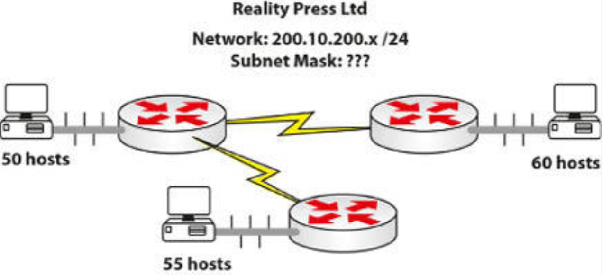
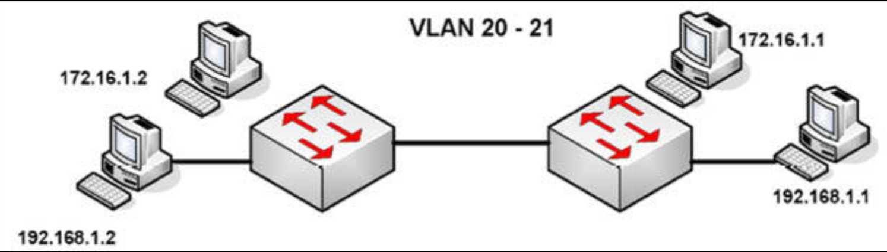

# 第 57 天 复习

## 第 57 天任务

- 复习咱们想要的任何课程
- 重做咱们想要的任何实验
- 若咱们愿意，完成今天挑战实验（下面的网址处充足的更多实验）
- 参加 [Free CCNA Training Bonus – Cisco CCNA in 60 Days v4](https://www.in60days.com/free/ccnain60days/) 处今天的考试；
- 凭记忆写出 CCNA 补习指南
- 在 subnetting.org 上花 15 分钟

## 挑战 1 —— VLAN 间路由 SVI

### 拓扑结构

### 实验说明

通过使用一条控制台连接，连接到交换机。连接其中的两台 PC 到交换机的以太网接口。设置 `VLAN2` 为 `172.16.0.0/16`，设置 `VLAN3` 为 `192.168.1.0/24`。

1. 在交换机上配置两个 VLAN，并将两台 PC 分别置于两个 VLAN 之一。根据需要设置默认网关；
2. 添加正确的 IP 地址与网关到两台 PC；
3. 在交换机上设置两个 SVI 接口，每个 VLAN 对应一个，并将子网与正确的 PC 匹配；
4. 在交换机上启用 IP 路由；
5. 自一台 PC `ping` 另一 PC；

## 挑战 2 —— VLSM 练习

咱们是 `200.10.200.0/24` 这个网络的网络管理员。咱们被要求重新设计这个网络，以适应公司方面的变化。现在公司要求这个网络拆分成三个较小的网络。其中一个网络需要 55 台主机，一个需要 50 台主机，另一个需要 60 台主机。还将需要两条 WAN 连接。解决方案或许在下一页。

## 挑战 3 —— VLAN

### 拓扑结构

### 实验说明

通过使用一条控制台连接，连接到交换机。分别连接两台 PC 连接到两台交换机，或连接交换机到两台路由器的快速以太网端口。

1. 添加 IP 地址到这些 PC 或路由器的以太网接口；
2. 在交换机上创建 `VLAN 20` 和 `VLAN 21`；
3. 设置那些连接 PC 的端口，为接入端口（默认设置，但总要做一下）；
4. 将两个交换机端口置于 `VLAN 20` 中，并将两个置于 `VLAN 21` 中。可咱们可选择哪些子网是那个 VLAN，`172` 还是 `192`；
5. 从 `172.16.1.1` `ping` 往 `172.16.1.2`，再从 `192.168.1.1` `ping` 往 `192.168.1.2`。由于没有路由器涉及，因此咱们将无法在子网间 `ping` 通；
6. 添加交换机端口安全到两台交换机。仅允许学习两个 MAC 地址，并使他们称为粘滞地址。针对两台交换机上的主机端口执行此操作。将默认操作设置为 “限制”。

### VLSM 挑战的答案

一种建议可以像下面这样：

- 55 台主机：`200.10.200.0/26`
- 50 台主机：`200.10.200.128/26`
- 60 台主机：`200.10.200.64/26`
+ 备用网络：`200.10.200.192/26`。这个网络可针对 WAN 链路而进一步划分：
    - 点对点网络 1：`200.10.200.192/30`
    - 点对点网络 2：`200.10.200.196/30`
