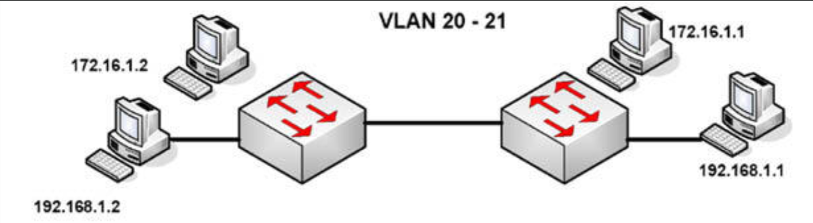
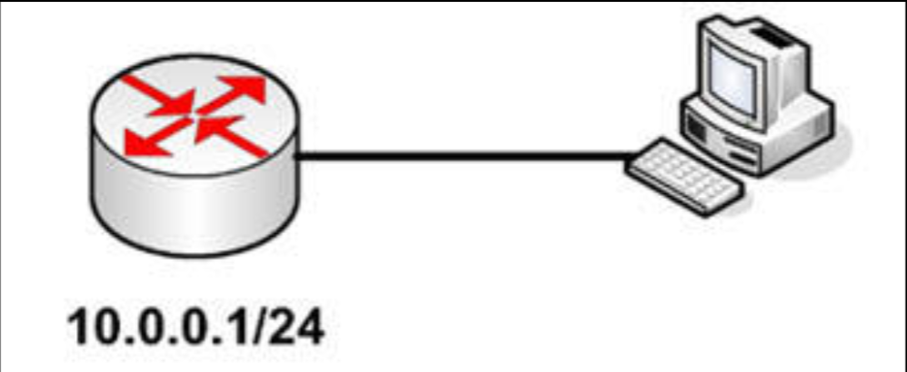

# 第 58 天 复习

## 第 58 天任务

- 复习咱们想要的任何课程
- 重做咱们想要的任何实验
- 若咱们愿意，完成今天挑战实验（下面的网址处充足的更多实验）
- 参加 [Free CCNA Training Bonus – Cisco CCNA in 60 Days v4](https://www.in60days.com/free/ccnain60days/) 处今天的考试；
- 凭记忆写出 CCNA 补习指南
- 在 subnetting.org 上花 15 分钟

## 挑战 1 —— VLAN

### 拓扑结构

### 实验说明

通过使用一条控制台连接，连接到交换机。分别连接两台 PC 连接到每台交换机，或将交换机连接到两台路由器的快速以太网端口。

1. 添加 IP 地址到这些 PC，或路由器的以太网接口；
2. 在交换机上创建 `VLAN 20` 和 `VLAN 21`；
3. 将连接这些 PC 的端口，设置为接入端口（默认设置，但还是进行设置）；
4. 将两个交换机端口置于 `VLAN 20` 中，并将两个置于 `VLAN 21` 中。可咱们可选择哪些子网是那个 VLAN，`172` 还是 `192`；
5. 从 `172.16.1.1` `ping` 往 `172.16.1.2`，再从 `192.168.1.1` `ping` 往 `192.168.1.2`。由于没有路由器涉及，因此咱们将无法在子网间 `ping` 通；

## 挑战 2 —— DHCP

### 拓扑结构

### 实验说明

连接 PC 到某个路由器以太网接口。

1. 在路由器上配置 IP 地址 `10.0.0.1/24`；
2. 创建一个网络 `10.0.0.100-200/24` 的 DHCP 池；
3. 添加一个路由器接口的排除地址；
4. 添加一个默认的路由器地址 `10.1.1.201`；
5. 添加一个 `in60days.com` 的 DNS 服务器名字；
6. 设置租约时长为 4 小时；
7. 配置其中的 PC 为经由 DHCP 获取 IP 地址；
8. `no shut` 这个路由器接口；
9. 检查 PC 的 IP 配置的IP 地址分配；
10. 检查路由器上的 DHCP 池分配。

**注意**：要使用问号（`?`）揭示许多的命令。咱们可怎样确保路由器上的地址池，仅包含咱们打算租用的哪些地址呢？为了得到答案，就要检查步骤 3。

