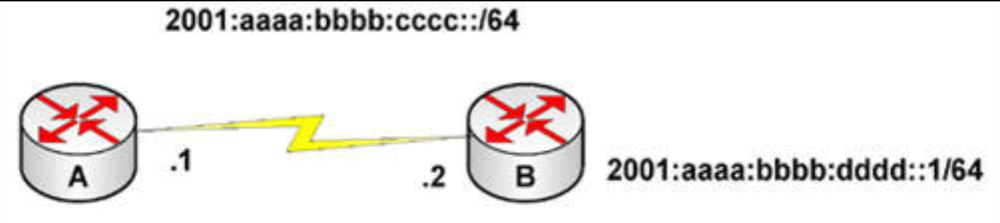
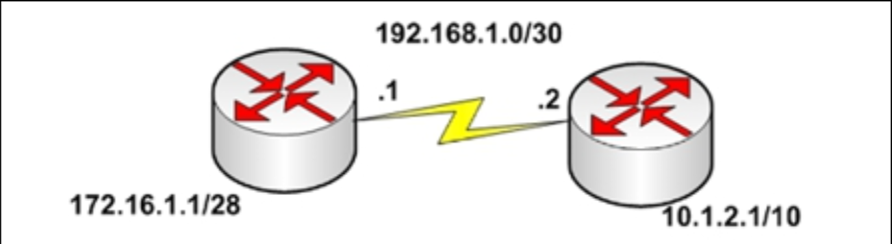

# 第 59 天 复习

## 第 59 天任务

- 复习咱们想要的任何课程
- 重做咱们想要的任何实验
- 若咱们愿意，完成今天挑战实验（下面的网址处充足的更多实验）
- 参加 [Free CCNA Training Bonus – Cisco CCNA in 60 Days v4](https://www.in60days.com/free/ccnain60days/) 处今天的考试；
- 凭记忆写出 CCNA 补习指南
- 在 subnetting.org 上花 15 分钟

咱们还有别的考试大纲中需要复习的内容吗？此时此刻，咱们应该已经解决了所有薄弱环节。

## 挑战 1 —— IPv6 静态路由

### 拓扑结构

### 实验说明

使用串行线或交叉网线，连接两台路由器。

1. 根据示意图，添加 IPv6 地址到两台路由器，在 `Router B` 上添加环回接口；
2. 在 `Router A` 上设置 `enable` 秘密口令 `cisco`，在 `Router B` 上设置 `enable` 口令；
3. 在 `Router A` 与 `Router B` 间 `ping`，测试串行链路（要记住时钟速率）；
4. 在 `Router A` 上配置一条静态路由，以到达 `Router B` 中环回接口上的网络；
5. 从 `Router A` `ping` 向 `Router B` 上的 IPv6 主机；
6. 在 `Router B` 上添加一个 `telnet` 口令，并在 `Router` `telnet` 到 `Router B`。

## 挑战 2 —— LLDP

### 拓扑结构

### 实验说明

以一条控制台线及一条以太网线，连接到路由器。连接另一路由器。

1. 在两台路由器上分别配置一个 IP 地址，并互相 `ping` 通；
2. 在两台路由器上启用 LLDP 功能；
3. 使用一些 LLDP 命令，看看咱们可以收集到有关另一台路由器的哪些信息；
4. 在左侧路由器上，关闭接口上的 LLDP；
5. 在右侧路由器上，关闭整个设备的 LLDP。

## 挑战 3 —— RTP

### 拓扑结构

### 实验说明

以串行或以太网连接，将两台路由器连接在一起。

1. 配置两台路由器之间的连接，并 `ping`；
2. 参照示意图，添加一些环回接口到两台路由器；
3. 在两台路由器上配置 RIPv2；
4. 执行一次 `show ip route` 命令，检查两台路由器上的所有网络；
5. 在两台路由器上配置 `no auto-summary`，并检查 `/10` 与 `/28` 的路由；
6. 让 `R2`（右侧路由器）上的环回接口，成为被动接口。
