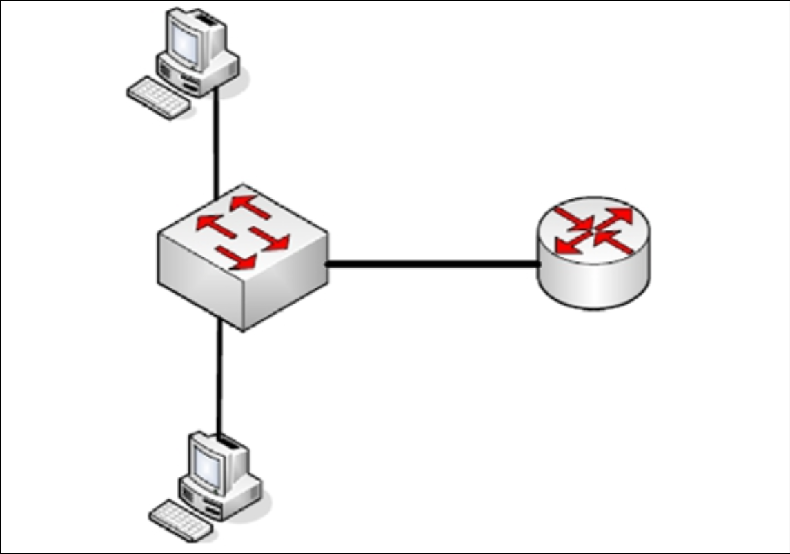
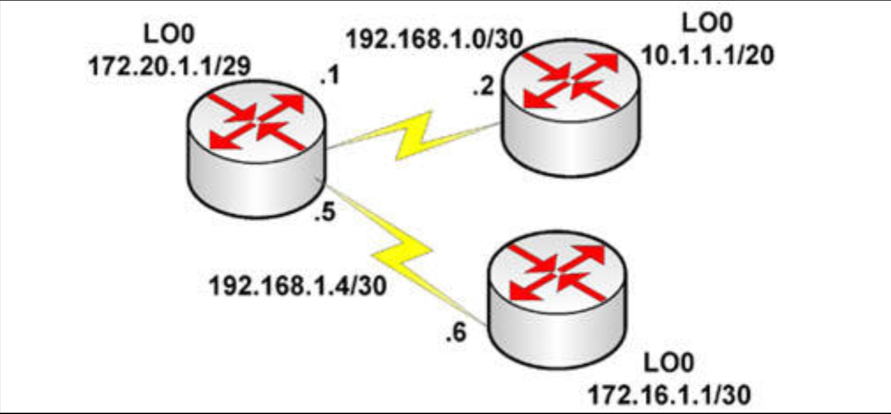
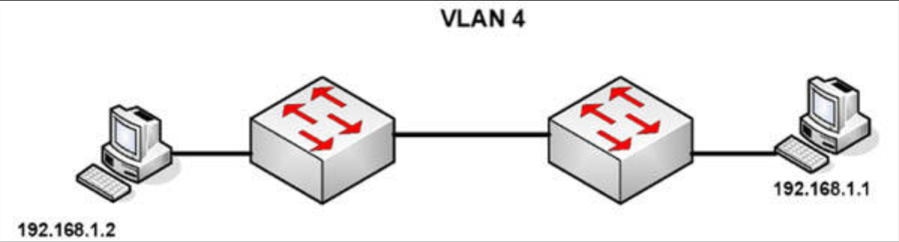
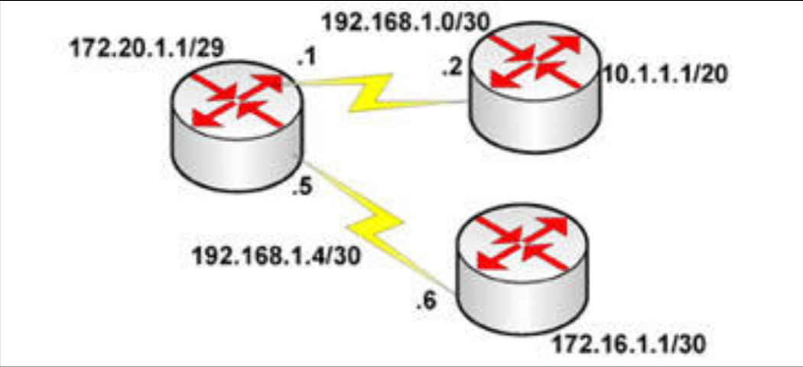

# 更多挑战实验

## 附加练习

- 若咱们希望更多作业，那么就深入研究下面这些实验吧

## 挑战 1 —— CDP

### 拓扑结构

### 实验说明

以一条控制台线及一条以太网线，连接到路由器。并连接另一路由器。

1. 在两台路由器上配置 IP 地址 `ping` 通；
2. 使用一些 CDP 命令，看看咱们可收集到有关另一台路由器的哪些信息；
3. 在左侧路由器上，关闭接口上的 CDP；
4. 在右侧路由器上，关闭整个设备上的 CDP。

## 挑战 2 —— DHCP

### 拓扑结构

### 实验说明

连接到其中路由器的以太网接口。

1. 在路由器上配置 IP 地址 `172.16.0.1/24`；
2. 创建一个 `172.16.0.100-200/24` 网络的 DHCP 池；
3. 添加一个路由器接口的排除地址；
4. 添加一个 `192.168.1.1` 的默认路由器地址；
5. 添加一个 in60days.com 的 DNS 服务器名字；
6. 设置租约时长为 4 小时；
7. 配置其中的 PC 为经由 DHCP 获取 IP 地址；
8. `no shut` 路由器接口；
9. 检查 PC 的 IP 配置中的 IP 地址分配；
10. 核查路由器上的 DHCP 地址池分配。

**注意**：要使用问号 (`?`) 揭示许多的命令。咱们要怎样确保，池中只包含咱们打算租用的哪些地址呢？要检查步骤 3 以找到答案。

## 挑战 3 —— VLAN 间路由的路由器子接口实现

### 拓扑结构

### 实验说明

通过使用一条控制台连接，连接到交换机。连接两台 PC 到其中的交换机，并将该交换机连接到某个路由器以太网接口。设置 `VLAN2` 为 `172.16.0.0/16`，设置 `VLAN3` 为 `192.168.1.0/24`。

1. 在交换机上配置两个 VLAN，并将两台 PC 分别置于其中一个 VLAN；
2. 根据需要设置默认网关；
3. 在交换机与路由器间设置一条中继链路；
4. 在路由器上设置一些子接口，以实现两个 VLAN 间的路由；
5. 将两个交换机端口置于 `VLAN 20` 中，并将两个置于 `VLAN 21` 中。可咱们可选择哪些子网是那个 VLAN，`172` 还是 `192`；
6. 从一台 PC `ping` 向另一 PC。检查交换机的 MAC 地址数据表。

## 挑战 4 —— NAT 与 RIP

### 拓扑结构

### 实验说明

以串行或以太网连接，将三台路由器连接在一起。

1. 配置这些路由器之间的连接，并 `ping`；
2. 根据上面的图示，添加一些环回地址到三台路由器；
3. 将 `172.16.1.0/30`、`10.1.1.0/20` 及两个 `192` 网络，置于 RIPv2 下；
4. 在两台分支路由器上，为 `192.168.20.0/24` 网络添加前往中心路由器的静态路由；
5. 在中心路由器上配置一个 NAT 地址池，使 `172.20.1.0/29` 这个网络，被 NAT 转换为 `192.168.20.0/24` 这个地址池；
6. 检查是否全部 RIP 路由，都以正确的网络位于路由数据表中；
7. 以 `172.20.1.1` 为源地址，`ping` 向分支路由器上的那些环回地址。先启用 NAT 调试，随后检查 NAT 转换数据表。

## 挑战 5 —— VLAN 与端口安全

### 拓扑结构

### 实验说明

通过使用一条控制台连接，连接到交换机。连接一台 PC 到交换机，或连接该交换机到某一路由器的快速以太网端口。

1. 添加端口安全到两台交换机，仅放行两台已连接 PC 的MAC地址；
2. 在两台交换机上创建 `VLAN10`；
3. 设置连接 PC 的端口为接入端口，设置交换机到交换机的端口为中继端口；
4. 将一些交换机接口置于 `VLAN10` 中；
5. 添加两台 PC 的 IP 地址于同一子网中，并 `ping` 通（需要约 30 秒后）；
6. 在交换机上执行 `show port-security interface x` 这条命令。

## 挑战 6 —— 中继与 DTP

### 拓扑结构

### 实验说明

通过使用一条控制台连接，连接到交换机。风别连接一台 PC 到两台交换机，或连接其中的交换机到某一路由器的快速以太网端口。

1. 添加 IP 地址到两台 PC 或路由器的以太网接口；
2. 在两台交换机上创建 `VLAN 4`；
3. 将连接 PC 的端口为接入端口（默认状态，但无论如何都要设置以下）；
4. 将两个交换机端口置于 `VLAN 4` 中；
5. 配置两台交换机之间的链路为中继端口，并 `no shut` 他们；
6. 在两台交换机上禁用 DTP；
7. 配置其中的中继链路为仅放行 `VLAN4`；
8. 设置原生 VLAN 为 `VLAN4`；
9. 最多等待约 30 秒，然后从一台 PC `ping` 向另一PC。

## 挑战 7 —— NAT 与静态路由

### 拓扑结构

### 实验说明

以串行或以太网连接，连接三台路由器在一起。

1. 配置路由器之间的连接，并 `ping` 测试；
2. 根据示意图添加一些环回接口到三台路由器；
3. 添加静态路由，从而是所有网络都能 `ping` 通另一网络。要混用出口接口及下一跳两种方式；
4. 在所有路由器上 `ping` 全部网络；
5. 在中心路由器（中间的）上配置一个 NAT 池，使 `172.20.1.0/29` 这个网络被 NAT 转换为 `192.168.20.0/24` 地址池；
6. 以 `172.20.1.1` 为源地址，`ping` 向两台分支路由器上的的回环地址。先启用 NAT 调试，随后检查 NAT 转换数据表。
